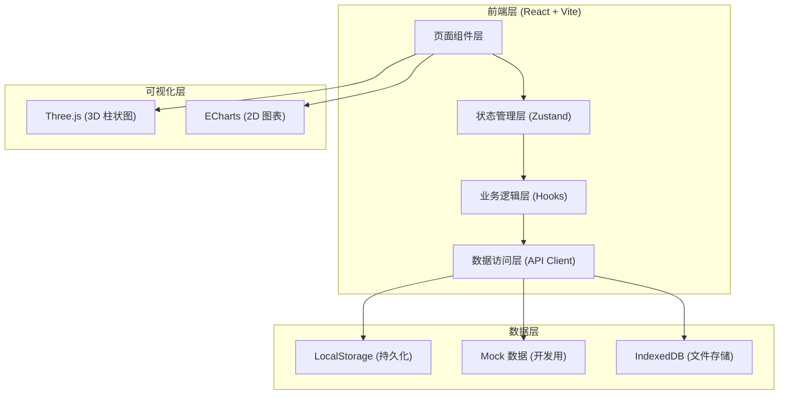
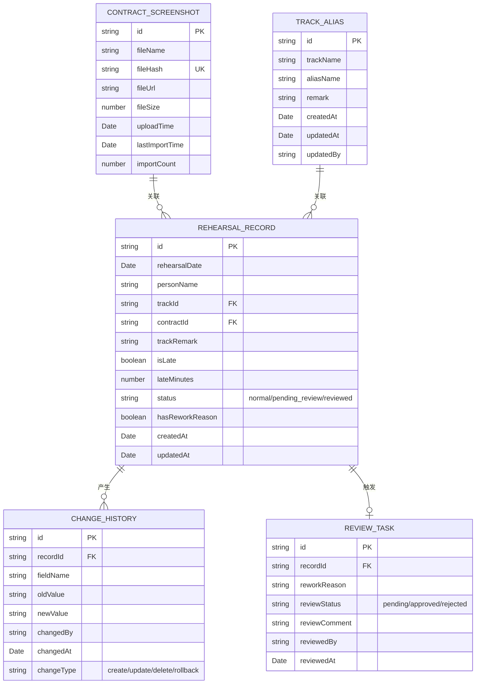

## 1. 架构设计



## 2. 技术描述

- **前端框架**：React@18 + TypeScript
- **构建工具**：Vite@5
- **样式方案**：TailwindCSS@3 + CSS 变量
- **状态管理**：Zustand（轻量，适合中小规模）
- **路由**：React Router@6
- **3D 可视化**：Three@0.160 + @react-three/fiber + @react-three/drei
- **2D 图表**：ECharts@5
- **文件哈希**：crypto-js (SHA-256)
- **Diff 对比**：diff-match-patch
- **图标**：lucide-react
- **后端**：无纯前端应用，数据持久化到 LocalStorage + IndexedDB
- **数据库**：无，使用 Mock 数据 + 浏览器存储

## 3. 路由定义

| 路由 | 页面 | 用途 |
|------|------|------|
| / | 首页仪表盘 | 统计概览、快速入口 |
| /contracts | 合同页截图管理 | 上传、预览、追溯合同截图 |
| /aliases | 曲目别名表 | 维护曲目别名、备注、版本历史 |
| /statistics | 排练迟到统计 | 统计列表、筛选、钻取 |
| /statistics/3d | 3D 图表展示 | 3D 柱状图可视化 |
| /history | 历史变更记录 | 修改对比、操作追溯 |
| /review | 异常复核工作台 | 返工原因处理、状态流转 |
| /rules | 边界规则说明 | 代码规则可视化、README |

## 4. 数据模型

### 4.1 数据模型定义



### 4.2 核心工具类型定义

```typescript
// 边界规则配置
interface BoundaryRules {
  remarkPreserve: {
    preserveLineBreaks: boolean;
    preserveWhitespace: boolean;
    noTruncation: boolean;
  };
  reworkDetection: {
    keywords: string[];
    caseSensitive: boolean;
    useRegex: boolean;
  };
  duplicateImport: {
    hashAlgorithm: 'sha256';
    updateTimeOnDuplicate: boolean;
    preventDuplicateStats: boolean;
  };
  historyTracking: {
    trackAllFields: boolean;
    keepFullHistory: boolean;
    enableRollback: boolean;
  };
}

// 返工原因检测结果
interface ReworkDetectionResult {
  hasRework: boolean;
  matchedKeywords: string[];
  detectionTime: Date;
}
```

## 5. 核心模块设计

### 5.1 文件去重模块

```typescript
// 位置：src/utils/fileHash.ts
// 职责：计算文件 SHA-256 哈希，检测重复导入
async function calculateFileHash(file: File): Promise<string>
function checkDuplicate(hash: string): ContractScreenshot | null
function handleDuplicateImport(existing: ContractScreenshot): void
```

### 5.2 返工原因检测模块

```typescript
// 位置：src/utils/reworkDetector.ts
// 职责：根据边界规则检测备注中是否包含返工原因
function detectReworkReason(
  remark: string,
  rules: BoundaryRules['reworkDetection']
): ReworkDetectionResult
```

### 5.3 历史变更模块

```typescript
// 位置：src/utils/historyTracker.ts
// 职责：记录字段级变更，生成 diff，支持回滚
function recordChange<T>(
  recordId: string,
  oldData: T,
  newData: T,
  fieldName: keyof T,
  changedBy: string
): ChangeHistory
function generateDiff(oldValue: string, newValue: string): DiffResult
function rollbackChange(historyId: string): void
```

### 5.4 3D 可视化模块

```typescript
// 位置：src/components/Statistics3D.tsx
// 职责：3D 柱状图渲染，点击钻取回溯源材料
interface BarData {
  id: string;
  label: string;
  value: number;
  sourceRecordId: string;
}
function handleBarClick(bar: BarData): void // 跳转至关联记录
```

## 6. Mock 数据设计

预置以下测试数据：
- 5 张合同页截图模拟数据
- 10 条曲目别名记录（含多条带返工原因的备注）
- 20 条排练迟到记录
- 15 条历史变更记录
- 5 条待复核任务

## 7. 项目结构

```
src/
├── components/          # 通用组件
│   ├── Layout.tsx
│   ├── Sidebar.tsx
│   ├── DataTable.tsx
│   ├── DiffViewer.tsx
│   └── Statistics3D.tsx
├── pages/               # 页面组件
│   ├── Dashboard.tsx
│   ├── Contracts.tsx
│   ├── TrackAliases.tsx
│   ├── Statistics.tsx
│   ├── Statistics3D.tsx
│   ├── History.tsx
│   ├── Review.tsx
│   └── Rules.tsx
├── store/               # 状态管理
│   └── useStore.ts
├── utils/               # 工具函数
│   ├── fileHash.ts
│   ├── reworkDetector.ts
│   ├── historyTracker.ts
│   └── boundaryRules.ts
├── types/               # 类型定义
│   └── index.ts
├── data/                # Mock 数据
│   └── mockData.ts
├── App.tsx
├── main.tsx
└── index.css
```
