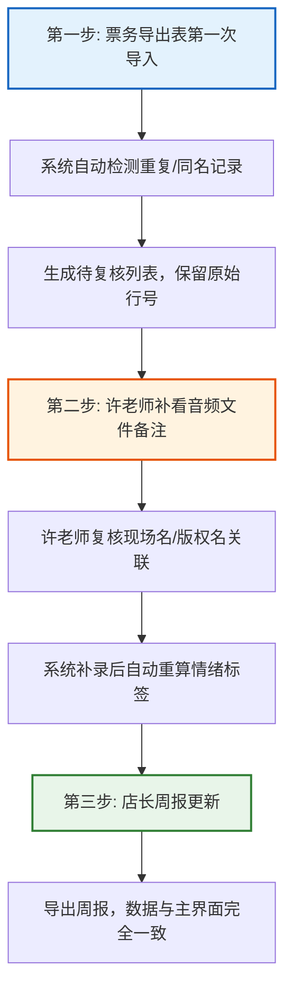
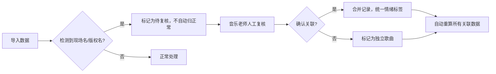

## 1. 产品概述

音频样本情绪标签系统，用于音乐团队高效管理音频样本的情绪标签，解决同一首歌现场名与版权名混淆、重复导入、数据不一致等核心痛点。

- 核心目的：让音乐老师10分钟内快速获取准确的情绪标签数据，支持票务导出表导入、人工复核、周报生成全流程
- 目标用户：音乐老师（许老师）、运营店长、新人运营
- 核心价值：数据可追溯、异常可复核、一处修改处处同步、新人零门槛上手

---

## 2. 核心功能

### 2.1 用户角色

| 角色 | 使用场景 | 核心权限 |
|------|----------|----------|
| 音乐老师（许老师） | 开会前快速查数据、复核异常记录、补看音频备注 | 全部功能、复核权限 |
| 店长 | 查看周报、了解整体数据 | 只读查看、导出报表 |
| 新人运营 | 按流程导入数据、执行日常操作 | 导入、补录、导出 |

### 2.2 功能模块

1. **数据导入页**：票务导出表导入、重复检测、原始数据留存
2. **情绪标签主界面**：数据明细展示、同一首歌关联显示、状态标记、人工备注
3. **自检中心**：重复导入检测、同名映射检查、补录重算验证、导出一致性校验
4. **周报生成页**：店长视图、数据汇总、导出报表
5. **异常复核区**：现场名/版权名待复核记录、人工确认流程

### 2.3 页面详情

| 页面名称 | 模块名称 | 功能描述 |
|----------|----------|----------|
| 数据导入页 | 文件上传区 | 支持CSV/Excel上传，显示原始行号映射 |
| 数据导入页 | 导入预览 | 展示前20行数据，标记疑似重复和同名记录 |
| 数据导入页 | 导入历史 | 每次导入时间、操作人、记录数、关联版本号 |
| 情绪标签主界面 | 数据表格 | 原始行号、现场名、版权名、情绪标签、处理状态、人工改动标记 |
| 情绪标签主界面 | 同名分组 | 同一首歌的现场名和版权名归组展示，待复核高亮 |
| 情绪标签主界面 | 操作栏 | 补录备注、确认正常、标记异常、批量操作 |
| 自检中心 | 四项自检卡片 | 重复导入、同名映射、补录重算、导出一致性，每项显示通过/异常数 |
| 自检中心 | 异常详情 | 点击可查看具体异常记录列表，支持一键跳转处理 |
| 周报生成页 | 店长视图 | 汇总统计、情绪分布、异常处理进度 |
| 周报生成页 | 导出功能 | 导出PDF/Excel周报，数据与主界面完全一致 |
| 异常复核区 | 待复核列表 | 高亮显示现场名/版权名待确认记录 |
| 异常复核区 | 复核操作 | 确认关联、标记独立、添加备注、批量复核 |

---

## 3. 核心流程

### 3.1 三步核心工作流

### 3.2 异常处理流程

---

## 4. 用户界面设计

### 4.1 设计风格

**设计方向：专业严谨的工作台风格**

- **主色调**：深蓝色系 (#1e3a5f 主色，#2c5282 辅助)，体现专业性和信任感
- **强调色**：琥珀橙 (#dd6b20) 用于待复核提醒，薄荷绿 (#38a169) 用于正常状态，珊瑚红 (#e53e3e) 用于异常
- **中性色**：浅灰 (#f7fafc) 背景，深灰 (#2d3748) 文字，确保长时间使用不疲劳
- **按钮风格**：直角微圆角 (2px)，实心按钮带微妙阴影，悬停有状态反馈
- **字体**：标题使用 "Noto Serif SC" 衬线体体现专业感，正文使用 "Inter" 无衬线体保证可读性
- **布局风格**：模块化卡片布局，数据表格为核心，左侧导航+顶部状态栏
- **图标风格**：线性图标 (Lucide)，统一2px线宽，颜色与语义匹配

### 4.2 页面设计概览

| 页面名称 | 模块名称 | UI元素 |
|----------|----------|--------|
| 数据导入页 | 文件上传区 | 拖拽上传区域，虚线边框，文件图标，上传进度条 |
| 数据导入页 | 导入预览 | 斑马纹表格，异常行橙色高亮，原始行号灰色小字 |
| 情绪标签主界面 | 同名分组 | 分组卡片带缩进，组标题显示歌曲数量，可展开收起 |
| 情绪标签主界面 | 数据表格 | 固定表头，列宽可调整，状态标签带圆角pill样式 |
| 自检中心 | 四项自检卡片 | 2x2网格卡片，大数字展示，通过/异常状态图标 |
| 周报生成页 | 店长视图 | 大号统计卡片，情绪分布饼图，时间筛选器 |

### 4.3 响应式

- Desktop-first 设计，优先保证1440px宽度下的数据展示效率
- 平板端：导航折叠为图标，表格支持横向滚动
- 移动端：卡片堆叠展示，核心数据优先，次要信息折叠
- 所有操作按钮尺寸≥44px，支持触摸操作

### 4.4 数据展示特殊要求

- 所有展示页面（明细表格、接口返回、导出文件）读取同一份数据源
- 原始行号始终显示在每行最左侧，灰色小字，不可隐藏
- 人工改动的单元格显示蓝色标记，hover显示改动历史
- 处理状态使用标签+颜色双重标识：待复核(橙)、处理中(蓝)、已确认(绿)、异常(红)
