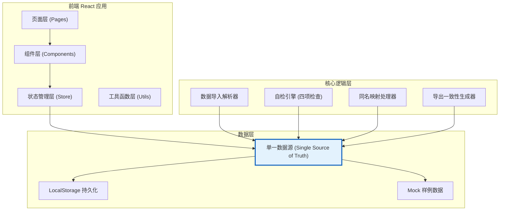

## 1. 架构设计



**核心架构原则：单一数据源 (Single Source of Truth)**
- 所有页面、组件、导出功能读取同一份状态数据
- 修改操作必须通过统一的 action 分发，确保数据一致性
- 状态变更自动触发相关计算（情绪标签重算、自检更新）

---

## 2. 技术描述

- **前端框架**: React@18 + TypeScript
- **构建工具**: Vite@5
- **样式方案**: TailwindCSS@3
- **状态管理**: Zustand@4 (轻量级，支持中间件和持久化)
- **UI组件库**: Lucide React (图标)
- **数据解析**: Papa Parse (CSV解析)
- **Excel导出**: SheetJS (xlsx)
- **后端**: 无后端，纯前端 + LocalStorage 持久化
- **数据库**: LocalStorage + 内存状态管理
- **初始化工具**: vite-init

---

## 3. 路由定义

| 路由 | 页面 | 用途 |
|------|------|------|
| / | 数据导入页 | 票务导出表上传、预览、历史记录 |
| /labels | 情绪标签主界面 | 数据明细、同名分组、状态管理 |
| /self-check | 自检中心 | 四项核心自检、异常详情 |
| /weekly-report | 周报生成页 | 店长视图、汇总统计、导出 |
| /review | 异常复核区 | 现场名/版权名待复核记录处理 |

---

## 4. 状态管理与数据模型

### 4.1 核心状态定义 (Zustand Store)

```typescript
// 歌曲记录状态
interface SongRecord {
  id: string;
  originalRowNumber: number;      // 原始行号（票务导出表）
  liveName: string;               // 现场名
  copyrightName: string;          // 版权名
  emotionTag: string;             // 情绪标签
  emotionConfidence: number;      // 情绪置信度
  status: 'pending' | 'reviewing' | 'confirmed' | 'exception';
  audioNote: string;              // 音频文件备注（许老师补录）
  manualChanges: ManualChange[];  // 人工改动历史
  groupId?: string;               // 同名分组ID
  importVersion: string;          // 导入版本号
  createdAt: number;
  updatedAt: number;
}

// 人工改动记录
interface ManualChange {
  id: string;
  field: string;
  oldValue: string;
  newValue: string;
  operator: string;
  timestamp: number;
  reason?: string;
}

// 同名分组
interface SongGroup {
  id: string;
  canonicalName: string;          // 规范名称
  memberIds: string[];            // 成员记录ID
  reviewStatus: 'pending' | 'confirmed' | 'rejected';
  reviewedBy?: string;
  reviewedAt?: number;
}

// 自检结果
interface SelfCheckResult {
  checkType: 'duplicate_import' | 'name_mapping' | 'recalculation' | 'export_consistency';
  passed: boolean;
  issueCount: number;
  issues: CheckIssue[];
  checkedAt: number;
}

interface CheckIssue {
  id: string;
  severity: 'warning' | 'error';
  description: string;
  recordIds: string[];
  resolved: boolean;
}
```

### 4.2 Store Actions

```typescript
interface EmotionLabelStore {
  // 数据
  records: SongRecord[];
  groups: SongGroup[];
  selfCheckResults: SelfCheckResult[];
  importHistory: ImportLog[];
  
  // 导入相关
  importCSV: (file: File) => Promise<ImportResult>;
  previewCSV: (file: File) => Promise<PreviewResult>;
  
  // 记录操作
  updateRecord: (id: string, updates: Partial<SongRecord>, operator: string, reason?: string) => void;
  batchUpdateStatus: (ids: string[], status: SongRecord['status']) => void;
  
  // 分组操作
  createGroup: (recordIds: string[], canonicalName: string) => string;
  confirmGroup: (groupId: string, reviewer: string) => void;
  rejectGroup: (groupId: string) => void;
  
  // 自检
  runSelfCheck: () => SelfCheckResult[];
  resolveIssue: (issueId: string) => void;
  
  // 导出
  exportCSV: () => string;
  exportExcel: () => Blob;
  exportWeeklyReport: () => Blob;
  
  // 持久化
  loadFromStorage: () => void;
  saveToStorage: () => void;
}
```

---

## 5. 自检引擎设计

### 5.1 四项核心自检逻辑

| 自检项 | 检查逻辑 | 异常判定 |
|--------|----------|----------|
| 重复导入 | 比较 liveName + copyrightName 组合，或导入版本号 | 同一组合出现≥2次且状态不同 |
| 同名映射 | 检查 groupId 关联的记录是否有不一致的 emotionTag | 同组内情绪标签不一致 |
| 补录重算 | audioNote 更新后检查 emotionTag 是否已重新计算 | audioNote 更新时间 > emotionTag 更新时间 |
| 导出一致性 | 对比页面展示数据与导出数据的哈希值 | 哈希值不一致 |

### 5.2 自检触发时机
- 数据导入后自动运行
- 任何记录修改后自动运行
- 用户手动触发
- 导出前强制运行

---

## 6. 数据一致性保证

### 6.1 单一数据源机制

```
                    ┌─────────────────────┐
                    │   Zustand Store     │
                    │  (Single Source)    │
                    └─────────┬───────────┘
                              │
          ┌───────────────────┼───────────────────┐
          │                   │                   │
┌─────────▼─────────┐ ┌───────▼───────┐ ┌─────────▼─────────┐
│  明细表格展示     │ │  接口返回     │ │  导出文件生成     │
│  (Labels Page)    │ │  (API Utils)  │ │  (Export Utils)   │
└───────────────────┘ └───────────────┘ └───────────────────┘
```

### 6.2 关键约束
- 禁止组件内部缓存或转换数据，必须直接从 store 读取
- 导出函数直接使用 store.records 生成，不经过中间转换
- 状态变更必须通过 action，禁止直接修改 store 状态
- 每次状态变更后自动触发自检，确保数据一致性

---

## 7. 目录结构

```
src/
├── pages/
│   ├── ImportPage.tsx          # 数据导入页
│   ├── LabelsPage.tsx          # 情绪标签主界面
│   ├── SelfCheckPage.tsx       # 自检中心
│   ├── WeeklyReportPage.tsx    # 周报生成页
│   └── ReviewPage.tsx          # 异常复核区
├── components/
│   ├── layout/
│   │   ├── Sidebar.tsx
│   │   └── Header.tsx
│   ├── common/
│   │   ├── DataTable.tsx
│   │   ├── StatusBadge.tsx
│   │   └── Card.tsx
│   ├── import/
│   │   ├── FileUploader.tsx
│   │   ├── ImportPreview.tsx
│   │   └── ImportHistory.tsx
│   ├── labels/
│   │   ├── SongGroupCard.tsx
│   │   ├── RecordRow.tsx
│   │   └── ManualChangeMarker.tsx
│   ├── self-check/
│   │   ├── CheckCard.tsx
│   │   └── IssueList.tsx
│   └── report/
│       ├── StatsCard.tsx
│       └── EmotionChart.tsx
├── store/
│   └── useEmotionLabelStore.ts  # Zustand store
├── utils/
│   ├── csvParser.ts             # CSV解析
│   ├── exporter.ts              # 导出功能
│   ├── selfCheckEngine.ts       # 自检引擎
│   ├── nameMatcher.ts           # 同名匹配
│   └── emotionCalculator.ts     # 情绪标签计算
├── types/
│   └── index.ts                 # TypeScript类型定义
├── data/
│   └── sampleData.ts            # 样例数据
├── App.tsx
├── main.tsx
└── index.css
```
