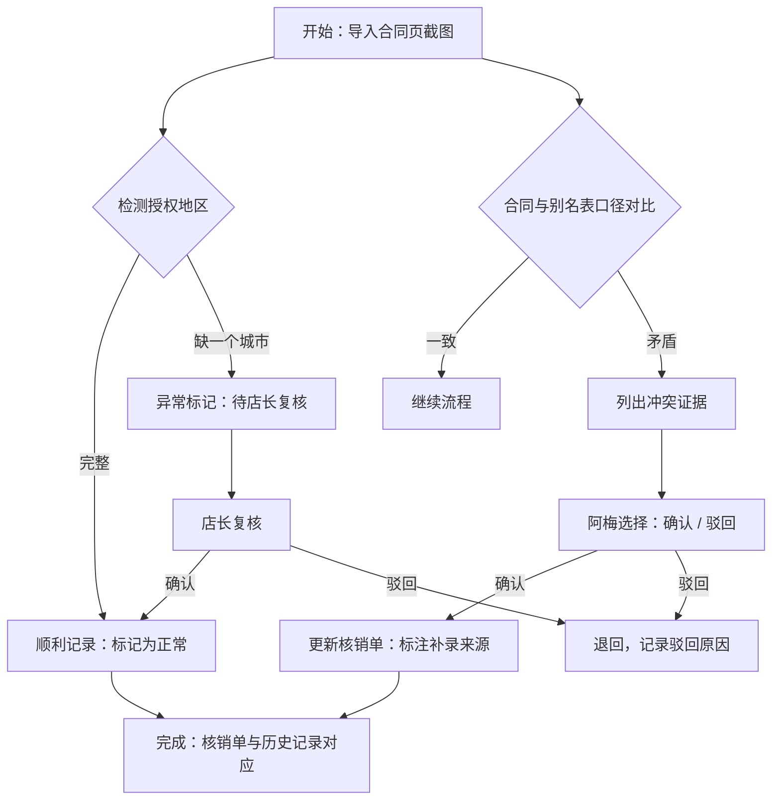

## 1. 产品概述

音乐版权投诉证据包管理系统，用于管理音乐版权投诉处理流程中的证据审核与追溯。解决当前手工解释效率低、证据链易断、前后口径不一致的问题，核心价值在于**可追溯性**和**人工决策机制**。

- 目标用户：巡演统筹（阿梅）、店长
- 核心场景：三种投诉记录处理（顺利、缺城市、旧口径补录）

## 2. 核心功能

### 2.1 用户角色

| 角色 | 注册方式 | 核心权限 |
|------|----------|----------|
| 巡演统筹（阿梅） | 系统内置 | 导入合同截图、补看曲目别名表、处理冲突证据、确认/驳回、更新课时核销单 |
| 店长 | 系统内置 | 查看证据包、复核授权地区异常、确认最终结论 |

### 2.2 功能模块

1. **证据包列表页**：展示所有投诉记录，按状态分类，支持查看详情
2. **证据包详情页**：三步工作流、证据展示、冲突对比、操作记录、状态流转
3. **曲目别名表**：参考数据展示，用于口径对比

### 2.3 页面详情

| 页面名称 | 模块名称 | 功能描述 |
|----------|----------|----------|
| 证据包列表页 | 状态筛选 | 按处理状态筛选（待处理、处理中、待店长复核、已完成） |
| 证据包列表页 | 记录卡片 | 展示投诉标题、当前状态、场景类型、创建时间 |
| 证据包详情页 | 三步工作流 | 可视化展示：导入合同→补看别名表→更新核销单 |
| 证据包详情页 | 证据展示区 | 合同页截图、曲目别名表信息、课时核销单 |
| 证据包详情页 | 冲突证据对比 | 并列展示合同截图与别名表矛盾之处，标注差异点 |
| 证据包详情页 | 操作记录时间线 | 完整追溯每一步操作，操作人、时间、内容 |
| 证据包详情页 | 决策操作区 | 确认/驳回按钮（阿梅）、店长复核按钮 |

## 3. 核心流程

### 三种场景说明

1. **顺利记录**：授权地区完整，合同与别名表口径一致，流程顺畅完成
2. **授权地区少写一个城市**：第一步即检测到异常，标记为"待店长复核"，暂停自动流转
3. **旧口径补录**：合同页截图为旧口径，从曲目别名表补充新口径，列出冲突让阿梅决策

## 4. 用户界面设计

### 4.1 设计风格

- **主色调**：深灰蓝 (#1E3A5F) - 专业、严谨
- **辅助色**：琥珀橙 (#F59E0B) - 待处理/异常状态
- **成功色**：墨绿 (#059669) - 已完成/确认
- **警告色**：砖红 (#DC2626) - 冲突/驳回
- **背景**：浅灰 (#F8FAFC) - 清爽专业
- **字体**：Noto Sans SC - 中文友好，清晰易读
- **按钮风格**：圆角 4px，轻微阴影，悬停有反馈
- **布局风格**：卡片式布局，时间线驱动，左侧导航 + 右侧内容区
- **风格定位**：简洁专业的业务系统，不花哨，重点在信息清晰可追溯

### 4.2 页面设计概述

| 页面名称 | 模块名称 | UI 元素 |
|----------|----------|----------|
| 证据包列表页 | 顶部导航 | 系统标题、角色切换、搜索框 |
| 证据包列表页 | 状态标签栏 | 四个状态标签，带计数角标 |
| 证据包列表页 | 卡片列表 | 白色卡片，场景类型用不同颜色标签区分 |
| 证据包详情页 | 三步进度条 | 可视化步骤，当前步骤高亮 |
| 证据包详情页 | 证据区 | 左右分栏：合同截图 vs 别名表 |
| 证据包详情页 | 冲突标记 | 红色边框 + 感叹号图标，逐条列出差异 |
| 证据包详情页 | 时间线 | 左侧竖线 + 节点，展示操作历史 |
| 证据包详情页 | 操作栏 | 底部固定，主操作按钮突出 |

### 4.3 响应式

- Desktop-first，桌面端优化
- 平板端：卡片自适应换行，操作栏移至页面内
- 不强制移动端适配，核心用户在桌面端操作

### 4.4 动效设计

- 步骤切换：平滑滑动过渡
- 冲突标记：淡入 + 轻微缩放
- 时间线节点：滚动时依次出现
- 按钮悬停：背景色渐变 + 上移 1px
