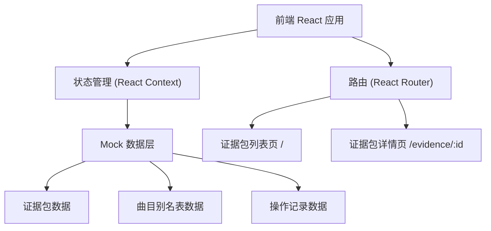
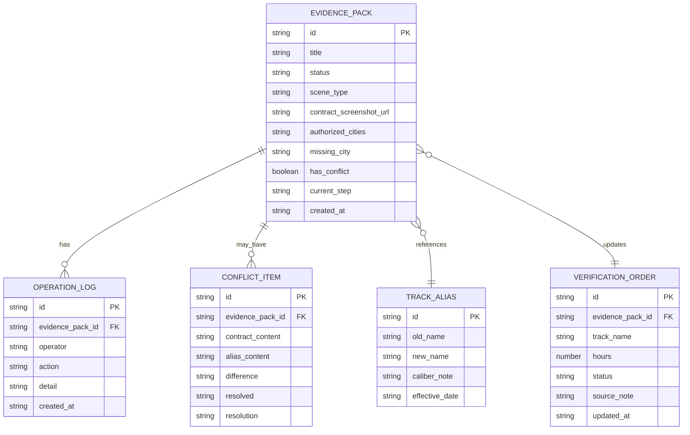

## 1. 架构设计



## 2. 技术描述

- **前端**：React@18 + TypeScript + Vite
- **样式**：Tailwind CSS@3
- **状态管理**：React Context + useReducer
- **路由**：React Router DOM@6
- **图标**：Lucide React
- **后端**：无（纯前端 Mock 数据）
- **数据库**：无（使用 TypeScript 模拟数据）
- **初始化工具**：Vite

## 3. 路由定义

| 路由 | 页面 | 用途 |
|------|------|------|
| / | 证据包列表页 | 展示所有投诉记录，按状态筛选 |
| /evidence/:id | 证据包详情页 | 展示证据包详情、三步工作流、冲突对比、操作记录 |

## 4. 数据模型

### 4.1 实体关系图



### 4.2 TypeScript 类型定义

```typescript
// 证据包状态
type EvidenceStatus = 'pending' | 'processing' | 'manager_review' | 'completed';

// 场景类型
type SceneType = 'smooth' | 'missing_city' | 'old_caliber';

// 证据包
interface EvidencePack {
  id: string;
  title: string;
  status: EvidenceStatus;
  sceneType: SceneType;
  contractScreenshotUrl: string;
  authorizedCities: string[];
  missingCity?: string;
  hasConflict: boolean;
  currentStep: number; // 1, 2, 3
  trackAliasId?: string;
  verificationOrderId?: string;
  createdAt: string;
}

// 曲目别名表
interface TrackAlias {
  id: string;
  oldName: string;
  newName: string;
  caliberNote: string;
  effectiveDate: string;
}

// 课时核销单
interface VerificationOrder {
  id: string;
  evidencePackId: string;
  trackName: string;
  hours: number;
  status: 'draft' | 'confirmed';
  sourceNote?: string;
  updatedAt: string;
}

// 操作记录
interface OperationLog {
  id: string;
  evidencePackId: string;
  operator: '阿梅' | '店长' | '系统';
  action: string;
  detail: string;
  createdAt: string;
}

// 冲突项
interface ConflictItem {
  id: string;
  evidencePackId: string;
  contractContent: string;
  aliasContent: string;
  difference: string;
  resolved: boolean;
  resolution?: 'confirm' | 'reject';
}
```

### 4.3 Mock 初始数据

**三条样例数据：**

1. **顺利记录** (sceneType: 'smooth')
   - 授权地区完整（北京、上海、广州、深圳）
   - 合同与别名表口径一致
   - 已完成状态

2. **授权地区缺城市** (sceneType: 'missing_city')
   - 授权地区：北京、上海、广州（缺深圳）
   - missingCity: '深圳'
   - 状态：待店长复核

3. **旧口径补录** (sceneType: 'old_caliber')
   - 合同中曲名为旧名称
   - 曲目别名表中有新名称
   - hasConflict: true
   - 列出冲突项，待阿梅确认

## 5. 核心组件结构

```
src/
├── App.tsx
├── main.tsx
├── types/
│   └── index.ts          # 类型定义
├── data/
│   └── mockData.ts       # Mock 数据
├── context/
│   └── EvidenceContext.tsx  # 状态管理
├── pages/
│   ├── EvidenceList.tsx     # 列表页
│   └── EvidenceDetail.tsx   # 详情页
├── components/
│   ├── StepProgress.tsx     # 三步进度条
│   ├── EvidenceCard.tsx     # 列表卡片
│   ├── ConflictPanel.tsx    # 冲突对比面板
│   ├── Timeline.tsx         # 操作记录时间线
│   └── ActionBar.tsx        # 底部操作栏
└── index.css
```

## 6. 状态流转逻辑

### 三步工作流状态机

```
Step 1: 导入合同页截图
  → 检测授权地区
  → 如缺城市 → 标记 manager_review，暂停在 Step 1
  → 如完整 → 进入 Step 2

Step 2: 巡演统筹补看曲目别名表
  → 对比合同与别名表
  → 无冲突 → 进入 Step 3
  → 有冲突 → 展示冲突面板，等待确认/驳回
    → 确认 → 进入 Step 3，记录补录来源
    → 驳回 → 退回 Step 1，记录原因

Step 3: 更新课时核销单
  → 核销单与历史记录对应
  → 标记 completed
```
