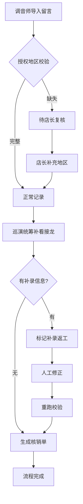

# 艺人周边库存联动 - 产品需求文档

## 1. 产品概述

艺人周边库存联动系统是巡演团队内部使用的业务流程管理工具，用于处理巡演周边商品库存与排练群信息的联动核对。系统通过标准化流程处理调音师留言导入、排练群接龙补录、授权地区校验等核心环节，将原本隐性的返工流程显性化，方便巡演统筹管理和新人培训。

- 核心目标：将错口径、补录等返工流程留痕，实现库存联动全过程可追溯
- 目标用户：巡演统筹（阿梅）、调音师、店长、新入职员工

## 2. 核心功能

### 2.1 用户角色

| 角色 | 说明 | 核心权限 |
|------|------|----------|
| 巡演统筹（阿梅） | 流程总负责人 | 导入数据、补看接龙、复核记录、查看全部历史 |
| 调音师 | 数据初始录入者 | 提交留言、查看自己的录入记录 |
| 店长 | 授权地区复核者 | 复核异常记录、确认地区信息 |
| 新人 | 学习者 | 查看演示数据、了解流程 |

### 2.2 功能模块

1. **库存联动工作台**：流程总览、待办事项、操作入口
2. **三步流程引擎**：调音师留言导入 → 巡演统筹补看接龙 → 课时核销单更新
3. **异常处理中心**：授权地区校验、店长复核队列、错口径标记
4. **演示数据中心**：三种典型记录的完整流程演示、流程讲解
5. **历史记录查询**：操作日志、变更轨迹、课时核销单对账

### 2.3 页面详情

| 页面名称 | 模块名称 | 功能描述 |
|-----------|-------------|---------------------|
| 工作台 | 流程概览卡片 | 展示当前流程进度、待办数量、三种记录类型统计 |
| 工作台 | 三步流程进度条 | 可视化展示"导入→补看→更新"三步进度 |
| 工作台 | 演示数据入口 | 一键加载演示数据、查看流程讲解 |
| 记录列表 | 筛选区域 | 按状态（正常/待复核/补录）、类型、时间筛选 |
| 记录列表 | 记录卡片 | 展示每条记录的核心信息、状态标签、操作按钮 |
| 记录详情 | 基本信息 | 艺人、周边商品、授权地区、数量等 |
| 记录详情 | 流程时间线 | 完整展示从导入到更新的每一步操作和时间 |
| 记录详情 | 异常标记区 | 显示授权地区缺失、错口径等异常信息 |
| 记录详情 | 操作区 | 补看接龙、提交复核、人工修正、重跑等操作 |
| 店长复核 | 复核列表 | 展示所有待店长复核的异常记录 |
| 店长复核 | 复核操作 | 确认地区、驳回、补充信息 |
| 核销单对账 | 课时核销单列表 | 展示核销单与库存记录的对应关系 |
| 核销单对账 | 对账差异标记 | 高亮显示核销单与历史记录不匹配的条目 |
| 演示中心 | 三种典型案例 | 顺利记录、地区缺失、补录旧口径的完整演示 |
| 演示中心 | 流程讲解 | 每一步操作的说明和注意事项 |

## 3. 核心流程

### 3.1 正常流程

调音师提交留言 → 系统自动校验授权地区 → 巡演统筹补看排练群接龙 → 生成课时核销单 → 流程完成

### 3.2 授权地区缺失流程

调音师提交留言（少写一个城市） → 系统检测到地区不完整 → 标记为"待店长复核" → 店长确认补充地区 → 巡演统筹补看接龙 → 生成核销单 → 流程完成

### 3.3 补录旧口径流程

初始记录已处理 → 排练群接龙出现新的旧口径信息 → 巡演统筹发起补录 → 标记为"补录返工" → 人工修正数据 → 重跑校验 → 更新核销单 → 流程完成

## 4. 用户界面设计

### 4.1 设计风格

- 主色调：深蓝 #1e3a5f（专业稳重），辅以橙红 #e67e22（异常提醒）、草绿 #27ae60（正常完成）
- 视觉风格：专业商务风，清晰的信息层级，强调流程可视化
- 字体：系统无衬线字体，标题加粗，数据使用等宽字体便于对齐
- 布局：左侧导航 + 右侧内容区，卡片式模块划分
- 状态标签：使用鲜明的颜色和图标区分不同状态

### 4.2 页面设计要点

| 页面名称 | 模块名称 | UI 设计要点 |
|-----------|-------------|-------------|
| 工作台 | 流程进度 | 横向时间轴，每一步有图标、标题、状态，已完成步骤显示对勾 |
| 工作台 | 统计卡片 | 三个数字卡片分别展示正常、待复核、补录数量，配色区分 |
| 记录列表 | 状态标签 | 绿色=正常，橙色=待复核，紫色=补录，带圆角小标签 |
| 记录详情 | 时间线 | 左侧垂直时间线，右侧对应操作内容和时间戳 |
| 记录详情 | 异常高亮 | 授权地区缺失字段用橙色边框和背景高亮 |
| 演示中心 | 案例卡片 | 三个案例并排，点击展开完整流程演示 |
| 核销单 | 差异标记 | 不匹配的行用红色背景和感叹号图标标记 |

### 4.3 响应式设计

- 桌面端优先设计，保证宽屏下信息展示完整
- 平板端适配：导航收起为侧边抽屉，卡片自动换行
- 不强制移动端适配，主要用户在桌面端操作

## 5. 演示数据规范

### 5.1 三条典型记录

**记录1：顺利记录**
- 艺人：张明演唱会
- 周边：应援棒
- 授权地区：北京、上海、广州、深圳
- 流程：导入 → 校验通过 → 补看接龙 → 生成核销单

**记录2：授权地区少写一个城市**
- 艺人：李华巡演
- 周边：T恤
- 初始授权地区：北京、上海、广州（缺深圳）
- 流程：导入 → 检测缺失 → 店长复核补充深圳 → 补看接龙 → 生成核销单

**记录3：补录旧口径**
- 艺人：王芳音乐节
- 周边：手幅
- 初始记录：按新口径统计
- 补录：排练群接龙出现旧口径数据需要补充
- 流程：初始完成 → 发现补录 → 标记返工 → 人工修正 → 重跑 → 更新核销单
