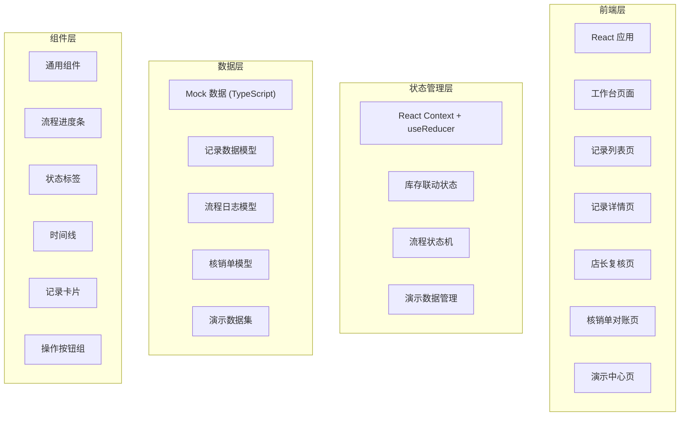
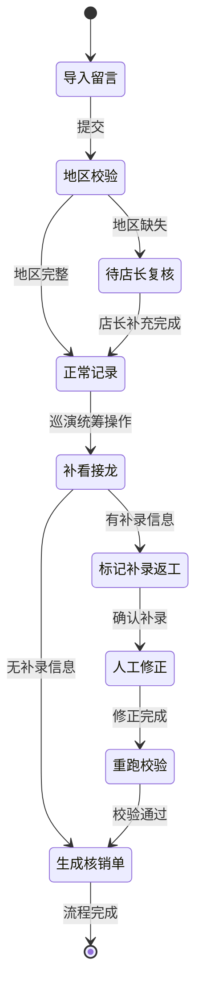

# 艺人周边库存联动 - 技术架构文档

## 1. 架构设计



## 2. 技术选型说明

- **前端框架**: React@18 + TypeScript
- **构建工具**: Vite@5
- **样式方案**: TailwindCSS@3
- **路由管理**: React Router@6
- **状态管理**: React Context + useReducer（轻量级，适合单页业务系统）
- **图标库**: Lucide React
- **数据**: 纯前端 Mock 数据，使用 TypeScript 类型定义保证数据一致性

## 3. 路由定义

| 路由路径 | 页面名称 | 说明 |
|-----------|----------|------|
| / | 工作台 | 流程概览、统计数据、快捷操作入口 |
| /records | 记录列表 | 所有库存联动记录，支持筛选和搜索 |
| /records/:id | 记录详情 | 单条记录的完整信息、流程时间线、操作区 |
| /review | 店长复核 | 待复核的异常记录列表和复核操作 |
| /verification | 核销单对账 | 课时核销单与历史记录对账 |
| /demo | 演示中心 | 三种典型案例的流程演示和讲解 |

## 4. 数据模型定义

### 4.1 核心数据类型

```typescript
// 记录状态类型
type RecordStatus = 'normal' | 'pending_review' | 'supplementary' | 'completed';

// 流程步骤类型
type ProcessStep = 'import' | 'review_jietlong' | 'update_verification';

// 操作日志类型
interface OperationLog {
  id: string;
  timestamp: string;
  operator: string;
  action: string;
  description: string;
  step: ProcessStep;
}

// 授权地区
interface AuthorizedRegion {
  city: string;
  isMissing?: boolean;
}

// 库存联动记录
interface InventoryRecord {
  id: string;
  artistName: string;
  merchandise: string;
  quantity: number;
  authorizedRegions: AuthorizedRegion[];
  status: RecordStatus;
  currentStep: ProcessStep;
  isDemo: boolean;
  demoType?: 'smooth' | 'missing_region' | 'supplementary';
  
  tunerMessage: string;
  groupJietlong?: string;
  hasSupplementary: boolean;
  supplementaryNote?: string;
  
  verificationOrder?: VerificationOrder;
  operationLogs: OperationLog[];
  
  createdAt: string;
  updatedAt: string;
}

// 课时核销单
interface VerificationOrder {
  id: string;
  orderNo: string;
  recordId: string;
  quantity: number;
  amount: number;
  status: 'matched' | 'mismatch' | 'pending';
  mismatchReason?: string;
  createdAt: string;
}
```

### 4.2 演示数据定义

```typescript
// 演示数据集
const demoRecords: InventoryRecord[] = [
  {
    id: 'demo-001',
    artistName: '张明演唱会',
    merchandise: '应援棒',
    quantity: 500,
    authorizedRegions: [
      { city: '北京' },
      { city: '上海' },
      { city: '广州' },
      { city: '深圳' }
    ],
    status: 'completed',
    currentStep: 'update_verification',
    isDemo: true,
    demoType: 'smooth',
    tunerMessage: '张明北京演唱会周边应援棒备货500支，四城联动',
    groupJietlong: '排练群接龙确认：北京150，上海150，广州100，深圳100',
    hasSupplementary: false,
    operationLogs: [...],
    createdAt: '2026-06-01 10:00:00',
    updatedAt: '2026-06-01 14:30:00'
  },
  // ... 另外两条演示数据
];
```

## 5. 状态机设计

### 5.1 流程状态转移



## 6. 核心组件结构

```
src/
├── components/
│   ├── layout/
│   │   ├── Sidebar.tsx        # 左侧导航
│   │   └── Header.tsx         # 顶部栏
│   ├── process/
│   │   ├── ProcessStepper.tsx # 三步流程进度条
│   │   └── Timeline.tsx       # 操作时间线
│   ├── common/
│   │   ├── StatusBadge.tsx    # 状态标签
│   │   ├── RecordCard.tsx     # 记录卡片
│   │   └── ActionButton.tsx   # 操作按钮
│   └── demo/
│       └── DemoCaseCard.tsx   # 演示案例卡片
├── pages/
│   ├── Dashboard.tsx          # 工作台
│   ├── RecordList.tsx         # 记录列表
│   ├── RecordDetail.tsx       # 记录详情
│   ├── ManagerReview.tsx      # 店长复核
│   ├── Verification.tsx       # 核销单对账
│   └── DemoCenter.tsx         # 演示中心
├── context/
│   └── InventoryContext.tsx   # 全局状态管理
├── data/
│   ├── mockData.ts            # Mock 数据
│   └── demoData.ts            # 演示数据
├── types/
│   └── index.ts               # TypeScript 类型定义
├── utils/
│   └── processUtils.ts        # 流程处理工具函数
├── App.tsx
├── main.tsx
└── index.css
```

## 7. 关键业务逻辑

### 7.1 授权地区校验

校验规则：
- 标准巡演应包含至少 4 个城市
- 缺少深圳（一线城市）自动标记为异常
- 异常记录不进入下一步，必须由店长复核补充

### 7.2 补录返工处理

触发条件：
- 排练群接龙中出现与初始口径不一致的数据
- 巡演统筹手动标记需要补录

处理流程：
- 标记"补录返工"状态
- 记录原始数据和补录数据的差异
- 人工修正后重跑全流程校验
- 更新核销单并保留修改痕迹

### 7.3 核销单对账

对账逻辑：
- 核销单数量 = 最终确认的库存数量
- 状态不一致时高亮显示差异
- 提供差异详情查看功能
- 支持手动对账确认
