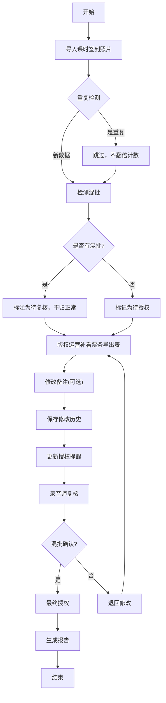

## 1. 产品概述

儿童合奏课堂打卡系统是面向录音师和版权运营人员的票务与课时管理工具，解决赠票与售票混批处理、重复导入去重、操作历史追踪等核心问题。
- 主要用户：录音师（10分钟快速复核）、版权运营小鹿（票务核对、备注修改）
- 核心价值：提升票务核对效率，减少人工错误，保留完整操作审计轨迹

## 2. 核心功能

### 2.1 用户角色

| 角色 | 注册方式 | 核心权限 |
|------|----------|----------|
| 录音师 | 系统内置 | 快速复核混批数据、最终授权、查看3D/图表展示 |
| 版权运营小鹿 | 系统内置 | 导入课时签到照片、补看票务导出表、修改备注、更新授权提醒 |

### 2.2 功能模块

1. **打卡主界面**：批次列表、混批标识、数量统计、三步流程进度
2. **导入模块**：课时签到照片导入、票务导出表导入、重复检测
3. **混批处理**：赠票/售票混批检测、标注、留待复核
4. **历史追踪**：备注修改前后对比、操作日志
5. **数据展示**：3D展示、图表展示、原始数据溯源
6. **授权提醒**：人性化提醒、原因说明、材料缺失提示、下一步指引
7. **报告模块**：可读报告、参数版本记录、取舍理由说明

### 2.3 页面详情

| 页面名称 | 模块名称 | 功能描述 |
|---------|---------|----------|
| 打卡主页 | 批次概览 | 展示所有批次卡片，混批高亮显示，显示三步流程进度 |
| 打卡主页 | 快捷统计 | 总人次、赠票数、售票数、待复核数、已授权数 |
| 批次详情 | 导入记录 | 课时签到照片预览、票务导出表预览、导入时间戳 |
| 批次详情 | 人员列表 | 每条记录标注赠票/售票类型，支持点击溯源原始数据 |
| 批次详情 | 备注历史 | 时间线展示备注修改记录，改前改后对比高亮 |
| 批次详情 | 授权提醒 | 卡片式提醒，包含原因、缺材料、下一步找谁 |
| 数据展示 | 3D视图 | 可旋转3D柱状图，点击柱子跳转到对应原始记录 |
| 数据展示 | 图表视图 | 趋势图、占比图，支持数据点溯源 |
| 报告页面 | 详情报告 | 非日志式报告，包含计算参数版本和取舍理由 |

## 3. 核心流程

### 三步处理流程
1. 第一步：版权运营小鹿导入课时签到照片，系统自动去重检测，发现混批自动标注
2. 第二步：版权运营小鹿补看票务导出表，核对每条记录类型，可修改备注
3. 第三步：系统更新授权提醒，录音师10分钟内快速复核混批数据并授权

## 4. 用户界面设计

### 4.1 设计风格
- 主色调：深青绿色 #0F766E（专业、可靠），辅助色：琥珀色 #F59E0B（提醒、待处理）
- 按钮风格：圆角8px，轻微阴影，hover时有0.2秒过渡动画
- 字体：标题用 Lora（优雅衬线），正文用 Inter（清晰易读）
- 布局风格：卡片式布局，左侧导航，右侧内容区，信息密度适中
- 图标风格：线性图标，1.5px描边，配色与主题一致

### 4.2 页面设计概览

| 页面名称 | 模块名称 | UI元素 |
|---------|---------|--------|
| 打卡主页 | 批次概览 | 网格卡片布局，混批卡片琥珀色边框，待复核角标，悬停放大效果 |
| 打卡主页 | 快捷统计 | 顶部横向排列的数字卡片，数字用大号显示，图标带动画 |
| 批次详情 | 时间线 | 左侧三步流程时间线，当前步骤高亮，已完成步骤打勾 |
| 批次详情 | 备注历史 | 时间线布局，新旧内容左右对比，差异部分高亮 |
| 批次详情 | 授权提醒 | 琥珀色渐变背景卡片，图标+标题+详情三级信息层次 |
| 数据展示 | 3D视图 | 全宽3D画布，底部控制条，点击柱子弹出详情浮层 |
| 报告页面 | 报告正文 | 分段式报告，参数版本用小标签标注在结果旁 |

### 4.3 响应式
- 桌面端优先（1280px+），适配1920px大屏
- 平板端（768px-1279px）：卡片改为两列布局
- 移动端（<768px）：单列布局，导航改为底部tab

### 4.4 3D场景指引
- 环境：简洁的深青色渐变背景，柔和的环境光
- 灯光：主光源45度角照射，辅光补亮暗部，柱子自发光效果
- 相机：默认45度俯视，支持鼠标拖拽旋转、滚轮缩放
- 构图：中心区域展示柱状图，四周留有呼吸空间
- 交互：柱子hover时升高+高亮，点击时飞出详情面板
- 后处理：轻微辉光效果，柔和阴影
- 性能：单批次最多50根柱子，超过时自动聚合
