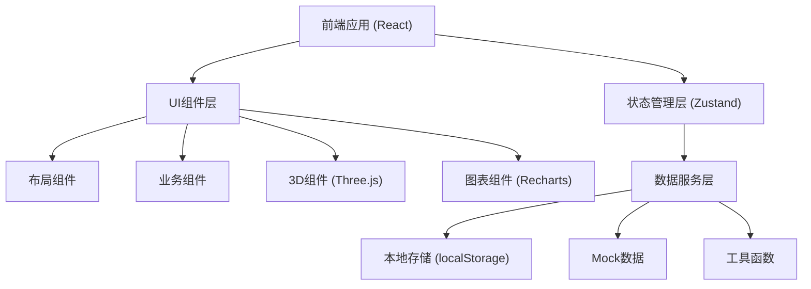
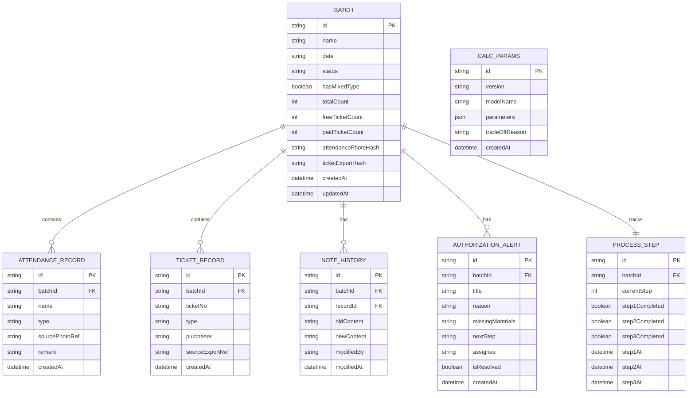

## 1. 架构设计



## 2. 技术描述

- 前端：React@18 + TypeScript + Vite@5
- 样式：TailwindCSS@3
- 状态管理：Zustand@4
- 3D渲染：three@0.160 + @react-three/fiber@8 + @react-three/drei@9
- 图表：recharts@2
- 路由：react-router-dom@6
- 后端：无（纯前端应用，使用localStorage + Mock数据）
- 数据库：localStorage 模拟持久化存储

## 3. 路由定义

| 路由 | 用途 |
|------|------|
| / | 打卡主页 - 批次列表概览 |
| /batch/:id | 批次详情页 - 三步流程处理 |
| /batch/:id/3d | 3D数据展示 |
| /batch/:id/chart | 图表数据展示 |
| /batch/:id/report | 报告详情页 |

## 4. 数据模型

### 4.1 数据模型定义



### 4.2 类型定义 (TypeScript)

```typescript
// 票务类型
type TicketType = 'free' | 'paid';

// 批次状态
type BatchStatus = 'pending' | 'reviewing' | 'authorized' | 'rejected';

// 批次
interface Batch {
  id: string;
  name: string;
  date: string;
  status: BatchStatus;
  hasMixedType: boolean;
  totalCount: number;
  freeTicketCount: number;
  paidTicketCount: number;
  attendancePhotoHash: string;
  ticketExportHash?: string;
  createdAt: string;
  updatedAt: string;
}

// 签到记录
interface AttendanceRecord {
  id: string;
  batchId: string;
  name: string;
  type: TicketType;
  sourcePhotoRef: string;
  remark?: string;
  createdAt: string;
}

// 票务记录
interface TicketRecord {
  id: string;
  batchId: string;
  ticketNo: string;
  type: TicketType;
  purchaser: string;
  sourceExportRef: string;
  createdAt: string;
}

// 备注历史
interface NoteHistory {
  id: string;
  batchId: string;
  recordId: string;
  oldContent: string;
  newContent: string;
  modifiedBy: 'recorder' | 'copyright';
  modifiedAt: string;
}

// 授权提醒
interface AuthorizationAlert {
  id: string;
  batchId: string;
  title: string;
  reason: string;
  missingMaterials: string[];
  nextStep: string;
  assignee: 'recorder' | 'copyright';
  isResolved: boolean;
  createdAt: string;
}

// 流程步骤
interface ProcessStep {
  id: string;
  batchId: string;
  currentStep: 1 | 2 | 3;
  step1Completed: boolean;
  step2Completed: boolean;
  step3Completed: boolean;
  step1At?: string;
  step2At?: string;
  step3At?: string;
}

// 计算参数版本
interface CalcParams {
  id: string;
  version: string;
  modelName: string;
  parameters: Record<string, any>;
  tradeOffReason: string;
  createdAt: string;
}
```

## 5. 核心工具函数

| 函数名 | 用途 |
|--------|------|
| generateHash(file) | 生成文件哈希，用于重复导入检测 |
| detectMixedType(records) | 检测批次中是否同时存在赠票和售票 |
| diffContent(oldStr, newStr) | 对比两段文本差异，高亮显示 |
| generateAlert(batch) | 根据批次状态生成人性化授权提醒 |
| generateReport(batch, records, params) | 生成可读格式的报告 |
| build3DData(records) | 将记录转换为3D柱状图数据格式 |

## 6. 状态管理设计

### Store 划分
- useBatchStore: 批次列表管理、CRUD操作
- useProcessStore: 三步流程状态管理
- useImportStore: 导入去重逻辑
- useAlertStore: 授权提醒管理
- useHistoryStore: 备注历史追踪

### 持久化策略
- 所有Store自动同步到localStorage
- 关键操作前自动快照，支持撤销
