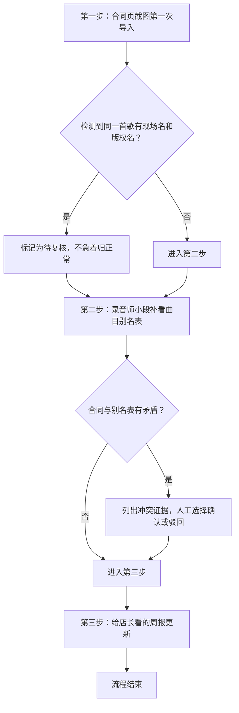

## 1. 产品概述

音乐社团经费报销管理系统，解决曲目名称多口径（现场名/版权名）导致的汇总对账难题，实现合同导入→别名补录→周报生成的全流程可追溯。

- 核心用户：录音师小段、音乐老师（复核）、店长（查看周报）
- 核心价值：避免同一首歌因现场名和版权名不一致导致的数字汇总错误，每步操作有证据链可查

## 2. 核心功能

### 2.1 用户角色
| 角色 | 登录方式 | 核心权限 |
|------|----------|----------|
| 录音师小段 | 本地操作 | 导入合同、补录别名、处理冲突、提交复核 |
| 音乐老师 | 本地操作 | 复核曲目名称冲突、确认别名映射 |
| 店长 | 本地操作 | 查看周报、浏览历史记录 |

### 2.2 功能模块
1. **合同导入页**：上传合同页截图，录入曲目、金额、日期等信息
2. **曲目别名管理页**：管理曲目现场名与版权名的映射关系
3. **冲突处理页**：列出合同与别名表的矛盾点，人工确认/驳回
4. **自检中心页**：运行四大自检（重复导入、同名异曲、补录重算、导出一致）
5. **周报生成页**：生成给店长看的经费汇总周报
6. **历史记录页**：查看所有操作历史和数据变更轨迹

### 2.3 页面详情
| 页面名称 | 模块名称 | 功能描述 |
|----------|----------|----------|
| 首页/仪表盘 | 流程概览 | 显示三步流程进度、待处理冲突数、自检结果摘要 |
| 合同导入页 | 合同录入 | 上传截图、填写曲目明细、提交导入 |
| 别名管理页 | 别名映射 | 增删改查曲目别名、标记现场名/版权名 |
| 冲突处理页 | 冲突列表 | 展示冲突证据、提供确认/驳回操作、留痕备注 |
| 自检中心页 | 自检运行 | 选择自检类型、运行检测、查看检测报告 |
| 周报生成页 | 周报预览 | 按周汇总、对比历史数据、导出报表 |
| 历史记录页 | 操作轨迹 | 按时间线展示所有操作、支持筛选搜索 |

## 3. 核心流程

### 3.1 标准三步工作流

### 3.2 自检流程
1. 重复导入检测：检查相同合同号/相同曲目+相同日期的重复记录
2. 同名异曲检测：检查同一曲目名对应不同金额/不同合同的异常
3. 补录重算检测：补录别名后重新计算汇总金额，验证一致性
4. 导出一致检测：验证页面展示数据与导出数据完全一致

## 4. 用户界面设计

### 4.1 设计风格
- **主色调**：深青色 #1e3a5f（专业、稳重），搭配琥珀橙 #f59e0b（警示、高亮）
- **辅助色**：浅灰背景 #f8fafc，边框 #e2e8f0
- **按钮风格**：轻微圆角（4px）、悬浮有微妙阴影、点击有反馈
- **字体**：标题用 Noto Serif SC（衬线，稳重专业），正文用 Noto Sans SC（无衬线，清晰易读）
- **布局风格**：左右分栏，左侧导航+右侧内容区，卡片式信息分组
- **图标风格**：线性细边图标，统一 16px/20px 尺寸

### 4.2 页面设计概览
| 页面名称 | 模块名称 | UI 元素 |
|----------|----------|---------|
| 仪表盘 | 流程卡 | 三步进度条、状态徽章、待办数字角标 |
| 合同导入 | 表单区 | 截图上传预览区、可编辑表格、金额自动求和 |
| 冲突处理 | 证据卡 | 左右对比布局（合同原文 vs 别名表）、时间戳、操作人 |
| 自检中心 | 检测卡 | 检测类型图标、运行状态指示灯、检测结果展开详情 |
| 周报 | 汇总表 | 周对比柱状图、数据导出按钮、历史周报选择器 |
| 历史记录 | 时间线 | 垂直时间轴、操作类型标签、展开查看详情 |

### 4.3 响应式
- Desktop-first，最小支持 1280px 宽度
- 表格区域允许横向滚动，保证数据完整性
- 移动端简化导航为底部 Tab 栏

### 4.4 动效设计
- 页面加载：内容区域淡入（200ms ease-out）
- 冲突检测：新冲突出现时有轻微脉冲高亮（2次琥珀色闪烁）
- 表单提交：按钮 loading 态 + 成功打勾动画
- 表格行：hover 时背景色微妙加深
