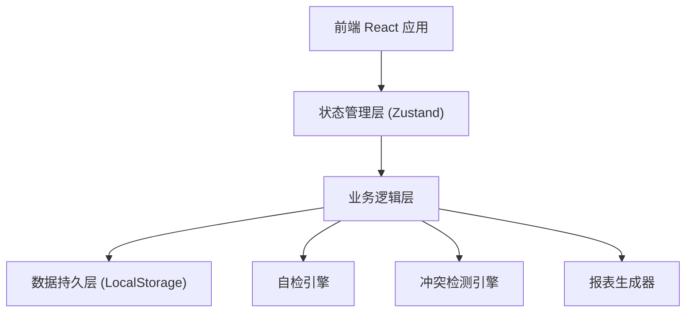
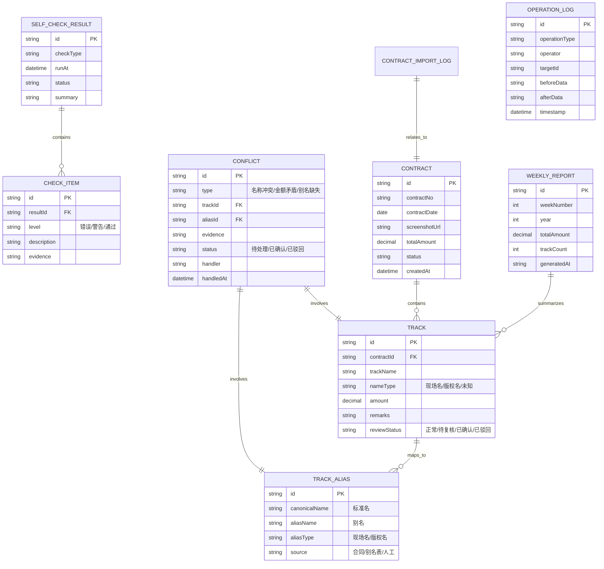

## 1. 架构设计



纯前端单页应用，数据存储在浏览器 LocalStorage，无需后端服务。

## 2. 技术描述

- **前端框架**: React@18 + TypeScript@5
- **构建工具**: Vite@5
- **样式方案**: TailwindCSS@3
- **状态管理**: Zustand@4
- **路由**: React Router@6
- **图表库**: Recharts@2
- **图标**: Lucide React
- **数据持久化**: LocalStorage + 自定义序列化
- **文件处理**: 浏览器原生 File API

## 3. 路由定义

| 路由 | 页面 | 用途 |
|------|------|------|
| / | 仪表盘 | 流程概览、待办事项、快捷入口 |
| /contract-import | 合同导入 | 上传合同截图、录入曲目明细 |
| /alias-management | 别名管理 | 管理曲目现场名与版权名映射 |
| /conflicts | 冲突处理 | 列出并处理合同与别名表的矛盾 |
| /self-check | 自检中心 | 运行四大自检、查看检测报告 |
| /weekly-report | 周报生成 | 生成和导出给店长的经费周报 |
| /history | 历史记录 | 查看操作历史和数据变更轨迹 |

## 4. 数据模型

### 4.1 ER 图



### 4.2 核心 Store 定义

```typescript
interface AppState {
  contracts: Contract[];
  tracks: Track[];
  trackAliases: TrackAlias[];
  conflicts: Conflict[];
  selfCheckResults: SelfCheckResult[];
  weeklyReports: WeeklyReport[];
  operationLogs: OperationLog[];
  
  importContract: (data: ContractImportData) => void;
  addTrackAlias: (alias: TrackAlias) => void;
  resolveConflict: (id: string, action: 'confirm' | 'reject', handler: string) => void;
  runSelfCheck: (type: CheckType) => SelfCheckResult;
  generateWeeklyReport: (week: number, year: number) => WeeklyReport;
  exportData: () => ExportData;
}
```

## 5. 自检引擎实现方案

### 5.1 重复导入检测
- 检测维度：contractNo 重复、同曲目名+同日期+同金额
- 输出：重复记录列表、建议合并/删除操作

### 5.2 同名异曲检测
- 检测维度：同一曲目名对应多个不同 canonicalName
- 输出：疑似同名异曲列表、标注现场名/版权名来源

### 5.3 补录重算检测
- 检测逻辑：新增别名后重新触发汇总计算，对比前后金额差异
- 输出：金额变化明细、重算前后对比

### 5.4 导出一致检测
- 检测逻辑：页面展示数据 vs 序列化导出数据 逐字段比对
- 输出：字段级一致性报告

## 6. 冲突检测规则

| 冲突类型 | 触发条件 | 处理方式 |
|----------|----------|----------|
| 名称冲突 | 曲目名在别名表中存在对应关系但类型不一致 | 列出合同原文 vs 别名表原文，人工确认 |
| 金额矛盾 | 同一 canonicalName 下不同记录金额差异 > 1% | 高亮金额差异，人工核对 |
| 别名缺失 | 曲目名无法匹配任何别名记录 | 标记为待补录，引导至别名管理页 |
| 双重身份 | 曲目同时作为现场名和版权名出现 | 标记为待音乐老师复核 |
