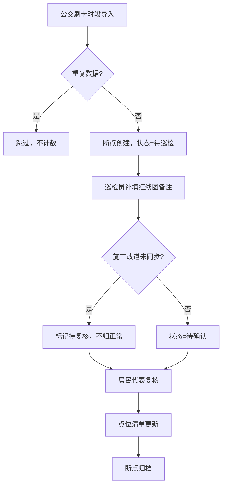
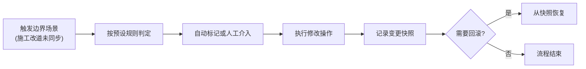

## 1. 产品概述

慢行绿道断点修补系统是面向市政巡检、居民代表的业务管理平台，用于管理绿道断点修复、施工临时改道、公交刷卡时段数据联动的全流程。系统解决口头约定导致的规则不透明、重复导入数据计数翻倍、历史修改无迹可查、错误提示不友好等痛点。

- 核心目标：建立透明的边界规则，实现可追溯的工作流，提供友好的人机交互
- 目标用户：市政巡检员（小付等）、居民代表、系统管理员

## 2. 核心功能

### 2.1 用户角色

| 角色 | 登录方式 | 核心权限 |
|------|----------|----------|
| 市政巡检员 | 账号登录 | 导入公交刷卡时段、补填红线图备注、标记施工改道、提交点位更新 |
| 居民代表 | 账号登录 | 复核施工改道异常、确认点位清单、查看历史变更 |
| 系统管理员 | 账号登录 | 配置边界规则、管理用户权限、查看操作日志 |

### 2.2 功能模块

1. **工作台**：待办事项、数据概览、三步工作流进度
2. **断点管理**：断点列表、详情、状态流转、施工改道标记
3. **数据导入**：公交刷卡时段批量导入、去重校验、导入日志
4. **历史记录**：变更追踪、备注修改前后对比、操作人时间戳
5. **可视化展示**：2D地图/3D场景、图表统计、点击溯源
6. **规则配置**：边界规则管理、判改回滚流程定义

### 2.3 页面详情

| 页面名称 | 模块名称 | 功能描述 |
|----------|----------|----------|
| 工作台 | 三步工作流看板 | 显示"导入→补备注→更新"三步进度，高亮待复核的施工改道 |
| 断点列表 | 断点表格 | 分页展示所有断点，支持按状态、施工改道标记筛选 |
| 断点详情 | 信息面板 | 展示断点基础信息、公交刷卡时段关联、红线图备注、历史记录时间线 |
| 数据导入 | 导入表单 | 上传公交刷卡时段文件，预览冲突，执行去重导入 |
| 历史记录 | 变更对比 | 展示每次修改的字段级差异，高亮备注变更 |
| 可视化 | 3D/图表展示 | 绿道断点地图分布、统计图表，点击可回溯原始数据 |
| 规则配置 | 边界规则表 | 展示和编辑施工临时改道等边界场景的判定、修改、回滚规则 |

## 3. 核心流程

### 3.1 三步核心工作流

1. **第一步：公交刷卡时段第一次导入**
   - 巡检员上传公交刷卡时段数据
   - 系统自动去重，不重复计数
   - 断点状态更新为"待巡检"

2. **第二步：市政巡检员补看红线图备注**
   - 巡检员查看断点详情，补充红线图备注
   - 如发现施工临时改道未同步地图，标记为"待复核"，不归为正常
   - 系统记录修改前后的备注差异

3. **第三步：点位清单更新**
   - 居民代表复核所有"待复核"的施工改道项
   - 确认后点位清单正式更新
   - 断点状态流转为"已完成"或"需施工"

### 3.2 边界规则处理流程

## 4. 用户界面设计

### 4.1 设计风格

- **主色调**：深绿 #0F5132（绿道主题）+ 橙红 #E85D04（告警标记）
- **辅助色**：浅灰背景，卡片式布局，清晰的视觉层次
- **按钮风格**：圆角 6px，悬停微阴影，主按钮使用深绿填充
- **字体**：Noto Sans SC 中文显示字体 + Roboto Mono 等宽数据字体
- **布局风格**：左侧导航 + 右侧内容区，卡片式分组，固定表头的数据表格
- **图标风格**：lucide-react 线性图标，保持统一的 24px 尺寸

### 4.2 页面设计概览

| 页面名称 | 模块名称 | UI 元素 |
|----------|----------|----------|
| 工作台 | 三步进度条 | 时间线样式，当前步骤高亮，待复核项橙色徽章 |
| 断点列表 | 数据表格 | 斑马纹行，施工改道行橙色背景标记，状态标签彩色 |
| 断点详情 | 历史时间线 | 垂直时间线，修改处展开显示前后对比 diff |
| 数据导入 | 上传区域 | 拖拽上传，文件拖入时边框高亮，冲突行红色标记 |
| 可视化 | 3D/图表 | 地图可缩放，点击断点弹出详情卡片，图表柱形渐变色 |
| 规则配置 | 规则卡片 | 每条规则独立卡片，包含判定条件、处理方式、回滚说明 |

### 4.3 响应式

- 桌面端优先，1280px 起步
- 平板端折叠侧边栏，表格支持横向滚动
- 移动端简化布局，保留核心操作按钮

### 4.4 可视化交互

- 地图/3D 场景点击后，高亮对应断点并滑出详情面板
- 详情面板中提供"跳转公交刷卡时段"、"查看红线图备注"快捷按钮
- 确保不只有漂亮画面，而是能服务复核流程
