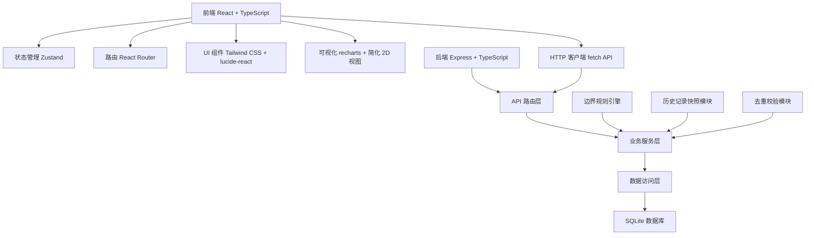
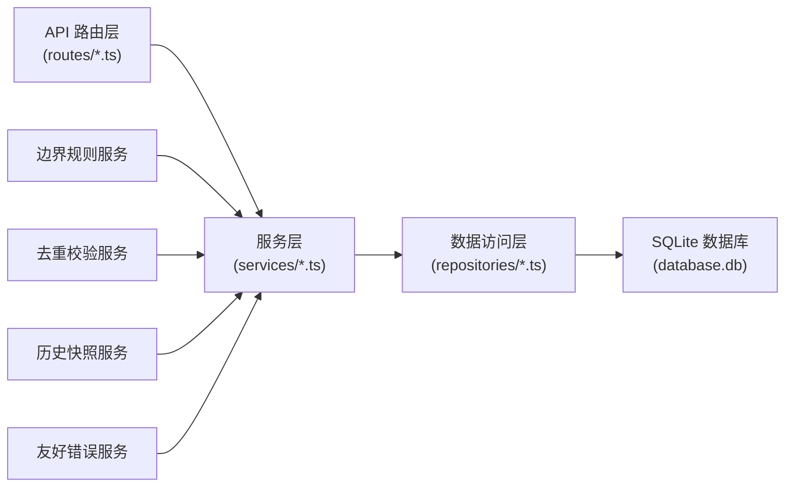
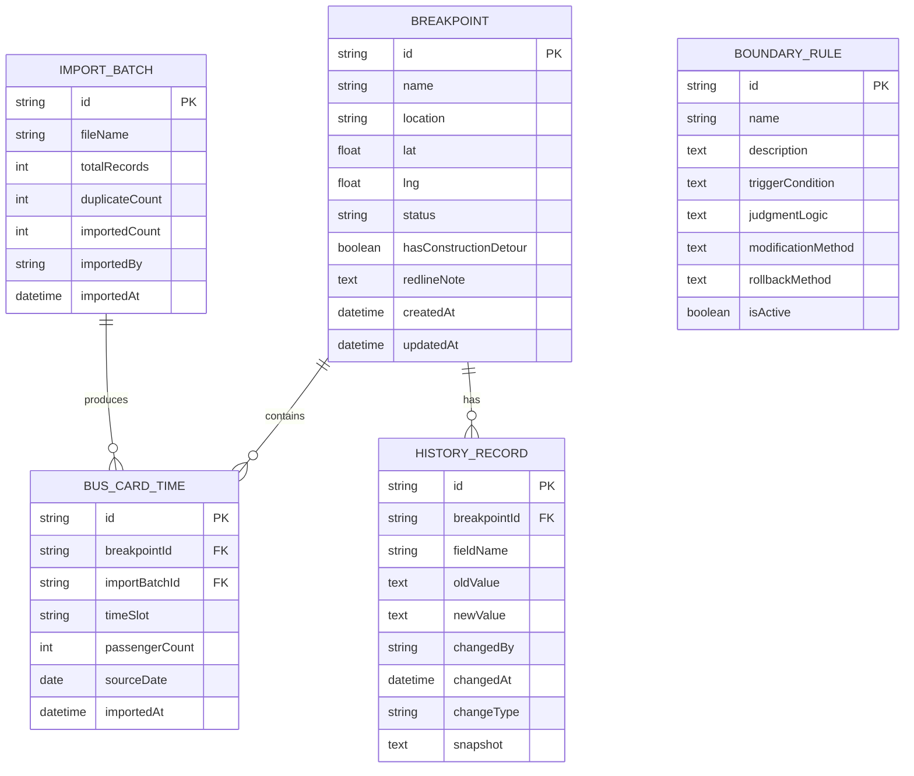

## 1. 架构设计



## 2. 技术描述

- **前端**：React@18 + TypeScript + Vite
- **样式**：tailwindcss@3 + lucide-react 图标
- **状态管理**：zustand
- **路由**：react-router-dom
- **图表**：recharts
- **后端**：Express@4 + TypeScript
- **数据库**：SQLite (better-sqlite3)，文件存储，无需额外服务
- **初始化工具**：vite-init

## 3. 路由定义

| 路由 | 页面 | 用途 |
|------|------|------|
| / | 工作台 | 三步工作流进度、待办事项、数据概览 |
| /breakpoints | 断点列表 | 所有断点的表格展示、筛选、搜索 |
| /breakpoints/:id | 断点详情 | 单个断点的完整信息、历史记录、操作 |
| /import | 数据导入 | 公交刷卡时段批量上传、去重预览 |
| /history | 历史记录 | 全量变更日志、字段级 diff 对比 |
| /visualization | 可视化 | 断点分布图表、绿道概览 |
| /rules | 规则配置 | 边界规则管理、判改回滚配置 |

## 4. API 定义

### 4.1 TypeScript 类型定义

```typescript
// 断点状态
type BreakpointStatus = 'pending_inspection' | 'inspecting' | 'pending_review' | 'confirmed' | 'completed';

// 断点
interface Breakpoint {
  id: string;
  name: string;
  location: string;
  coordinates: { lat: number; lng: number };
  status: BreakpointStatus;
  hasConstructionDetour: boolean;
  busCardTimes: BusCardTime[];
  redlineNote: string | null;
  createdAt: string;
  updatedAt: string;
}

// 公交刷卡时段
interface BusCardTime {
  id: string;
  breakpointId: string;
  importBatchId: string;
  timeSlot: string;
  passengerCount: number;
  sourceDate: string;
  importedAt: string;
}

// 导入批次
interface ImportBatch {
  id: string;
  fileName: string;
  totalRecords: number;
  duplicateCount: number;
  importedCount: number;
  importedBy: string;
  importedAt: string;
}

// 历史记录
interface HistoryRecord {
  id: string;
  breakpointId: string;
  fieldName: string;
  oldValue: string | null;
  newValue: string | null;
  changedBy: string;
  changedAt: string;
  changeType: 'create' | 'update' | 'status_change';
  snapshot: Record<string, unknown>;
}

// 边界规则
interface BoundaryRule {
  id: string;
  name: string;
  description: string;
  triggerCondition: string;
  judgmentLogic: string;
  modificationMethod: string;
  rollbackMethod: string;
  isActive: boolean;
}

// 友好错误
interface FriendlyError {
  code: string;
  message: string;
  suggestion: string;
  details?: string;
}
```

### 4.2 API 接口

| 方法 | 路径 | 说明 |
|------|------|------|
| GET | /api/breakpoints | 获取断点列表，支持筛选分页 |
| GET | /api/breakpoints/:id | 获取单个断点详情 |
| PATCH | /api/breakpoints/:id | 更新断点信息（含备注修改） |
| POST | /api/breakpoints/:id/mark-detour | 标记施工临时改道 |
| POST | /api/import/bus-card-times | 批量导入公交刷卡时段 |
| GET | /api/import/batches | 获取导入批次列表 |
| GET | /api/history/:breakpointId | 获取断点历史记录 |
| GET | /api/rules | 获取边界规则列表 |
| POST | /api/rules/:id/rollback | 按规则执行回滚 |

## 5. 服务器架构图



## 6. 数据模型

### 6.1 ER 图



### 6.2 DDL 语句

```sql
CREATE TABLE breakpoints (
  id TEXT PRIMARY KEY,
  name TEXT NOT NULL,
  location TEXT NOT NULL,
  lat REAL NOT NULL,
  lng REAL NOT NULL,
  status TEXT NOT NULL DEFAULT 'pending_inspection',
  has_construction_detour INTEGER NOT NULL DEFAULT 0,
  redline_note TEXT,
  created_at TEXT NOT NULL,
  updated_at TEXT NOT NULL
);

CREATE TABLE bus_card_times (
  id TEXT PRIMARY KEY,
  breakpoint_id TEXT NOT NULL,
  import_batch_id TEXT NOT NULL,
  time_slot TEXT NOT NULL,
  passenger_count INTEGER NOT NULL,
  source_date TEXT NOT NULL,
  imported_at TEXT NOT NULL,
  FOREIGN KEY (breakpoint_id) REFERENCES breakpoints(id),
  FOREIGN KEY (import_batch_id) REFERENCES import_batches(id),
  UNIQUE(breakpoint_id, time_slot, source_date)
);

CREATE TABLE import_batches (
  id TEXT PRIMARY KEY,
  file_name TEXT NOT NULL,
  total_records INTEGER NOT NULL,
  duplicate_count INTEGER NOT NULL DEFAULT 0,
  imported_count INTEGER NOT NULL DEFAULT 0,
  imported_by TEXT NOT NULL,
  imported_at TEXT NOT NULL
);

CREATE TABLE history_records (
  id TEXT PRIMARY KEY,
  breakpoint_id TEXT NOT NULL,
  field_name TEXT NOT NULL,
  old_value TEXT,
  new_value TEXT,
  changed_by TEXT NOT NULL,
  changed_at TEXT NOT NULL,
  change_type TEXT NOT NULL,
  snapshot TEXT NOT NULL,
  FOREIGN KEY (breakpoint_id) REFERENCES breakpoints(id)
);

CREATE TABLE boundary_rules (
  id TEXT PRIMARY KEY,
  name TEXT NOT NULL,
  description TEXT NOT NULL,
  trigger_condition TEXT NOT NULL,
  judgment_logic TEXT NOT NULL,
  modification_method TEXT NOT NULL,
  rollback_method TEXT NOT NULL,
  is_active INTEGER NOT NULL DEFAULT 1
);

CREATE INDEX idx_breakpoints_status ON breakpoints(status);
CREATE INDEX idx_breakpoints_detour ON breakpoints(has_construction_detour);
CREATE INDEX idx_bus_card_times_breakpoint ON bus_card_times(breakpoint_id);
CREATE INDEX idx_history_breakpoint ON history_records(breakpoint_id);
```
