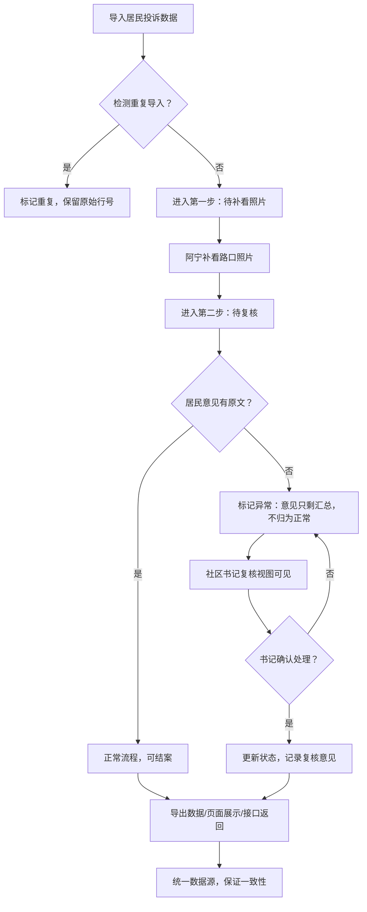

## 1. 产品概述

菜市场摊位外溢治理系统是城更项目管理工具，解决居民投诉处理流程中数据不一致、证据追溯难、交接信息断层等问题。目标用户为城更项目经理（阿宁）和社区书记，提供可追溯、可复核、可复盘的全流程治理记录。

## 2. 核心功能

### 2.1 用户角色

| 角色 | 核心权限 |
|------|----------|
| 城更项目经理（阿宁） | 导入投诉数据、补看路口照片、更新处理状态、执行自检、导出数据 |
| 社区书记 | 复核异常记录、查看全流程审计、确认最终结果 |

### 2.2 功能模块

1. **数据导入模块**：居民投诉编号批量导入，重复检测，原始行号留存
2. **三步工作流**：第一次导入 → 补看路口照片 → 冲突复核表更新
3. **异常处理**：居民意见只剩汇总无原文时标记为待复核，不自动归为正常
4. **审计追踪**：原始行号、人工改动记录、处理状态完整留痕
5. **自检系统**：重复导入检测、居民意见缺失检测、补录重算、导出一致性校验
6. **统一数据出口**：页面展示、接口返回、文件导出读取同一份数据源
7. **复盘记录**：操作日志完整，提供可重新运行的命令脚本

### 2.3 页面详情

| 页面名称 | 模块名称 | 功能描述 |
|----------|----------|----------|
| 工作台 | 数据概览 | 投诉总数、各状态数量、异常告警、自检结果摘要 |
| 投诉列表 | 数据表格 | 居民投诉编号、原始行号、处理状态、路口照片状态、居民意见状态 |
| 投诉详情 | 三步流程卡片 | 显示当前所处步骤，每步操作记录、时间、操作人 |
| 投诉详情 | 审计时间线 | 完整操作历史，包括人工改动前后对比 |
| 复核视图 | 异常列表 | 社区书记专属视图，集中展示待复核的"意见只剩汇总"记录 |
| 自检中心 | 检测执行 | 运行四项自检，展示检测结果和修复建议 |
| 数据导出 | 导出配置 | 选择导出范围，预览数据一致性，生成导出文件 |

## 3. 核心流程

居民投诉处理完整流程：数据导入 → 路口照片补录 → 自动异常检测 → 项目经理初审 → 社区书记复核 → 结案归档。

## 4. 用户界面设计

### 4.1 设计风格
- **主色调**：深蓝 #1e3a5f（专业、政府感）+ 暖橙 #f59e0b（警示、待处理）
- **辅助色**：翠绿 #10b981（正常）、红色 #ef4444（异常）、灰色 #6b7280（中性）
- **按钮风格**：直角微圆角（2px），扁平化，悬停有轻微阴影
- **字体**：思源黑体 / Noto Sans SC，正文14px，标题16-18px
- **布局风格**：顶部导航 + 左侧菜单 + 内容区卡片式布局，信息密度适中
- **图标风格**：Lucide 线性图标，简约专业

### 4.2 页面设计概述

| 页面名称 | 模块名称 | UI Elements |
|----------|----------|-------------|
| 工作台 | 数据概览 | 卡片式统计面板，状态色标签，异常告警醒目红色标识 |
| 投诉列表 | 数据表格 | 斑马纹行，状态色标签，悬停高亮，列可排序筛选 |
| 投诉详情 | 三步流程卡片 | 时间轴式步骤展示，当前步骤高亮，已完成步骤打钩 |
| 投诉详情 | 审计时间线 | 纵向时间线，每条记录显示操作人、时间、改动前后对比 |
| 复核视图 | 异常列表 | 卡片式异常项，红色边框突出，标注卡点步骤 |
| 自检中心 | 检测执行 | 四项检测卡片，运行进度条，结果展开详情 |

### 4.3 响应性
- Desktop-first 设计，适配 1280px 以上宽度
- 表格列支持横向滚动，小屏幕下优先级低的列可折叠
- 移动端保留核心列表和详情查看功能

### 4.4 交接体验设计
社区书记打开系统时：
1. 首页直接显示"待我复核"数量的醒目徽章
2. 复核视图每条异常记录明确标注"卡点：第X步 - 居民意见只剩汇总无原文"
3. 点击可直接查看完整审计链，无需询问项目经理
