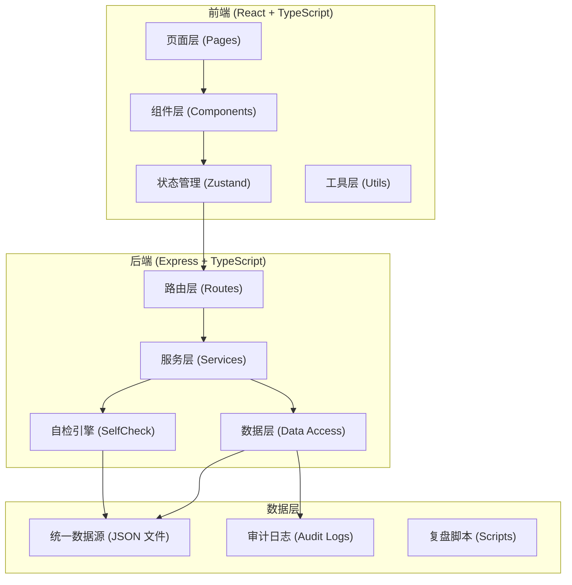
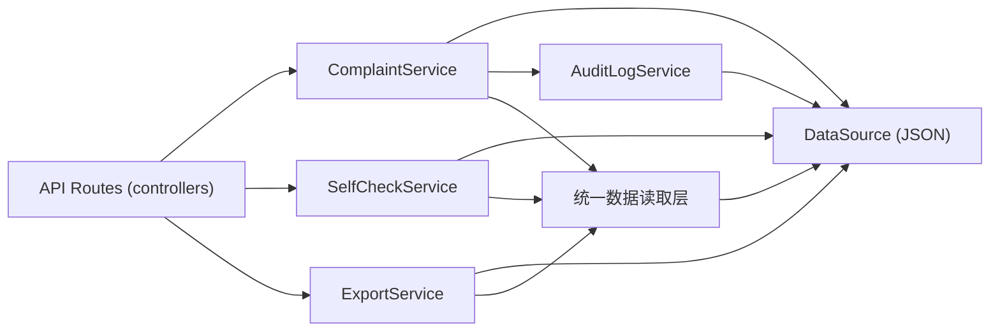
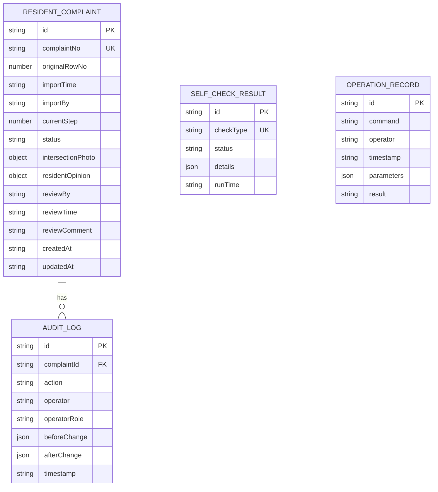

## 1. 架构设计



## 2. 技术描述

- **前端**：React@18 + TypeScript + TailwindCSS@3 + Vite + Zustand + React Router
- **后端**：Express@4 + TypeScript + ESM
- **数据存储**：本地 JSON 文件（便于复盘和版本追踪，无数据库依赖）
- **初始化工具**：vite-init react-express-ts 模板

## 3. 路由定义

| 前端路由 | 页面用途 |
|----------|----------|
| /dashboard | 工作台 - 数据概览和快捷操作 |
| /complaints | 投诉列表 - 所有投诉记录表格 |
| /complaints/:id | 投诉详情 - 三步流程和审计时间线 |
| /review | 复核视图 - 社区书记专属异常列表 |
| /self-check | 自检中心 - 运行四项检测 |
| /export | 数据导出 - 配置和预览导出 |

| 后端 API 路由 | 方法 | 用途 |
|---------------|------|------|
| /api/complaints | GET | 获取投诉列表 |
| /api/complaints/:id | GET | 获取单条投诉详情（含审计日志） |
| /api/complaints/import | POST | 批量导入投诉数据 |
| /api/complaints/:id/step | PATCH | 更新处理步骤 |
| /api/complaints/:id/status | PATCH | 更新处理状态 |
| /api/complaints/:id/photo | PATCH | 补录路口照片信息 |
| /api/complaints/:id/review | PATCH | 社区书记复核 |
| /api/self-check/run | POST | 运行自检 |
| /api/self-check/results | GET | 获取自检结果 |
| /api/export | GET | 导出数据（统一数据源） |

## 4. API 定义

### TypeScript 类型定义

```typescript
// 投诉处理状态
type ComplaintStatus = 'pending_photo' | 'pending_review' | 'normal' | 'missing_opinion' | 'resolved';

// 处理步骤
type ProcessStep = 1 | 2 | 3;

// 居民投诉记录
interface ResidentComplaint {
  id: string;
  complaintNo: string;           // 居民投诉编号
  originalRowNo: number;         // 原始行号
  importTime: string;
  importBy: string;
  currentStep: ProcessStep;      // 当前步骤：1-导入 2-补照片 3-复核
  status: ComplaintStatus;
  intersectionPhoto: {
    hasPhoto: boolean;
    photoUrl?: string;
    reviewedBy?: string;
    reviewTime?: string;
  };
  residentOpinion: {
    hasOriginal: boolean;        // 是否有原文
    summary: string;             // 汇总
    originalText?: string;       // 原文
  };
  reviewBy?: string;             // 社区书记复核人
  reviewTime?: string;
  reviewComment?: string;
  createdAt: string;
  updatedAt: string;
}

// 审计日志
interface AuditLog {
  id: string;
  complaintId: string;
  action: string;
  operator: string;
  operatorRole: 'manager' | 'secretary';
  beforeChange: any;
  afterChange: any;
  timestamp: string;
}

// 自检结果
interface SelfCheckResult {
  checkId: string;
  checkName: string;
  checkType: 'duplicate_import' | 'missing_opinion' | 'recalc_after_add' | 'export_consistency';
  status: 'pass' | 'warning' | 'error';
  message: string;
  details: any[];
  runTime: string;
}

// 操作记录（复盘用）
interface OperationRecord {
  id: string;
  command: string;
  operator: string;
  timestamp: string;
  parameters: any;
  result: 'success' | 'failed';
}
```

## 5. 服务器架构图



## 6. 数据模型

### 6.1 数据模型定义



### 6.2 数据文件结构

```
data/
  complaints.json      # 投诉主数据
  audit-logs.json      # 审计日志
  self-check-results.json  # 自检结果
  operation-records.json   # 操作记录（复盘用）
  export-snapshot.json     # 导出快照（用于一致性校验）
```

### 6.3 初始数据

系统启动时会创建示例数据，包含：
- 5条正常流程投诉记录
- 2条"居民意见只剩汇总无原文"的异常记录
- 1条重复导入记录
- 完整的审计日志链
