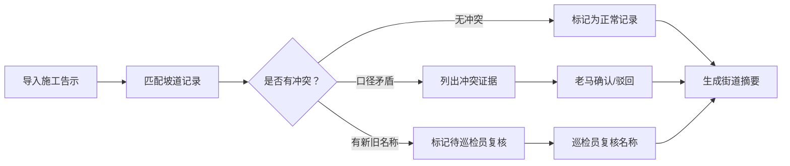

## 1. 产品概述

地铁口无障碍绕行管理系统，用于协助交通协管老马处理地铁口无障碍绕行记录的复核工作。解决同一小区新旧名称混淆、施工告示与无障碍坡道记录口径冲突等问题，提供清晰的变更追踪和街道级摘要输出。

- 核心目标：降低人工核对成本，确保绕行记录可追溯、口径一致
- 目标用户：交通协管老马、市政巡检员、街道办工作人员

## 2. 核心功能

### 2.1 用户角色
| 角色 | 登录方式 | 核心权限 |
|------|----------|----------|
| 交通协管老马 | 系统默认角色 | 导入施工告示、查看无障碍坡道记录、处理名称冲突、确认/驳回冲突、生成街道摘要 |
| 市政巡检员 | 系统默认角色 | 复核新旧名称冲突记录、标注最终确认名称 |
| 街道办查看 | 只读角色 | 查看汇总摘要和历史记录 |

### 2.2 功能模块
1. **记录列表页**：展示所有绕行记录，支持按状态筛选（正常/待复核/冲突/已完成）
2. **记录详情页**：展示单条记录完整信息，包含施工告示、坡道记录、变更历史
3. **冲突处理页**：列出施工告示与坡道记录的冲突证据，支持确认/驳回操作
4. **摘要生成页**：生成街道会看的汇总摘要，支持导出
5. **三步流程向导**：引导完成施工告示导入→补看坡道记录→生成街道摘要

### 2.3 页面详情
| 页面名称 | 模块名称 | 功能描述 |
|----------|----------|----------|
| 记录列表页 | 筛选区 | 按状态、小区名称、日期范围筛选 |
| 记录列表页 | 记录卡片 | 展示小区名称、状态标签、最后更新时间、操作按钮 |
| 记录详情页 | 基本信息区 | 地铁口、小区名称、绕行路线、无障碍设施情况 |
| 记录详情页 | 来源对比区 | 左右对比施工告示与坡道记录的差异 |
| 记录详情页 | 变更历史区 | 时间线展示谁改了什么、为什么改、影响结果 |
| 冲突处理页 | 冲突证据区 | 逐条列出矛盾点，高亮差异字段 |
| 冲突处理页 | 操作区 | 确认施工告示/确认坡道记录/驳回待核实 |
| 摘要生成页 | 统计概览 | 正常数、待复核数、冲突数、已补录数 |
| 摘要生成页 | 明细列表 | 按街道分组的绕行记录汇总 |

## 3. 核心流程

主流程：交通协管老马导入施工告示 → 系统自动匹配无障碍坡道记录 → 识别名称冲突和口径差异 → 老马复核冲突并选择确认或驳回 → 市政巡检员复核新旧名称 → 生成街道摘要

## 4. 用户界面设计

### 4.1 设计风格
- 主色调：政务蓝 (#1e40af) 搭配警示橙 (#f97316)
- 辅助色：成功绿 (#10b981)、警告黄 (#f59e0b)、危险红 (#ef4444)
- 中性色：深灰 (#1f2937)、中灰 (#6b7280)、浅灰 (#f3f4f6)
- 按钮风格：直角矩形，2px 边框，悬停时背景加深
- 字体："Noto Sans SC" 中文显示字体，清晰易读
- 布局：顶部导航 + 左侧筛选 + 主内容区的政务系统布局
- 图标：使用 lucide-react 线性图标，保持统一风格

### 4.2 页面设计概述
| 页面名称 | 模块名称 | UI 元素 |
|----------|----------|---------|
| 记录列表页 | 顶部导航 | 系统标题、当前角色、三步流程进度条 |
| 记录列表页 | 筛选侧边栏 | 状态标签组、日期选择器、搜索框 |
| 记录列表页 | 列表区 | 卡片式布局，状态用彩色标签标识 |
| 记录详情页 | 头部 | 小区名称大字、状态徽章、操作按钮组 |
| 记录详情页 | 双栏对比 | 左栏施工告示、右栏坡道记录，差异处红色高亮 |
| 记录详情页 | 时间线 | 垂直时间线，每条记录有操作人、时间、变更内容 |
| 冲突处理页 | 冲突列表 | 逐条冲突项，带来源标记、差异对比 |
| 冲突处理页 | 决策区 | 三个大号按钮：确认告示、确认坡道、驳回待查 |
| 摘要生成页 | 统计卡片 | 四个数据卡片，数字加大显示 |
| 摘要生成页 | 导出区 | 导出按钮、预览区域 |

### 4.3 响应式
- 桌面端优先设计，1200px 以上最优显示
- 平板端：侧边栏收起为抽屉，列表保持卡片布局
- 移动端：单列布局，筛选折叠，底部操作栏固定

### 4.4 动效设计
- 页面加载：内容区淡入 + 轻微上移
- 状态变更：状态标签颜色渐变过渡
- 冲突标记：差异处红色脉冲闪烁提示
- 时间线：滚动时逐条渐入显示
