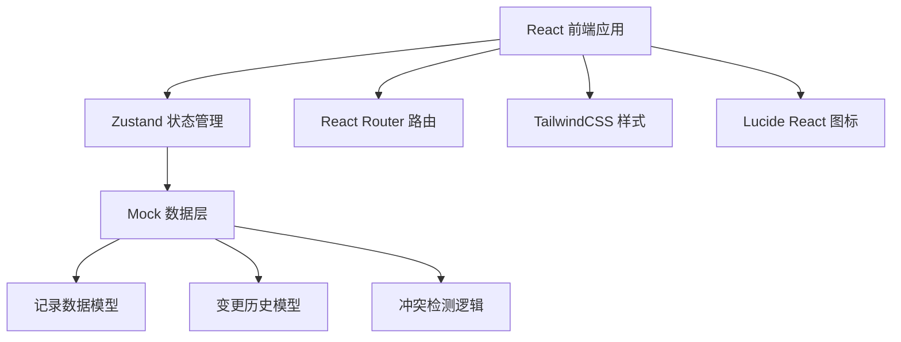
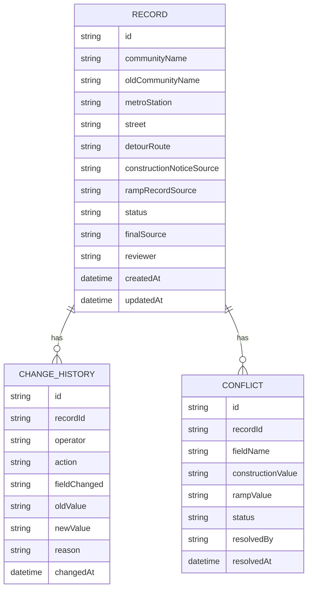

## 1. 架构设计



## 2. 技术描述

- **前端**：React 18 + TypeScript + Vite 5
- **样式方案**：TailwindCSS 3
- **状态管理**：Zustand
- **路由**：React Router DOM 6
- **图标**：lucide-react
- **后端**：纯前端 Mock，无后端服务
- **数据持久化**：LocalStorage（可选）

## 3. 路由定义

| 路由 | 用途 |
|------|------|
| / | 记录列表页（首页） |
| /record/:id | 记录详情页 |
| /conflict/:id | 冲突处理页 |
| /summary | 街道摘要页 |
| /wizard | 三步流程向导 |

## 4. 数据模型

### 4.1 数据模型定义



### 4.2 记录状态枚举

- `normal` - 正常（无冲突）
- `name_conflict` - 新旧名称冲突（待巡检员复核）
- `data_conflict` - 数据口径冲突（待老马确认）
- `completed` - 已完成复核
- `ramp_supplemented` - 坡道记录补录

### 4.3 样例数据说明

| 样例类型 | 小区名称 | 状态 | 说明 |
|----------|----------|------|------|
| 顺利记录 | 阳光花园 | normal | 施工告示与坡道记录完全一致 |
| 新旧名字冲突 | 幸福家园（旧名：幸福村小区） | name_conflict | 施工告示用新名，坡道记录用旧名 |
| 坡道补录旧口径 | 和平里小区 | ramp_supplemented | 坡道记录补充了施工告示缺失的无障碍信息 |
| 口径冲突 | 建设小区 | data_conflict | 施工告示说"有坡道"，坡道记录说"坡道损坏" |

## 5. 核心模块

### 5.1 冲突检测模块
- 对比施工告示与坡道记录的字段差异
- 识别小区名称新旧映射
- 生成冲突证据列表

### 5.2 变更历史模块
- 记录每次操作的操作人、时间、变更内容
- 说明变更原因和影响结果
- 时间线形式展示

### 5.3 摘要生成模块
- 按街道分组统计
- 生成各类状态数量汇总
- 支持文本导出

## 6. 组件结构

```
src/
├── components/
│   ├── layout/
│   │   ├── Header.tsx
│   │   ├── Sidebar.tsx
│   │   └── StepProgress.tsx
│   ├── record/
│   │   ├── RecordCard.tsx
│   │   ├── RecordDetail.tsx
│   │   ├── SourceComparison.tsx
│   │   └── ChangeTimeline.tsx
│   ├── conflict/
│   │   ├── ConflictItem.tsx
│   │   └── ConflictResolver.tsx
│   └── summary/
│       ├── StatCard.tsx
│       └── SummaryTable.tsx
├── pages/
│   ├── RecordList.tsx
│   ├── RecordDetail.tsx
│   ├── ConflictPage.tsx
│   ├── SummaryPage.tsx
│   └── WizardPage.tsx
├── store/
│   └── useRecordStore.ts
├── types/
│   └── index.ts
├── data/
│   └── mockData.ts
└── utils/
    ├── conflictDetector.ts
    └── summaryGenerator.ts
```
