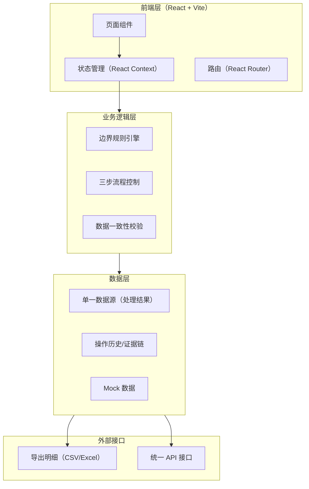
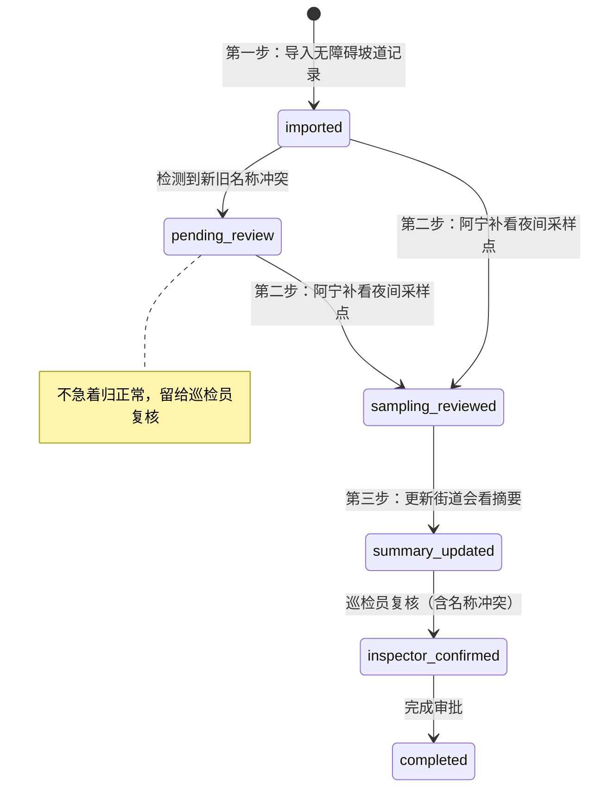

## 1. 架构设计



**核心设计原则：单一数据源**
- 所有页面展示、导出明细、API 返回均读取同一份处理结果数据
- 记录的任何修改都通过统一的数据变更接口执行，确保三处一致

## 2. 技术选型

- **前端框架**：React@18 + TypeScript
- **构建工具**：Vite@5
- **样式方案**：TailwindCSS@3
- **路由管理**：React Router@6
- **状态管理**：React Context + useReducer（轻量，满足需求）
- **图标库**：Lucide React
- **数据导出**：xlsx（Excel 导出）+ papaparse（CSV 处理）
- **Mock 数据**：内置 Mock 数据，无需后端

## 3. 路由定义

| 路由路径 | 页面名称 | 说明 |
|----------|----------|------|
| / | 审批工作台 | 首页，展示三步流程和记录列表 |
| /import | 数据导入 | 无障碍坡道记录导入 |
| /record/:id | 记录详情 | 单条记录完整证据链和数据对比 |
| /export | 摘要导出 | 街道会看摘要和明细导出 |
| /rules | 边界规则 | 规则说明和操作指引 |

## 4. 数据模型定义

### 4.1 核心数据结构

```typescript
// 审批记录主表
interface ApprovalRecord {
  id: string;                    // 唯一标识
  originalLineNumber: number;    // 原始行号（导入文件中的行号，永久保留）
  communityOldName?: string;     // 小区旧名称
  communityNewName?: string;     // 小区新名称
  communityFinalName?: string;   // 最终确认的小区名称
  hasNameConflict: boolean;      // 是否存在新旧名称冲突
  
  // 无障碍坡道记录
  rampRecord: {
    exists: boolean;             // 是否存在坡道
    location: string;            // 坡道位置
    condition: string;           // 坡道状况
    source: 'import';            // 数据来源
  };
  
  // 夜间采样点记录
  samplingPoint?: {
    exists: boolean;             // 是否有采样点
    location: string;            // 采样点位置
    credibility: 'high' | 'medium' | 'low';  // 可信度
    reviewedBy: string;          // 审阅人（阿宁）
    reviewedAt: Date;            // 审阅时间
  };
  
  // 处理状态
  status: 'imported' | 'pending_review' | 'sampling_reviewed' | 'summary_updated' | 'inspector_confirmed' | 'completed';
  currentStep: 1 | 2 | 3;        // 当前处于三步流程的哪一步
  
  // 街道会看摘要
  summary?: {
    content: string;              // 摘要内容
    updatedBy: string;
    updatedAt: Date;
  };
  
  // 处理人信息
  assignee?: 'aning' | 'inspector' | 'street';
  createdAt: Date;
  updatedAt: Date;
}

// 操作历史记录（证据链）
interface HistoryEntry {
  id: string;
  recordId: string;
  action: 'create' | 'update_status' | 'update_name' | 'add_sampling' | 'update_summary' | 'rollback';
  operator: string;              // 操作人
  operatorRole: string;          // 操作人角色
  timestamp: Date;
  field?: string;                // 修改的字段
  oldValue?: any;                // 修改前值
  newValue?: any;                // 修改后值
  remark?: string;               // 备注
}

// 边界规则
interface BoundaryRule {
  id: string;
  title: string;
  category: 'name_conflict' | 'rollback' | 'consistency' | 'exception';
  description: string;           // 规则描述（阿宁与巡检员交接风格）
  logic: string;                 // 判定逻辑
  example: string;               // 示例
}
```

### 4.2 状态流转定义



## 5. 边界规则引擎

### 5.1 新旧名称冲突判定规则

```typescript
// 规则 1：同一小区新旧名称判定
// - 导入时自动匹配：小区地址/坐标一致但名称不同 → 标记为新旧名称冲突
// - 冲突后状态：自动设为 pending_review，不自动合并
// - 最终确认权：市政巡检员确认后才写入 communityFinalName
```

### 5.2 数据一致性保证

```typescript
// 规则 2：三处数据一致
// - 单一数据源：所有展示/导出/API 均从 approvalRecords 读取
// - 修改拦截：任何修改必须经过 updateRecord() 统一接口
// - 实时校验：导出前自动校验三处哈希值一致
```

### 5.3 回滚规则

```typescript
// 规则 3：操作可回滚
// - 每次状态变更均生成 HistoryEntry
// - 可回滚到任意历史状态
// - 回滚操作本身也记录到历史中
```

## 6. 目录结构

```
src/
├── components/          # 公共组件
│   ├── Layout.tsx       # 布局组件
│   ├── StatusTag.tsx    # 状态标签
│   ├── Timeline.tsx     # 时间线组件
│   └── DataCompare.tsx  # 数据对比组件
├── pages/               # 页面组件
│   ├── Workbench.tsx    # 审批工作台
│   ├── Import.tsx       # 数据导入
│   ├── RecordDetail.tsx # 记录详情
│   ├── Export.tsx       # 摘要导出
│   └── Rules.tsx        # 边界规则
├── store/               # 状态管理
│   ├── AppContext.tsx   # 全局 Context
│   └── reducer.ts       # Reducer 逻辑
├── types/               # 类型定义
│   └── index.ts
├── data/                # Mock 数据和规则
│   ├── mockRecords.ts   # 模拟审批记录
│   └── boundaryRules.ts # 边界规则定义
├── utils/               # 工具函数
│   ├── export.ts        # 导出功能
│   └── consistency.ts   # 一致性校验
└── App.tsx              # 路由入口
```
