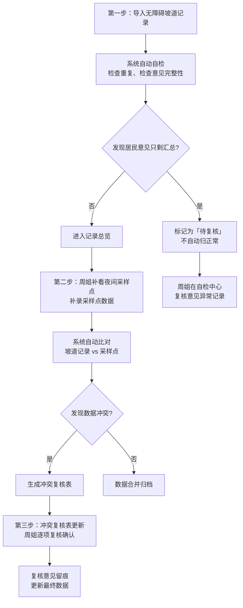

## 1. 产品概述

面向社区居委会的"施工围挡绕行告示"管理工具，解决无障碍坡道记录与夜间采样点数据冲突、居民意见丢失追溯难的问题。社区书记周姐能一眼看到问题出在哪、谁改的、改了啥，不用翻一堆Excel。

- 核心目标：让数据对得上、问题留痕迹、复核有依据
- 目标用户：社区书记、居委会工作人员

## 2. 核心功能

### 2.1 用户角色

| 角色 | 登录方式 | 核心权限 |
|------|----------|----------|
| 社区书记 | 账号密码 | 导入数据、复核冲突、导出结果、查看完整操作痕迹 |
| 工作人员 | 账号密码 | 录入数据、标记问题、发起复核 |

### 2.2 功能模块

1. **数据导入页**：无障碍坡道记录导入、夜间采样点补录、重复导入自动拦截
2. **记录总览页**：所有记录列表、状态筛选、异常高亮、原始行号追溯
3. **冲突复核页**：无障碍坡道与夜间采样点冲突列表、逐项复核、复核意见留痕
4. **自检中心页**：四项自检（重复导入、意见缺原文、补录重算、导出一致性）
5. **导出页面**：明细导出、确保与页面、接口返回同一份数据

### 2.3 页面详情

| 页面名称 | 模块名称 | 功能描述 |
|---------|----------|----------|
| 数据导入页 | 导入区域 | 拖拽/点击上传Excel，显示导入进度，重复记录自动标红提示 |
| 数据导入页 | 补录区域 | 夜间采样点单独补录入口，补录后自动触发重算 |
| 记录总览页 | 记录列表 | 显示原始行号、处理状态、最后修改人、修改时间、居民意见原文/摘要 |
| 记录总览页 | 筛选区域 | 按状态筛选（正常/待复核/冲突/已归档），按来源筛选（坡道/采样点） |
| 冲突复核页 | 冲突列表 | 逐条展示冲突双方数据，标注差异点，提供"合并/保留坡道/保留采样点"操作 |
| 冲突复核页 | 复核留痕 | 每条复核记录操作人、时间、意见全部留存 |
| 自检中心页 | 四项自检卡片 | 每项自检显示结果数量，点击展开详情，可一键处理 |
| 自检中心页 | 意见异常处理 | 居民意见只剩汇总的记录，单独列表，标记"待书记复核"，不自动归正常 |
| 导出页面 | 导出预览 | 导出前预览数据，确认与页面展示一致后再导出 |

## 3. 核心流程

### 三步核心操作流程

### 数据一致性保障

- 页面展示、接口返回、导出文件，三者读取同一份处理结果
- 每次数据变更（补录、复核）后自动重算，确保三方同步
- 原始行号、人工修改记录、处理状态全程保留，可追溯到每一步

## 4. 用户界面设计

### 4.1 设计风格

- 主色调：政务蓝（#1e40af）+ 警示橙（#f97316）+ 成功绿（#10b981）
- 按钮风格：圆角8px，悬浮时轻微上浮+阴影
- 字体：思源黑体（清晰易读，适合长时间办公）
- 布局：顶部导航 + 左侧菜单 + 主内容区卡片式布局
- 图标：lucide-react线性图标，简洁明了

### 4.2 页面设计要点

| 页面名称 | 模块名称 | UI设计重点 |
|---------|----------|------------|
| 记录总览 | 异常高亮 | 待复核记录橙底色，冲突记录红底色，一目了然 |
| 记录总览 | 操作痕迹 | 每条记录展开可看修改历史：谁、什么时候、改了什么 |
| 冲突复核 | 差异对比 | 左右两列对比冲突数据，差异点黄底高亮 |
| 自检中心 | 卡片设计 | 四项自检做成四张状态卡片，数字醒目，颜色对应状态 |
| 数据导入 | 进度反馈 | 导入时显示进度条，完成后显示"成功X条，重复Y条，异常Z条" |

### 4.3 响应式

- 桌面端优先设计，适配1366px及以上宽度
- 表格列支持横向滚动，保证小屏幕也能看全
- 按钮、输入框最小40px高度，便于触控操作

### 4.4 交互细节

- 状态标签用颜色区分：绿=正常，橙=待复核，红=冲突，灰=已归档
- 鼠标悬停在原始行号上，tooltip显示原始导入文件信息
- 修改记录用时间线样式展示，清晰看出变更顺序
- 重要操作（如复核确认、导出）需要二次确认，防止误操作
