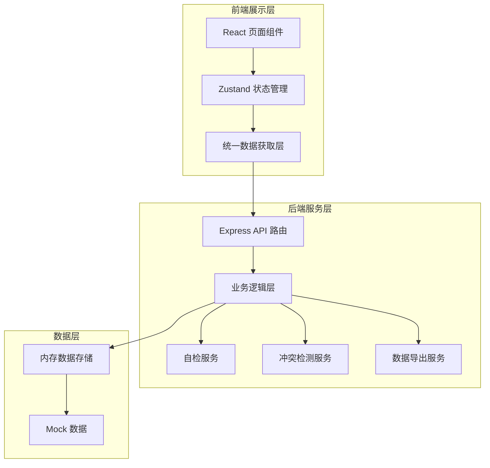
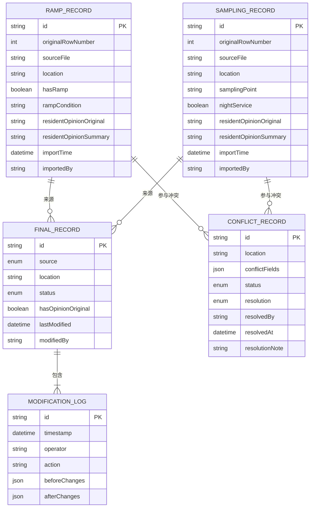

## 1. 架构设计



## 2. 技术描述

- 前端：React@18 + TypeScript + Vite + TailwindCSS@3 + Zustand + React Router
- 后端：Express@4 + TypeScript
- 数据存储：内存存储（开发阶段）+ Mock数据
- UI组件：lucide-react图标库
- 导出功能：SheetJS (xlsx) 处理Excel导入导出

## 3. 路由定义

| 路由路径 | 页面名称 | 功能 |
|---------|----------|------|
| / | 记录总览页 | 所有记录列表、筛选、查看详情 |
| /import | 数据导入页 | 坡道记录导入、采样点补录 |
| /conflicts | 冲突复核页 | 冲突列表、逐项复核 |
| /self-check | 自检中心页 | 四项自检、异常处理 |
| /export | 导出页面 | 数据预览、导出Excel |

## 4. API 定义

### 4.1 类型定义

```typescript
// 记录来源
type RecordSource = 'ramp' | 'sampling' | 'merged';

// 处理状态
type RecordStatus = 'normal' | 'pending_review' | 'conflict' | 'archived';

// 无障碍坡道记录
interface RampRecord {
  id: string;
  originalRowNumber: number;       // 原始行号
  sourceFile: string;              // 来源文件名
  location: string;                // 位置
  hasRamp: boolean;                // 是否有无障碍坡道
  rampCondition: string;           // 坡道状况
  residentOpinionOriginal?: string;// 居民意见原文
  residentOpinionSummary: string;  // 居民意见汇总
  importTime: string;              // 导入时间
  importedBy: string;              // 导入人
}

// 夜间采样点记录
interface SamplingRecord {
  id: string;
  originalRowNumber: number;
  sourceFile: string;
  location: string;
  samplingPoint: string;           // 采样点名称
  nightService: boolean;           // 是否夜间服务
  residentOpinionOriginal?: string;
  residentOpinionSummary: string;
  importTime: string;
  importedBy: string;
}

// 合并后的最终记录
interface FinalRecord {
  id: string;
  source: RecordSource;
  location: string;
  status: RecordStatus;
  rampData?: RampRecord;
  samplingData?: SamplingRecord;
  residentOpinionOriginal?: string;
  residentOpinionSummary: string;
  hasOpinionOriginal: boolean;     // 是否有意见原文（自检用）
  lastModified: string;
  modifiedBy: string;
  modificationHistory: ModificationLog[];
}

// 修改日志
interface ModificationLog {
  id: string;
  timestamp: string;
  operator: string;
  action: string;                  // 操作描述
  beforeChanges?: Record<string, any>;
  afterChanges?: Record<string, any>;
}

// 冲突记录
interface ConflictRecord {
  id: string;
  location: string;
  rampRecord: RampRecord;
  samplingRecord: SamplingRecord;
  conflictFields: string[];        // 冲突字段
  status: 'pending' | 'resolved';
  resolution?: 'keep_ramp' | 'keep_sampling' | 'merge';
  resolvedBy?: string;
  resolvedAt?: string;
  resolutionNote?: string;
}

// 自检结果
interface SelfCheckResult {
  duplicateImports: FinalRecord[];
  missingOpinionOriginal: FinalRecord[];
  recalculationNeeded: FinalRecord[];
  exportConsistency: {
    isConsistent: boolean;
    mismatches: Array<{
      recordId: string;
      field: string;
      pageValue: any;
      exportValue: any;
    }>;
  };
}
```

### 4.2 接口列表

| 方法 | 路径 | 说明 |
|------|------|------|
| GET | /api/records | 获取所有记录（支持筛选） |
| GET | /api/records/:id | 获取单条记录详情（含修改历史） |
| POST | /api/import/ramp | 导入无障碍坡道记录 |
| POST | /api/import/sampling | 导入/补录夜间采样点 |
| GET | /api/conflicts | 获取冲突列表 |
| POST | /api/conflicts/:id/resolve | 解决冲突 |
| GET | /api/self-check | 执行四项自检 |
| POST | /api/self-check/resolve-opinion | 复核意见异常记录 |
| GET | /api/export/preview | 导出预览数据 |
| GET | /api/export/download | 下载Excel文件 |

## 5. 数据模型



## 6. 核心业务逻辑设计

### 6.1 重复导入检测
- 按「位置 + 来源文件」去重
- 检测到重复时保留原始记录，标记新导入为重复
- 提供"覆盖导入"和"跳过重复"选项

### 6.2 意见完整性检测
- 检查 residentOpinionOriginal 字段是否为空或undefined
- 若只有summary没有original，标记为 pending_review 状态
- 不自动修复，留待社区书记复核

### 6.3 补录后自动重算
- 补录采样点数据后，自动触发：
  1. 与坡道记录按位置匹配
  2. 检测冲突字段
  3. 生成冲突记录或合并数据
  4. 更新所有相关记录的状态

### 6.4 导出一致性保障
- 页面、接口、导出使用同一份 finalRecords 数据源
- 导出前执行一致性校验：比对页面展示数据与即将导出的数据
- 发现不一致时阻止导出并提示

### 6.5 修改痕迹留存
- 每次修改（导入、补录、复核、状态变更）都写入 modificationHistory
- 记录修改人、时间、修改前后字段值
- 前端可展开查看完整时间线
