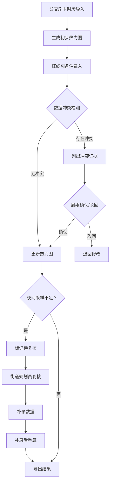

# 城市更新租户安置系统 PRD

## 1. 产品概述

本系统是面向社区基层工作人员的城市更新租户安置数据处理平台，重点解决公交刷卡时段与红线图备注数据冲突、热力图异常检测、数据补录重算等业务痛点。

- 主要目标：为社区书记周姐等一线工作人员提供直观、高效、容错的数据分析工具，减少人工核对成本，提高安置数据处理效率。

## 2. 核心功能

### 2.1 用户角色

| 角色 | 注册方式 | 核心权限 |
|------|----------|----------|
| 社区书记（周姐） | 系统内置账号 | 导入数据导入、查看热力图、处理数据冲突、确认或驳回矛盾数据 |
| 街道规划员 | 系统内置账号 | 复核异常热力图复核、导出数据 |
| 系统管理员 | 系统内置账号 | 配置系统配置、用户管理 |

### 2.2 功能模块

1. **数据导入**：公交刷卡时段导入、红线图备注导入、补录数据导入
2. **热力图展示**：实时热力图渲染、历史记录对比、异常标注
3. **冲突检测**：自动检测公交刷卡时段与红线图备注矛盾、列出冲突证据
4. **审批流程**：社区书记确认/驳回、规划员复核异常
5. **自检中心**：重复导入检测、夜间采样不足检测、补录重算验证、导出一致性校验
6. **历史记录**：操作日志、版本回溯、数据对比

### 2.3 页面详情

| 页面名称 | 模块名称 | 功能描述 |
|----------|----------|----------|
| 首页 | 数据概览 | 展示当前项目列表、待处理事项、异常预警 |
| 数据导入 | 公交刷卡导入 | 支持Excel/CSV导入，实时预览，重复检测 |
| 数据导入 | 红线图备注导入 | 支持图片/PDF上传，OCR识别关键信息 |
| 热力图页面 | 热力图展示 | 区域热力渲染、时间轴滑动、历史对比 |
| 冲突处理 | 冲突列表 | 列出所有数据冲突项，展示证据对比 |
| 冲突处理 | 冲突详情 | 公交刷卡数据 vs 红线图备注并排对比 |
| 自检中心 | 自检仪表盘 | 四项核心自检项执行与结果展示 |
| 历史记录 | 操作日志 | 所有操作的时间线记录 |
| 历史记录 | 版本对比 | 不同版本数据并排对比 |

## 3. 核心流程

### 3.1 主业务流程描述

1. 公交刷卡时段第一次导入 → 系统自动生成初步热力图
2. 社区书记周姐补看红线图备注并录入系统
3. 系统自动检测公交刷卡时段与红线图备注是否矛盾
4. 若存在矛盾，列出冲突证据，由周姐选择确认或驳回
5. 若热力图出现夜间采样不足导致偏低时，标记为待复核状态
6. 街道规划员复核异常热力图
7. 补录数据后系统自动重算热力图
8. 导出最终结果

### 3.2 流程图

## 4. 用户界面设计

### 4.1 设计风格

- **主色调**：深蓝色 (#1e3a5f) 代表专业、可信赖
- **辅助色**：橙色 (#f59e0b) 用于警示、待处理事项
- **成功色**：绿色 (#10b981) 用于已确认、正常状态
- **错误色**：红色 (#ef4444) 用于冲突、异常
- **按钮样式**：圆角8px，悬停时有轻微阴影
- **字体**：Noto Sans SC（中文支持好，现代感）
- **布局风格**：侧边栏导航 + 卡片式内容区
- **图标风格**：Lucide 线性图标，简洁现代

### 4.2 页面设计概览

| 页面名称 | 模块名称 | UI元素 |
|----------|----------|--------|
| 首页 | 数据概览 | 统计卡片、待办列表、异常预警横幅 |
| 热力图页面 | 热力图展示 | 地图容器、时间滑块、图例、历史对比切换 |
| 冲突处理 | 冲突列表 | 表格、状态标签、操作按钮 |
| 冲突处理 | 冲突详情 | 左右分栏对比、证据卡片、确认/驳回按钮 |
| 自检中心 | 自检仪表盘 | 四个自检项卡片、执行按钮、结果详情展开 |

### 4.3 响应式

- 桌面端优先设计（1280px及以上
- 平板端自适应（768px-1279px）：侧边栏可收起
- 移动端适配（<768px）：底部导航栏，卡片堆叠布局

### 4.4 错误提示设计原则

- 直接说人话，不使用内部字段名
- 提供具体的解决建议
- 错误信息格式：问题描述 + 影响范围 + 建议操作
- 示例：❌ 检测到3条重复导入记录，可能导致热力图数据重复统计，建议去重后重新导入
