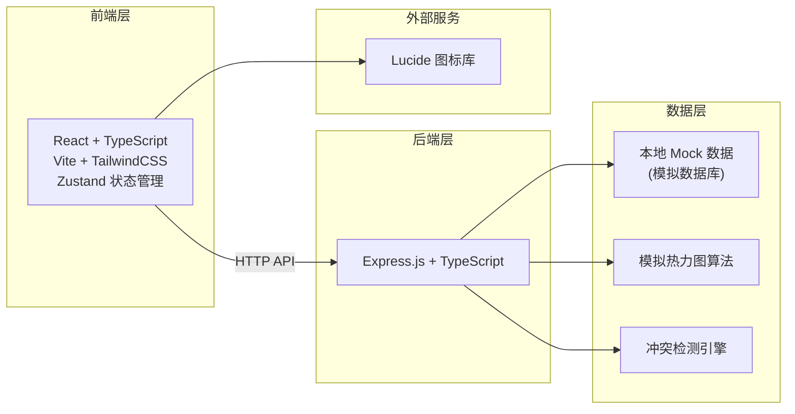
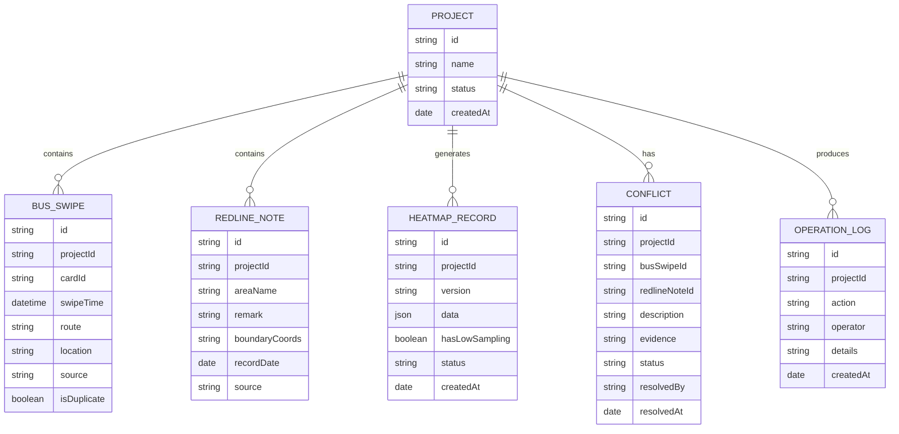

# 城市更新租户安置系统 技术架构文档

## 1. 架构设计



## 2. 技术说明

- **前端**: React@18 + TypeScript + Vite + TailwindCSS@3 + Zustand + react-router-dom
- **初始化工具**: vite-init
- **后端**: Express@4 + TypeScript
- **数据库**: 本地 Mock 数据（前端内置模拟数据，便于演示）
- **热力图渲染**: 基于 Canvas 的自定义热力图组件
- **图标**: lucide-react

## 3. 路由定义

| 路由 | 页面 | 用途 |
|------|------|------|
| / | 首页 | 数据概览、待办列表 |
| /import | 数据导入 | 公交刷卡、红线图备注导入 |
| /heatmap | 热力图 | 热力图展示、时间轴、历史对比 |
| /conflicts | 冲突处理 | 冲突列表、详情、确认/驳回 |
| /self-check | 自检中心 | 四项核心自检功能 |
| /history | 历史记录 | 操作日志、版本对比 |

## 4. 数据模型

### 4.1 数据模型定义



### 4.2 核心类型定义

```typescript
// 项目
interface Project {
  id: string;
  name: string;
  status: 'pending' | 'processing' | 'completed' | 'reviewing';
  createdAt: string;
}

// 公交刷卡记录
interface BusSwipeRecord {
  id: string;
  projectId: string;
  cardId: string;
  swipeTime: string;
  route: string;
  location: string;
  source: 'normal' | 'wrong' | 'supplement';
  isDuplicate?: boolean;
}

// 红线图备注
interface RedlineNote {
  id: string;
  projectId: string;
  areaName: string;
  remark: string;
  boundaryCoords: string;
  recordDate: string;
  source: 'normal' | 'wrong' | 'supplement';
}

// 热力图数据
interface HeatmapData {
  id: string;
  projectId: string;
  version: string;
  data: Array<{ x: number; y: number; value: number; time: string }>;
  hasLowSampling: boolean;
  lowSamplingAreas?: string[];
  status: 'draft' | 'pending_review' | 'confirmed';
  createdAt: string;
}

// 冲突记录
interface ConflictRecord {
  id: string;
  projectId: string;
  busSwipeId: string;
  redlineNoteId: string;
  description: string;
  evidence: {
    busSwipe: BusSwipeRecord;
    redlineNote: RedlineNote;
    contradiction: string;
  };
  status: 'pending' | 'confirmed' | 'rejected';
  resolvedBy?: string;
  resolvedAt?: string;
}

// 自检结果
interface SelfCheckResult {
  type: 'duplicate' | 'low_sampling' | 'recalculation' | 'export_consistency';
  name: string;
  status: 'pass' | 'warning' | 'error';
  message: string;
  details?: any;
}

// 操作日志
interface OperationLog {
  id: string;
  projectId: string;
  action: string;
  operator: string;
  details: string;
  createdAt: string;
}
```

## 5. 核心算法说明

### 5.1 冲突检测算法

检测公交刷卡时段与红线图备注的矛盾：

1. 时间窗口匹配：比较刷卡时间与红线图记录日期
2. 地理位置匹配：比较刷卡站点与红线图区域
3. 矛盾判定规则：
   - 刷卡时间在红线图划定的"已拆迁"时间段内 → 冲突
   - 刷卡地点在红线图划定的"已清空"区域内 → 冲突
   - 同一区域内公交刷卡量骤降但红线图未标注 → 潜在冲突

### 5.2 夜间采样不足检测

1. 按小时统计各区域公交刷卡量
2. 夜间时段（22:00-06:00）采样量低于日间平均值30%
3. 标记该区域为"采样不足"，热力图显示为偏冷色调
4. 自动标记为"待街道规划员复核"状态

### 5.3 热力图重算机制

1. 补录数据导入后，自动触发重算
2. 保留历史版本，支持回滚
3. 重算后自动执行自检
4. 生成操作日志记录重算过程
