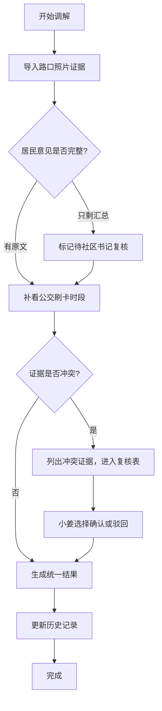

## 1. 产品概述

夜间经济噪声调解系统是面向街道规划员的证据整合与冲突复核工具，用于将"路口照片主流程"和"公交刷卡时段现场说法"两类证据统一呈现，支持三类处理结果的区分展示，确保证据链可追溯、冲突可人工复核。

- 核心用户：街道规划员小姜、社区书记
- 核心价值：避免结论虚满、证据断链，确保调解过程留痕可查

## 2. 核心功能

### 2.1 用户角色

| 角色 | 操作方式 | 核心权限 |
|------|----------|----------|
| 街道规划员小姜 | 系统登录/直接操作 | 导入证据、补看公交刷卡时段、提交冲突复核、查看历史记录 |
| 社区书记 | 复核入口 | 审核"居民意见只剩汇总"的记录、确认最终结论 |

### 2.2 功能模块

1. **调解工作台**：案件列表、新建调解、证据录入三步流程
2. **证据整合面板**：路口照片证据区、公交刷卡时段证据区、统一结果展示
3. **冲突复核表**：冲突证据对比、确认/驳回操作、复核历史
4. **历史记录追踪**：操作日志、证据版本、状态变更时间线

### 2.3 页面详情

| 页面名称 | 模块名称 | 功能描述 |
|----------|----------|----------|
| 调解工作台 | 案件列表 | 展示所有调解案件，按状态分类（正常/待复核/冲突/补录） |
| 调解工作台 | 三步流程引导 | 路口照片导入 → 补看公交刷卡时段 → 冲突复核表更新 |
| 证据详情页 | 路口照片区 | 展示主流程证据，包含照片、时间、地点、描述 |
| 证据详情页 | 公交刷卡时段区 | 展示现场说法证据，包含刷卡记录、时段、证人描述 |
| 证据详情页 | 统一结果区 | 整合两类证据，标注处理结果类型（顺利/汇总待复核/旧口径补录） |
| 冲突复核表 | 冲突对比 | 并列展示矛盾证据，标注冲突点来源 |
| 冲突复核表 | 复核操作 | 确认/驳回按钮，需人工选择，不自动拍板 |
| 历史记录 | 时间线 | 展示所有操作节点、证据版本、状态变更 |

## 3. 核心流程

用户进入工作台后选择案件，按三步流程操作：
1. 第一次导入路口照片证据，系统初步归类
2. 街道规划员补看公交刷卡时段，系统检测是否存在冲突
3. 若无冲突自动生成结果；若有冲突则进入复核表，由人工确认/驳回
特殊情况：居民意见只剩汇总没有原文时，自动标记为"待社区书记复核"，不自动归正常

## 4. 用户界面设计

### 4.1 设计风格
- 主色调：政务蓝 (#1e40af) 搭配 沉稳灰 (#374151)
- 辅助色：正常绿 (#10b981)、待办黄 (#f59e0b)、冲突红 (#ef4444)
- 按钮风格：方正略带圆角，实心填充为主，次要操作用线框
- 字体：思源黑体为主，标题加粗，正文常规
- 布局风格：左右分栏，左侧导航+列表，右侧详情面板，卡片式分区
- 图标风格：线性图标，简洁清晰，避免过度装饰

### 4.2 页面设计概述

| 页面名称 | 模块名称 | UI元素 |
|----------|----------|--------|
| 调解工作台 | 顶部导航 | Logo、系统名称、用户信息、消息提醒 |
| 调解工作台 | 左侧案件列表 | 案件卡片，带状态标签色点，点击高亮 |
| 调解工作台 | 右侧流程区 | 三步进度条，当前步骤高亮，已完成步骤打勾 |
| 证据详情页 | 双栏证据区 | 左路口照片、右公交刷卡时段，卡片阴影区分 |
| 证据详情页 | 结果标签 | 三种结果用不同色胶囊标签：顺利(绿)、待复核(黄)、补录(蓝) |
| 冲突复核表 | 对比表格 | 两列并排，冲突行用红色背景高亮 |
| 冲突复核表 | 操作区 | 确认(绿)、驳回(红)大按钮，下方备注输入框 |
| 历史记录 | 时间线 | 左侧竖线，节点圆点，右侧操作描述+时间 |

### 4.3 响应性
- 桌面端优先设计，最低支持1280px宽度
- 平板端自适应，案件列表可收起
- 关键操作按钮确保触控区域足够

## 5. 样例数据要求

系统预置三条样例记录，覆盖三种处理结果：
1. **顺利记录**：路口照片和公交刷卡时段证据一致，居民意见完整
2. **居民意见只剩汇总**：路口照片有，但居民意见仅存汇总无原文，标记待复核
3. **旧口径补录**：从公交刷卡时段补录的历史口径，与主流程证据有时间差，标注补录来源
