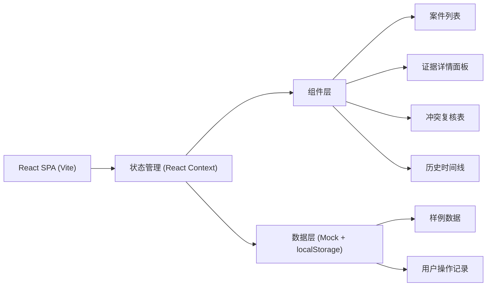
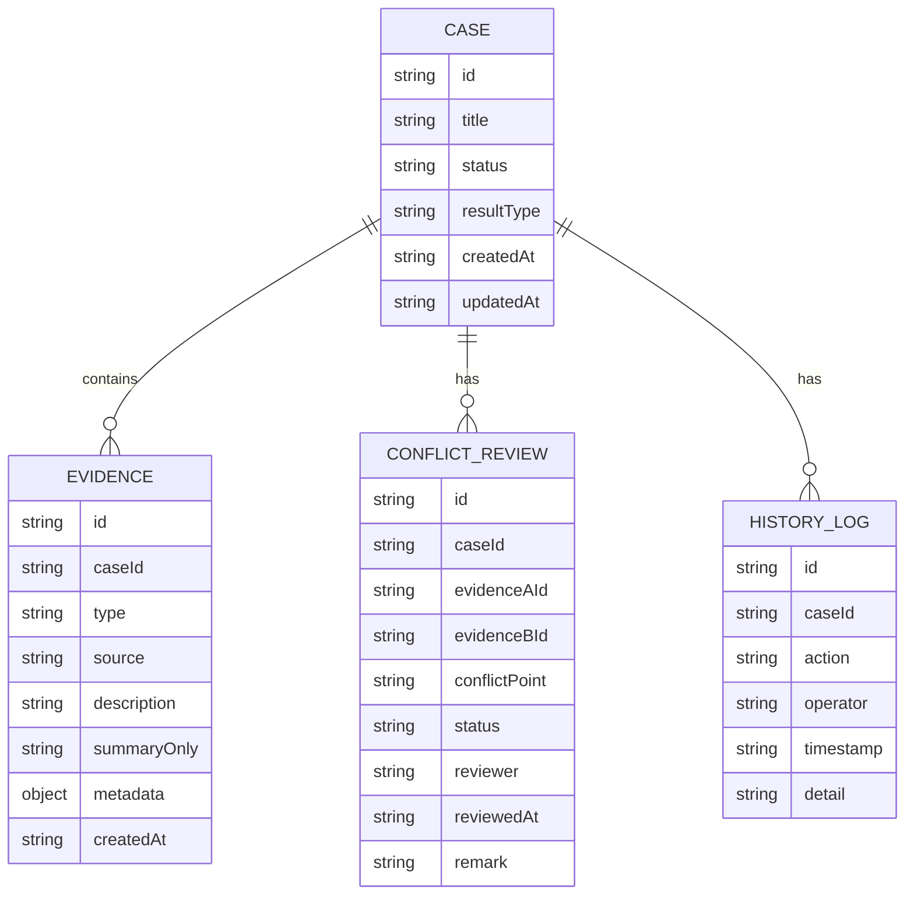

## 1. 架构设计

本系统为纯前端单页应用，使用React + TypeScript构建，数据采用本地Mock + localStorage持久化，无需后端服务。



## 2. 技术描述

- **前端框架**: React@18 + TypeScript
- **构建工具**: Vite@5
- **样式方案**: Tailwind CSS@3
- **路由**: React Router DOM@6
- **状态管理**: React Context + useReducer
- **数据持久化**: localStorage
- **图标**: Lucide React
- **日期处理**: date-fns

## 3. 路由定义

| 路由 | 用途 |
|------|------|
| / | 工作台首页，案件列表 + 三步流程引导 |
| /case/:id | 案件详情页，证据整合面板 + 冲突复核表 + 历史记录 |

## 4. 数据模型

### 4.1 数据模型定义



### 4.2 TypeScript类型定义

```typescript
type CaseStatus = 'normal' | 'pending_review' | 'conflict' | 'supplemented';
type ResultType = 'smooth' | 'summary_only' | 'old_supplemented';
type EvidenceType = 'road_photo' | 'bus_card';
type ConflictStatus = 'pending' | 'confirmed' | 'rejected';

interface Case {
  id: string;
  title: string;
  address: string;
  status: CaseStatus;
  resultType: ResultType;
  currentStep: number;
  createdAt: string;
  updatedAt: string;
}

interface Evidence {
  id: string;
  caseId: string;
  type: EvidenceType;
  source: string;
  title: string;
  description: string;
  hasOriginalText: boolean;
  summary?: string;
  metadata: Record<string, any>;
  createdAt: string;
}

interface ConflictItem {
  id: string;
  caseId: string;
  evidenceA: Evidence;
  evidenceB: Evidence;
  conflictPoint: string;
  status: ConflictStatus;
  reviewer?: string;
  reviewedAt?: string;
  remark?: string;
}

interface HistoryLog {
  id: string;
  caseId: string;
  action: string;
  operator: string;
  timestamp: string;
  detail: string;
}
```

## 5. 核心模块结构

```
src/
├── components/
│   ├── Layout/              # 布局组件
│   ├── CaseList/            # 案件列表
│   ├── StepProgress/        # 三步进度条
│   ├── EvidencePanel/       # 证据面板
│   ├── ConflictReviewTable/ # 冲突复核表
│   └── HistoryTimeline/     # 历史时间线
├── context/
│   └── CaseContext.tsx      # 案件状态管理
├── data/
│   └── mockData.ts          # 样例数据(三种类型)
├── hooks/
│   └── useLocalStorage.ts   # 持久化Hook
├── types/
│   └── index.ts             # 类型定义
├── pages/
│   ├── Dashboard.tsx        # 工作台
│   └── CaseDetail.tsx       # 案件详情
├── App.tsx
└── main.tsx
```

## 6. 样例数据规范

预置3条案件数据，分别对应：

1. **顺利记录 (smooth)**:
   - 路口照片证据完整，居民意见有原文
   - 公交刷卡时段证据与路口照片一致
   - 无冲突，状态为normal

2. **居民意见只剩汇总 (summary_only)**:
   - 路口照片有，但居民意见hasOriginalText=false
   - 仅有summary字段，无完整原文
   - 状态为pending_review，需社区书记复核

3. **旧口径补录 (old_supplemented)**:
   - 公交刷卡时段证据为补录，source标记"历史口径补录"
   - 时间戳较早，与主流程有时间差
   - 状态为supplemented，resultType标注补录来源
