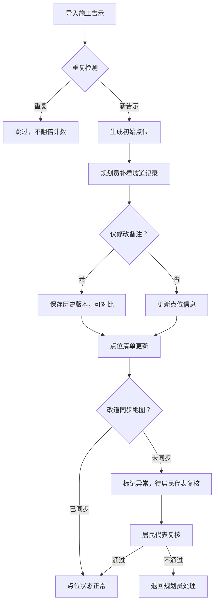

## 1. 产品概述

滨水驿站人流预警系统是面向街道规划员的协同管理平台，整合施工告示与无障碍坡道记录，实现点位复核、变更追踪、历史回溯的全流程数字化管理。

- 核心目标：解决施工告示与无障碍坡道数据不一致、重复导入数据翻倍、变更无迹可寻的问题
- 目标用户：街道规划员（小姜）、居民代表、复核人员
- 价值：提升复核效率，确保数据一致性，所有操作可追溯可审计

## 2. 核心功能

### 2.1 用户角色

| 角色 | 说明 | 核心权限 |
|------|------|----------|
| 街道规划员 | 系统主要操作者，如小姜 | 导入施工告示、编辑无障碍坡道、修改备注、更新点位清单 |
| 居民代表 | 复核人员 | 查看异常点位、标记复核状态、添加复核意见 |
| 系统管理员 | 系统维护 | 配置管理、用户权限、日志审计 |

### 2.2 功能模块

1. **首页概览**：预警统计、待复核清单、近期变更动态
2. **施工告示管理**：导入、去重、列表、详情、历史版本
3. **无障碍坡道记录**：补录、关联施工告示、编辑、历史追踪
4. **点位清单**：综合视图、状态流转、材料说明、责任人标注
5. **复核中心**：异常处理、居民代表复核、改道同步校验
6. **3D/图表展示**：可视化看板、点位地图、点击溯源
7. **变更历史**：全量操作日志、改前改后对比、影响分析

### 2.3 页面详情

| 页面名称 | 模块名称 | 功能描述 |
|----------|----------|----------|
| 首页概览 | 预警统计卡片 | 人流预警总数、待复核数、异常改道数、今日变更数 |
| 首页概览 | 待办任务列表 | 待复核点位、待补录坡道、待同步改道 |
| 首页概览 | 近期变更动态 | 谁改了什么、修改时间、影响结果 |
| 施工告示管理 | 导入面板 | 批量导入、重复检测、预览确认 |
| 施工告示管理 | 告示列表 | 筛选、搜索、状态标签、操作入口 |
| 施工告示管理 | 告示详情 | 基本信息、关联坡道、变更历史、版本对比 |
| 无障碍坡道记录 | 坡道列表 | 按点位筛选、关联状态、补录入口 |
| 无障碍坡道记录 | 坡道编辑 | 信息录入、关联施工告示、备注修改 |
| 点位清单 | 点位综合列表 | 点位状态、保留原因、缺料说明、下一步责任人 |
| 点位清单 | 点位详情 | 全信息聚合、关联文档、操作记录 |
| 复核中心 | 异常点位列表 | 未同步改道、数据冲突、待复核标记 |
| 复核中心 | 复核操作 | 居民代表复核、意见填写、状态流转 |
| 可视化看板 | 3D/图表视图 | 点位分布、热力图、柱状图统计 |
| 可视化看板 | 点击溯源 | 点击数据点跳转至原始施工告示或坡道记录 |
| 变更历史 | 操作日志 | 全量审计、筛选查询、操作者追踪 |
| 变更历史 | 版本对比 | 改前改后差异高亮、影响范围分析 |

## 3. 核心流程

### 三步核心工作流
1. **第一步：施工告示第一次导入**
   - 规划员批量导入施工告示
   - 系统自动去重（相同告示不重复计数）
   - 生成初始点位清单

2. **第二步：规划员补看无障碍坡道记录**
   - 规划员查看未关联坡道的点位
   - 补录或关联无障碍坡道记录
   - 仅修改备注时保留历史版本

3. **第三步：点位清单更新**
   - 系统综合施工告示与坡道记录更新点位
   - 标注保留原因、缺料情况、下一步责任人
   - 发现改道未同步地图时，标记为待居民代表复核

## 4. 用户界面设计

### 4.1 设计风格
- **主色调**：深蓝 #1E3A5F（专业、可靠）
- **辅助色**：青蓝 #3B82F6（信息）、琥珀 #F59E0B（预警）、翠绿 #10B981（正常）、玫红 #EF4444（异常）
- **按钮风格**：圆角 8px，轻微阴影，hover 有微动效
- **字体**：标题用 Noto Serif SC（人文感），正文用 Noto Sans SC（清晰易读）
- **布局风格**：卡片式布局，左侧导航 + 主内容区 + 右侧详情抽屉
- **图标风格**：线性图标，2px 描边，统一圆角

### 4.2 页面设计概述

| 页面名称 | 模块名称 | UI 元素 |
|----------|----------|---------|
| 首页概览 | 预警统计卡片 | 渐变背景、数字动效、趋势箭头、悬浮放大 |
| 施工告示管理 | 导入面板 | 拖拽上传区、进度条、重复项高亮提示 |
| 点位清单 | 点位行 | 状态标签带色、保留原因tooltip、缺料标记、责任人头像 |
| 变更历史 | 版本对比 | 左右分栏、删除线+绿色高亮显示差异、变更人信息 |
| 复核中心 | 异常卡片 | 红色边框、警告图标、复核按钮、倒计时 |
| 可视化看板 | 3D地图 | 悬浮点位、点击涟漪效果、跳转按钮 |

### 4.3 响应式
- 桌面端优先（1440px 基准）
- 平板端：导航折叠，卡片自适应
- 移动端：底部导航，列表单列，详情全屏
- 触控优化：按钮最小 44px，列表项足够点击区域

### 4.4 3D 场景指引
- 环境：城市滨水区域鸟瞰视角，柔和日光
- 灯光：HDRI 环境光 + 方向光，阴影柔和
- 相机：初始俯视角 45°，可旋转缩放
- 交互：点击点位弹出信息卡，支持跳转详情
- 后处理：泛光效果，轻微色差，提升质感
- 性能：点位使用实例化渲染，控制在 100 个以内
