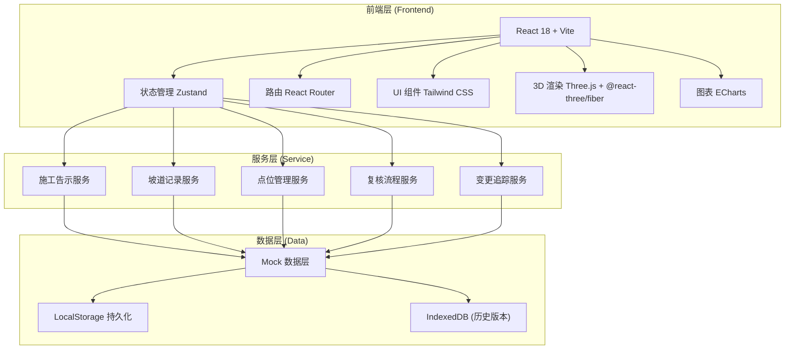
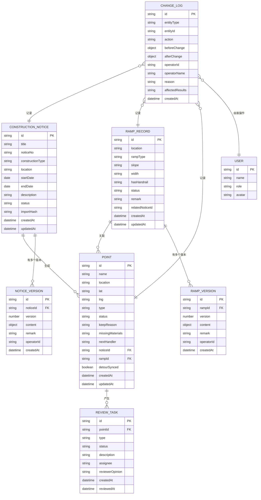

## 1. 架构设计



## 2. 技术描述

- **前端框架**: React@18 + TypeScript
- **构建工具**: Vite@5
- **状态管理**: Zustand@4（轻量、简洁、支持 Immer）
- **路由**: React Router@6
- **UI 方案**: Tailwind CSS@3 + Headless UI
- **3D 渲染**: Three@0.160 + @react-three/fiber@8 + @react-three/drei@9
- **图表库**: ECharts@5
- **图标**: Lucide React
- **动画**: Framer Motion
- **数据持久化**: LocalStorage + IndexedDB（Dexie.js）
- **后端**: 纯前端 Mock 数据，无真实后端
- **开发工具**: ESLint + Prettier + TypeScript 严格模式

## 3. 路由定义

| 路由 | 页面名称 | 说明 |
|------|----------|------|
| / | 首页概览 | 预警统计、待办任务、变更动态 |
| /notices | 施工告示管理 | 告示列表、导入、详情 |
| /notices/:id | 施工告示详情 | 单条告示详情、版本对比 |
| /ramps | 无障碍坡道记录 | 坡道列表、补录、编辑 |
| /ramps/:id | 坡道记录详情 | 单条坡道详情、关联信息 |
| /points | 点位清单 | 综合点位列表、状态管理 |
| /points/:id | 点位详情 | 点位全信息、操作记录 |
| /review | 复核中心 | 异常点位、复核操作 |
| /visualization | 可视化看板 | 3D地图、图表统计 |
| /history | 变更历史 | 操作日志、版本对比 |

## 4. 数据模型

### 4.1 数据模型定义



### 4.2 核心类型定义

```typescript
// 施工告示
interface ConstructionNotice {
  id: string;
  title: string;
  noticeNo: string;
  constructionType: 'road' | 'ramp' | 'pipeline' | 'landscape';
  location: string;
  startDate: string;
  endDate: string;
  description: string;
  status: 'draft' | 'active' | 'completed' | 'cancelled';
  importHash: string;
  createdAt: string;
  updatedAt: string;
}

// 坡道记录
interface RampRecord {
  id: string;
  location: string;
  rampType: 'step_free' | 'slope' | 'elevator';
  slope: string;
  width: string;
  hasHandrail: boolean;
  status: 'normal' | 'under_maintenance' | 'closed';
  remark: string;
  relatedNoticeId?: string;
  createdAt: string;
  updatedAt: string;
}

// 点位
interface Point {
  id: string;
  name: string;
  location: string;
  lat: number;
  lng: number;
  type: 'notice' | 'ramp' | 'both';
  status: 'normal' | 'warning' | 'pending_review' | 'exception';
  keepReason: string;
  missingMaterials: string[];
  nextHandler: 'planner' | 'resident_rep' | 'admin';
  noticeId?: string;
  rampId?: string;
  detourSynced: boolean;
  createdAt: string;
  updatedAt: string;
}

// 变更日志
interface ChangeLog {
  id: string;
  entityType: 'notice' | 'ramp' | 'point';
  entityId: string;
  action: 'create' | 'update' | 'delete' | 'import';
  beforeChange: Record<string, any> | null;
  afterChange: Record<string, any>;
  operatorId: string;
  operatorName: string;
  reason: string;
  affectedResults: string[];
  createdAt: string;
}

// 复核任务
interface ReviewTask {
  id: string;
  pointId: string;
  type: 'detour_not_synced' | 'data_conflict' | 'manual_review';
  status: 'pending' | 'approved' | 'rejected';
  description: string;
  assignee: string;
  reviewerOpinion?: string;
  createdAt: string;
  reviewedAt?: string;
}
```

## 5. 核心业务逻辑设计

### 5.1 重复导入检测
- 使用 `importHash` 字段，基于告示标题、编号、位置、起止日期生成唯一哈希
- 导入时计算哈希，与数据库中已存在的哈希比对
- 重复项高亮标记，不新增记录，不增加计数

### 5.2 版本追踪机制
- 每次修改创建新版本记录，保留完整快照
- 备注修改单独标记为 `remark_change` 类型
- 版本对比使用 diff 算法高亮差异

### 5.3 点位状态流转
```
正常 → 预警 → 待复核 → （复核通过）→ 正常
                              → （复核不通过）→ 异常 → 处理后 → 待复核
```

### 5.4 改道同步检测
- 点位更新时检查 `detourSynced` 字段
- 未同步时自动创建复核任务，指派给居民代表
- 不自动标记为正常，必须人工复核
