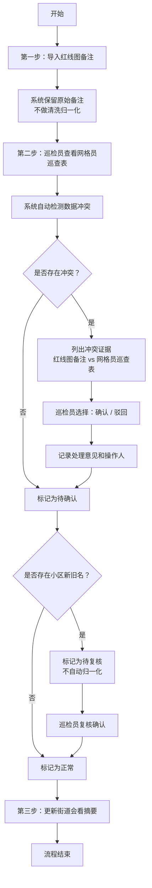
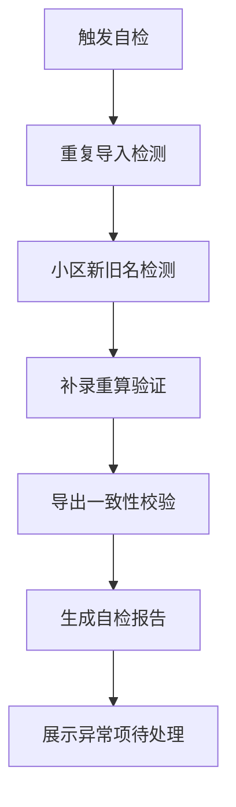

## 1. 产品概述

道路开挖恢复验收系统是面向市政巡检业务的专业管理平台，核心解决红线图备注与网格员巡查表的数据冲突校验、验收流程规范化、数据一致性保障等业务痛点。系统服务于市政巡检员、街道审核人员等角色，确保验收数据的真实性、可追溯性和一致性。

产品目标：
- 完整保留原始备注信息，不做过度清洗
- 建立数据冲突发现与人工复核机制，不自动拍板
- 提供自检功能覆盖高频出错场景
- 保障页面展示、接口返回、导出数据三者一致

## 2. 核心功能

### 2.1 用户角色
| 角色 | 注册方式 | 核心权限 |
|------|----------|----------|
| 市政巡检员（小付） | 系统分配 | 导入红线图备注、查看网格员巡查表、处理数据冲突、确认/驳回冲突、更新摘要、导出数据、执行自检 |
| 街道审核人员 | 系统分配 | 查看验收摘要、查看冲突处理记录、导出数据 |

### 2.2 功能模块
1. **验收记录管理页**：验收记录列表、导入红线图备注、查看详情、三步流程状态跟踪
2. **冲突处理页**：冲突证据展示、确认/驳回操作、冲突处理记录
3. **自检中心页**：重复导入检测、小区新旧名检测、补录重算验证、导出一致性校验
4. **数据导出页**：明细导出、摘要导出、导出一致性保障

### 2.3 页面详情
| 页面名称 | 模块名称 | 功能描述 |
|----------|----------|----------|
| 验收记录管理 | 记录列表 | 展示所有验收记录，支持搜索筛选，显示三步流程进度状态 |
| 验收记录管理 | 红线图备注导入 | 支持Excel/表单导入，完整保留原始备注文本，记录导入时间和操作人 |
| 验收记录管理 | 三步流程跟踪 | 可视化展示"导入→巡检员复核→摘要更新"三步进度 |
| 冲突处理 | 冲突证据展示 | 并列展示红线图备注与网格员巡查表的矛盾内容，标注冲突点 |
| 冲突处理 | 确认/驳回操作 | 提供明确的确认、驳回按钮，要求填写处理意见，不提供自动处理 |
| 冲突处理 | 小区新旧名处理 | 同一小区存在新旧名称时，标记为待复核状态，不自动归一化 |
| 自检中心 | 重复导入检测 | 检测同一红线图编号的多次导入，列出重复记录 |
| 自检中心 | 小区新旧名检测 | 基于地址、坐标等信息识别可能的新旧小区名，列出待确认清单 |
| 自检中心 | 补录重算验证 | 补录数据后自动触发重算，展示重算前后对比 |
| 自检中心 | 导出一致性校验 | 校验导出数据、页面展示、接口返回三者的一致性 |
| 数据导出 | 明细导出 | 导出完整验收明细，包含所有备注和冲突处理记录 |
| 数据导出 | 摘要导出 | 导出街道会看用的摘要信息 |

## 3. 核心流程

### 3.1 验收三步主流程
市政巡检员小付首先导入红线图备注，系统完整保留原始备注信息；接着小付补看网格员巡查表，系统自动检测两者是否存在矛盾，如有冲突则列出证据等待小付确认或驳回；最后更新给街道会看的摘要。整个过程中如遇同一小区有新旧两个名字，不急着归正常，留给巡检员复核。

### 3.2 自检流程

## 4. 用户界面设计

### 4.1 设计风格
- **主色调**：深市政蓝 (#1e3a5f)，体现专业、稳重的政务系统调性
- **辅助色**：警示橙 (#f59e0b) 用于冲突标记，成功绿 (#10b981) 用于确认状态，危险红 (#ef4444) 用于驳回标记
- **中性色**：冷灰系列 (#64748b, #94a3b8, #cbd5e1)，确保长时间使用不疲劳
- **按钮风格**：直角微圆角 (4px)，扁平设计，点击反馈清晰
- **字体**：标题使用"思源黑体"加粗，正文使用"思源黑体"常规，确保政务文档可读性
- **布局风格**：顶部导航 + 左侧菜单栏 + 主内容区的经典政务布局，卡片式信息分组
- **图标风格**：线性图标，统一2px描边，使用lucide-react图标库

### 4.2 页面设计概述
| 页面名称 | 模块名称 | UI元素 |
|----------|----------|--------|
| 验收记录管理 | 记录列表 | 表格布局，行高48px，斑马纹，状态标签用不同颜色区分，hover高亮 |
| 验收记录管理 | 三步流程条 | 顶部时间线式步骤条，已完成打勾，进行中高亮，待处理置灰 |
| 冲突处理 | 冲突对比 | 左右分栏对比布局，中间冲突连线标注，差异内容高亮 |
| 冲突处理 | 操作区 | 底部固定操作栏，确认/驳回按钮明显区分，处理意见输入框 |
| 自检中心 | 自检卡片 | 四个自检模块用卡片网格布局，每个卡片显示检测状态、异常数量、快捷操作 |
| 自检中心 | 自检报告 | 折叠面板展示详细检测结果，异常项红色标记，可一键处理 |
| 数据导出 | 导出设置 | 表单式布局，导出选项分组，预览区域实时展示导出样例 |

### 4.3 响应式
- 桌面优先设计，适配1366px及以上分辨率
- 表格区域支持横向滚动，适配窄屏
- 移动端简化布局，核心功能可操作

### 4.4 数据展示规范
- 备注信息使用等宽字体展示，保留原始换行和空格
- 冲突内容使用黄色背景高亮，鼠标悬停显示详细对比
- 专业计算结果旁显示参数版本和取舍理由的tooltip
- 小区新旧名记录使用特殊标记，不做隐藏处理
