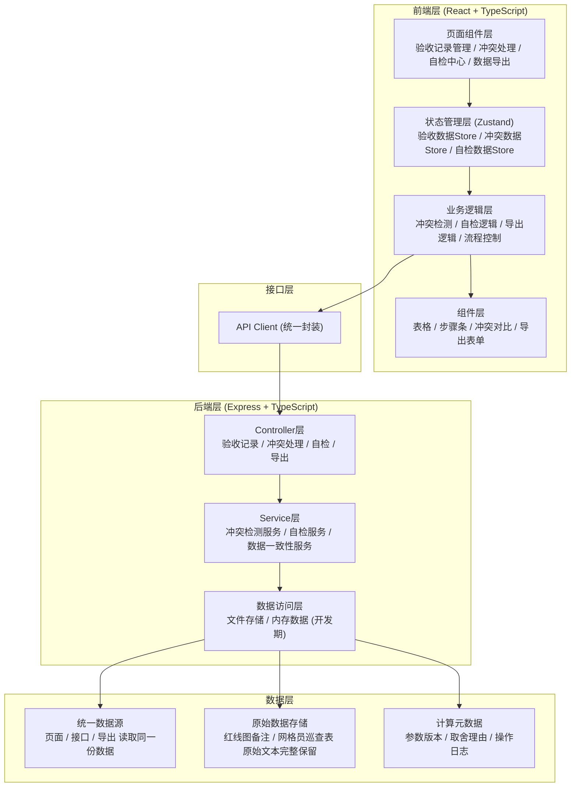
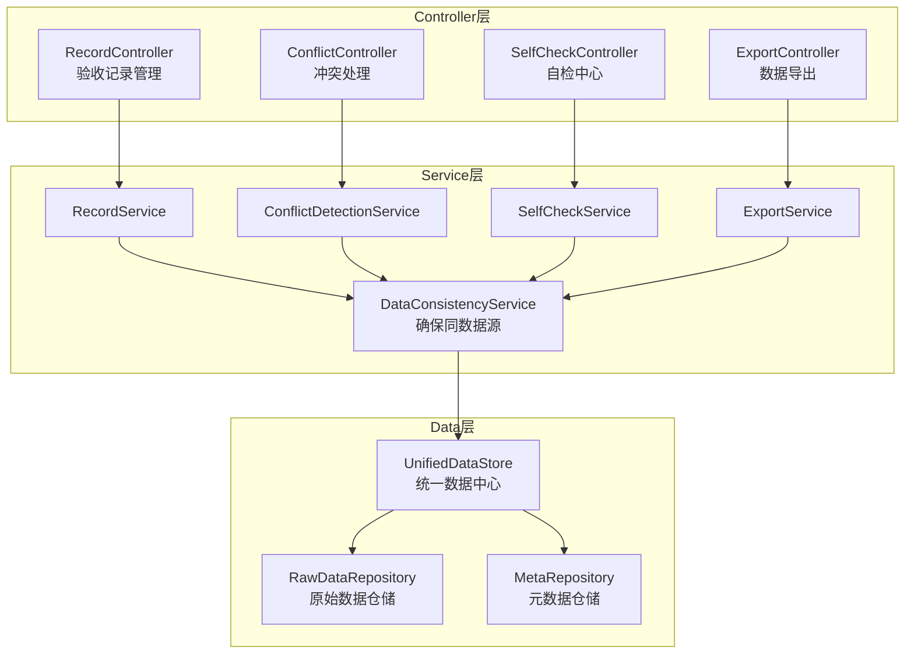
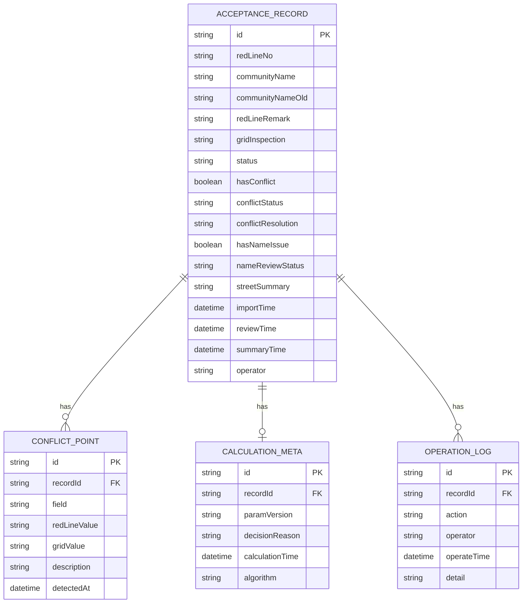

## 1. 架构设计



## 2. 技术描述

- **前端**：React@18 + TypeScript + Vite + TailwindCSS@3 + Zustand + React Router DOM + Lucide React
- **后端**：Express@4 + TypeScript
- **初始化工具**：vite-init (react-express-ts 模板)
- **数据存储**：开发期使用内存存储 + JSON文件持久化，生产可替换为数据库
- **导出功能**：xlsx 库处理Excel导出
- **自检机制**：前端统一数据计算中心，确保页面/接口/导出同数据源

## 3. 路由定义

| 路由 | 页面名称 | 说明 |
|------|----------|------|
| / | 验收记录管理 | 首页，展示所有验收记录列表 |
| /record/:id | 验收详情 | 单条验收记录详情，包含三步流程 |
| /conflict/:id | 冲突处理 | 冲突证据展示与确认/驳回操作 |
| /self-check | 自检中心 | 四项自检功能入口与报告展示 |
| /export | 数据导出 | 明细导出与摘要导出 |

## 4. API 定义

### 4.1 类型定义
```typescript
// 验收记录
interface AcceptanceRecord {
  id: string;
  redLineNo: string;           // 红线图编号
  communityName: string;       // 小区名称
  communityNameOld?: string;   // 小区旧名称（如有）
  redLineRemark: string;       // 红线图备注 - 完整保留原始文本
  gridInspection: string;      // 网格员巡查表 - 完整保留原始文本
  status: 'pending_import' | 'pending_review' | 'pending_summary' | 'completed';
  hasConflict: boolean;
  conflictStatus?: 'pending' | 'confirmed' | 'rejected';
  conflictResolution?: string;
  hasNameIssue: boolean;       // 是否存在小区新旧名问题
  nameReviewStatus?: 'pending' | 'confirmed';
  streetSummary: string;       // 街道会看摘要
  importTime: string;
  reviewTime?: string;
  summaryTime?: string;
  operator: string;
  calculationMeta?: CalculationMeta;  // 专业计算元数据
}

// 计算元数据
interface CalculationMeta {
  paramVersion: string;        // 参数版本号
  decisionReason: string;      // 取舍理由
  calculationTime: string;
  algorithm: string;
}

// 冲突检测结果
interface ConflictResult {
  recordId: string;
  conflictPoints: ConflictPoint[];
  detectedAt: string;
}

interface ConflictPoint {
  field: string;
  redLineValue: string;
  gridValue: string;
  description: string;
}

// 自检结果
interface SelfCheckResult {
  duplicateImport: DuplicateItem[];
  communityNameIssue: NameIssueItem[];
  recalcConsistency: RecalcItem[];
  exportConsistency: ExportConsistencyItem[];
  checkTime: string;
}
```

### 4.2 接口列表
| 方法 | 路径 | 说明 |
|------|------|------|
| GET | /api/records | 获取验收记录列表 |
| GET | /api/records/:id | 获取单条验收记录详情 |
| POST | /api/records/import | 导入红线图备注 |
| POST | /api/records/:id/review | 提交巡检员复核（网格员巡查表） |
| POST | /api/records/:id/conflict/confirm | 确认冲突 |
| POST | /api/records/:id/conflict/reject | 驳回冲突 |
| POST | /api/records/:id/name-review | 小区新旧名复核 |
| POST | /api/records/:id/summary | 更新街道会看摘要 |
| GET | /api/self-check | 执行全部自检 |
| GET | /api/self-check/duplicate | 重复导入检测 |
| GET | /api/self-check/name-issue | 小区新旧名检测 |
| GET | /api/self-check/recalc | 补录重算验证 |
| GET | /api/self-check/export-consistency | 导出一致性校验 |
| GET | /api/export/detail | 导出明细 |
| GET | /api/export/summary | 导出摘要 |

## 5. 服务端架构图



## 6. 数据模型

### 6.1 数据模型ER图



### 6.2 核心设计原则

1. **原始数据完整保留**：redLineRemark 和 gridInspection 字段使用 TEXT 类型，不做任何清洗、截断、归一化处理
2. **同数据源原则**：所有页面展示、接口返回、数据导出都从 UnifiedDataStore 读取同一份计算结果
3. **操作可追溯**：所有状态变更都记录 OPERATION_LOG，包含操作人、时间、详细内容
4. **冲突不自动处理**：ConflictDetectionService 只负责检测和标记，不自动覆盖数据
5. **小区名不自动归一**：检测到新旧小区名时仅标记 hasNameIssue，等待人工复核
