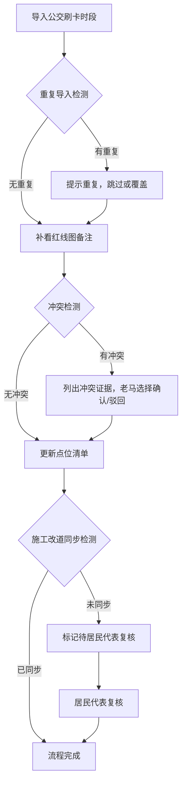

## 1. 产品概述

校园周边摊贩疏导管理系统，用于管理校园周边摊贩点位、公交刷卡时段、红线图备注等数据，解决施工临时改道不同步、数据口径不一致、补录数据混乱等问题。目标用户包括交通协管人员（老马）、居民代表和业务工作人员。

## 2. 核心功能

### 2.1 用户角色

| 角色 | 注册方式 | 核心权限 |
|------|----------|----------|
| 交通协管（老马） | 系统分配 | 导入数据、补录红线图备注、确认/驳回冲突、查看点位清单 |
| 居民代表 | 系统分配 | 复核施工改道问题、查看历史记录、追问数据一致性 |
| 业务工作人员 | 系统分配 | 全功能操作、数据导出、系统自检 |

### 2.2 功能模块

1. **点位清单管理**：摊贩点位增删改查、公交刷卡时段管理、红线图备注管理
2. **历史记录追踪**：所有操作留痕、数据变更对比、前后口径一致性检查
3. **冲突检测中心**：公交刷卡时段与红线图备注冲突自动检测、证据列示、人工确认/驳回
4. **系统自检面板**：重复导入检测、施工改道同步检查、补录后重算、导出一致性校验
5. **三步流程工作台**：公交刷卡导入 → 红线图补看 → 点位清单更新，施工改道异常留待复核

### 2.3 页面详情

| 页面名称 | 模块名称 | 功能描述 |
|-----------|-------------|---------------------|
| 工作台首页 | 数据概览 | 点位总数、待处理冲突、待复核改道、最近操作记录 |
| 点位清单 | 点位列表 | 搜索、筛选、查看详情、编辑点位信息 |
| 冲突检测 | 冲突列表 | 自动检测冲突、列示证据、确认/驳回操作 |
| 自检中心 | 自检面板 | 一键自检、问题分类展示、修复指引 |
| 流程工作台 | 三步流程 | 按步骤引导完成导入、补看、更新操作 |
| 历史记录 | 操作日志 | 全量操作记录、数据变更对比 |

## 3. 核心流程

用户登录系统后，交通协管老马按三步流程操作：先导入公交刷卡时段数据，系统自动检测重复导入；然后补看红线图备注，系统自动检测与公交时段的冲突并列出证据，由老马确认或驳回；最后更新点位清单。若检测到施工临时改道未同步到地图，系统不自动归为正常，而是标记为待居民代表复核状态。

## 4. 用户界面设计

### 4.1 设计风格

- 主色调：深蓝色（#1e3a5f），代表专业、可信赖
- 辅助色：橙色（#f59e0b）用于警告和待处理，绿色（#10b981）用于正常状态，红色（#ef4444）用于冲突
- 中性色：白色背景、深灰文字、浅灰边框
- 按钮风格：圆角4px，悬停有轻微阴影和背景色加深
- 字体：系统无衬线字体，标题16px加粗，正文14px，备注12px
- 布局风格：顶部导航 + 左侧菜单 + 右侧内容区，卡片式布局
- 图标风格：使用Lucide线性图标，简洁明了

### 4.2 页面设计概览

| 页面名称 | 模块名称 | UI元素 |
|-----------|-------------|-------------|
| 工作台首页 | 数据概览 | 统计卡片网格、待办事项列表、最近操作时间线 |
| 点位清单 | 点位列表 | 筛选栏、表格、分页、详情侧滑面板 |
| 冲突检测 | 冲突列表 | 冲突卡片、证据对比区、操作按钮组 |
| 自检中心 | 自检面板 | 自检进度条、问题分类标签、修复指引展开面板 |
| 流程工作台 | 三步流程 | 步骤指示器、当前步骤内容区、上一步/下一步按钮 |
| 历史记录 | 操作日志 | 时间轴布局、变更前后对比、操作人信息 |

### 4.3 响应性

桌面端优先设计，适配1280px及以上宽度。平板端左侧菜单可折叠，移动端采用底部导航，表格转为卡片列表展示。

### 4.4 错误提示设计

所有错误提示使用自然语言描述，不暴露内部字段名：
- 不友好："bus_card_time 字段与 red_line_note 冲突"
- 友好："公交刷卡的时间段和红线图上标注的时段不一致，请仔细核对"
