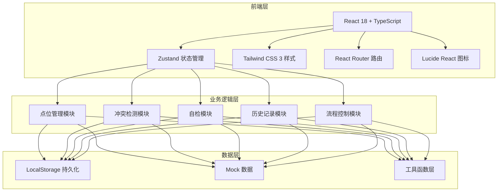
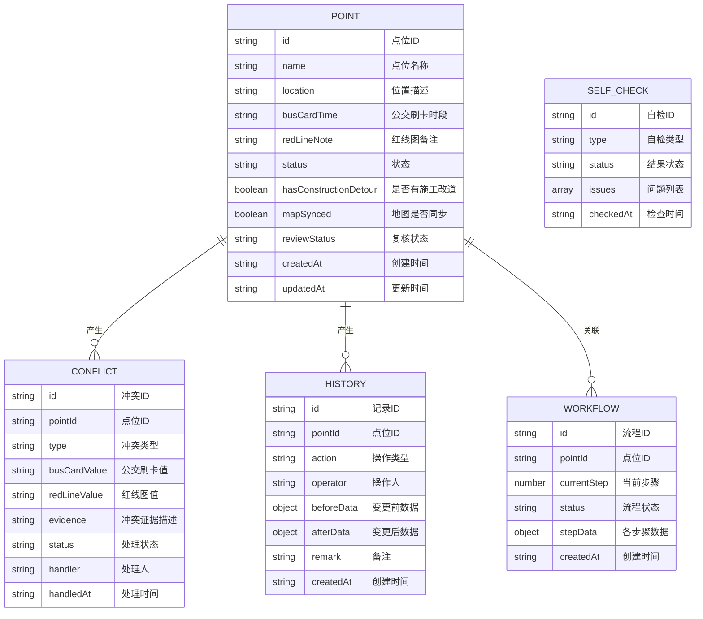

## 1. 架构设计



## 2. 技术描述

- 前端：React@18 + TypeScript + Vite
- 样式：Tailwind CSS@3
- 状态管理：Zustand
- 路由：React Router DOM@6
- 图标：Lucide React
- 数据持久化：LocalStorage（纯前端演示）
- 后端：无（纯前端应用，使用Mock数据）

## 3. 路由定义

| 路由 | 页面名称 | 用途 |
|-------|---------|------|
| / | 工作台首页 | 数据概览、待办事项 |
| /points | 点位清单 | 点位列表管理 |
| /conflicts | 冲突检测 | 冲突列表和处理 |
| /self-check | 自检中心 | 系统自检功能 |
| /workflow | 流程工作台 | 三步流程引导 |
| /history | 历史记录 | 操作日志查看 |

## 4. 数据模型

### 4.1 数据模型定义



### 4.2 TypeScript 类型定义

```typescript
// 点位类型
interface Point {
  id: string;
  name: string;
  location: string;
  busCardTime: string;
  redLineNote: string;
  status: 'normal' | 'pending' | 'conflict';
  hasConstructionDetour: boolean;
  mapSynced: boolean;
  reviewStatus: 'not-needed' | 'pending' | 'approved' | 'rejected';
  createdAt: string;
  updatedAt: string;
}

// 冲突类型
interface Conflict {
  id: string;
  pointId: string;
  type: 'bus-vs-redline' | 'detour-not-synced' | 'data-inconsistent';
  busCardValue: string;
  redLineValue: string;
  evidence: string;
  status: 'pending' | 'confirmed' | 'rejected';
  handler?: string;
  handledAt?: string;
}

// 历史记录类型
interface HistoryRecord {
  id: string;
  pointId: string;
  action: 'create' | 'update' | 'import' | 'confirm' | 'reject' | 'review';
  operator: string;
  beforeData: Partial<Point>;
  afterData: Partial<Point>;
  remark: string;
  createdAt: string;
}

// 自检结果类型
interface SelfCheckResult {
  id: string;
  type: 'duplicate-import' | 'detour-sync' | 'recalculate' | 'export-consistent';
  status: 'pass' | 'warning' | 'error';
  issues: string[];
  checkedAt: string;
}

// 工作流类型
interface Workflow {
  id: string;
  pointId: string;
  currentStep: 1 | 2 | 3;
  status: 'in-progress' | 'completed' | 'pending-review';
  stepData: {
    step1?: { busCardTime: string; importedAt: string };
    step2?: { redLineNote: string; reviewedAt: string };
    step3?: { updatedAt: string };
  };
  createdAt: string;
}
```
