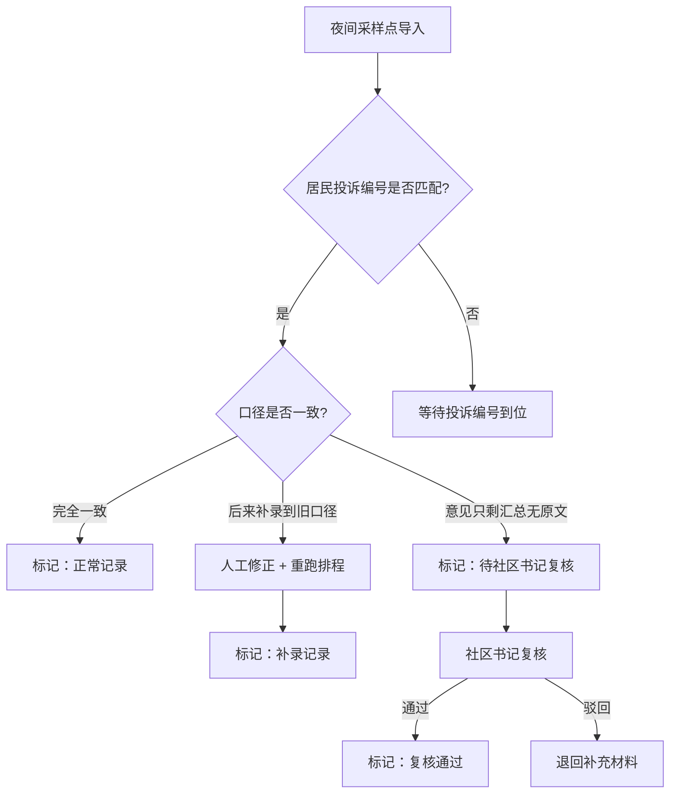

## 1. 产品概述

绿道驿站补给排程系统是为街道规划员设计的工作辅助工具，用于管理夜间采样点的补给排程、处理居民投诉编号匹配、追踪口径变更和返工流程。系统通过透明化的冲突复核和历史记录机制，帮助街道规划员小姜等工作人员将返工过程留在明面上，便于新人培训和流程追溯。

- 核心目标：解决夜间采样点排程中因居民投诉编号滞后导致的口径错配、补录返工问题
- 目标用户：街道规划员、社区书记、新人培训讲师

## 2. 核心功能

### 2.1 用户角色

| 角色 | 使用方式 | 核心权限 |
|------|----------|----------|
| 街道规划员 | 日常操作 | 导入采样点、补看投诉编号、人工修正、重跑排程 |
| 社区书记 | 复核操作 | 对"意见只剩汇总无原文"记录进行复核标记 |
| 新人/培训讲师 | 查看学习 | 查看完整流程演示、历史记录追踪 |

### 2.2 功能模块

1. **排程总览页**：数据统计卡片、排程记录列表、状态筛选
2. **冲突复核表**：展示口径冲突、补录记录、待复核项
3. **历史记录追踪**：版本对比、人工修正痕迹、重跑日志
4. **流程向导**：三步操作引导（导入→补看投诉→更新复核表）
5. **演示数据集**：内置三种典型场景的真实感演示数据

### 2.3 页面详情

| 页面名称 | 模块名称 | 功能描述 |
|----------|----------|----------|
| 排程总览 | 数据统计卡片 | 展示正常/待复核/补录/冲突四类记录数量 |
| 排程总览 | 记录列表 | 展示所有排程记录，支持按状态筛选，点击查看详情 |
| 冲突复核表 | 冲突列表 | 展示口径不匹配记录，标注错口径来源和补录来源 |
| 冲突复核表 | 复核操作 | 社区书记对"无原文汇总"项进行标记通过/驳回 |
| 历史记录 | 时间线 | 单条记录的完整操作历史，含人工修正和重跑标记 |
| 历史记录 | 版本对比 | 并排展示同一记录的不同版本差异 |
| 流程向导 | 步骤引导 | 高亮当前步骤，提供操作提示，模拟真实工作流 |

## 3. 核心流程

### 三步标准工作流
1. **夜间采样点第一次导入**：系统导入夜间采样点基础数据，生成初始排程记录
2. **街道规划员补看居民投诉编号**：居民投诉编号到位后，规划员匹配投诉信息到对应采样点
3. **冲突复核表更新**：系统自动检测口径冲突，生成冲突复核表，分类标记处理结果

### 三种典型记录处理路径
- **顺利记录**：导入 → 投诉编号匹配 → 口径一致 → 标记正常
- **待复核记录**：导入 → 投诉编号匹配 → 发现意见只剩汇总无原文 → 标记待社区书记复核
- **补录旧口径记录**：导入 → 初判正常 → 投诉编号补录后发现旧口径 → 人工修正 → 重跑 → 标记补录

## 4. 用户界面设计

### 4.1 设计风格
- **主色调**：深青绿 (#0F766E) - 呼应"绿道"主题，体现政务系统的稳重感
- **辅助色**：琥珀橙 (#D97706) - 用于待复核标记、警示提示
- **成功色**：森林绿 (#15803D) - 正常记录、复核通过
- **补录色**：靛蓝 (#4F46E5) - 补录记录、旧口径标记
- **字体**：标题用"思源宋体"体现正式感，正文用"Inter"保证可读性
- **布局风格**：左侧导航 + 主内容区卡片式布局，顶部放置流程向导
- **图标风格**：线性图标搭配小色块背景，简洁专业

### 4.2 页面设计概述

| 页面名称 | 模块名称 | UI元素 |
|----------|----------|--------|
| 排程总览 | 统计卡片 | 四色卡片带数字和趋势箭头，悬停有微动效 |
| 排程总览 | 记录列表 | 斑马纹表格，状态标签带圆角色块，行悬停高亮 |
| 冲突复核表 | 分类标签页 | 顶部标签切换"全部/错口径/补录/待复核" |
| 冲突复核表 | 操作按钮 | 社区书记操作区用橙色边框突出 |
| 历史记录 | 时间线 | 左侧垂直时间线，节点用不同颜色区分操作类型 |
| 流程向导 | 步骤条 | 顶部横向三步条，已完成打勾，当前步骤脉冲动画 |

### 4.3 响应式
- Desktop-first设计，主内容区最小宽度1200px
- 平板端适配：导航折叠，表格可横向滚动
- 移动端：卡片堆叠展示，优先显示核心信息

### 4.4 动效设计
- 页面加载：统计卡片数字从0滚动到目标值
- 状态变更：记录行高亮闪烁后渐变为新状态色
- 流程步骤切换：横向滑动过渡
- 人工修正标记：添加蓝色角标，悬停显示修正说明
