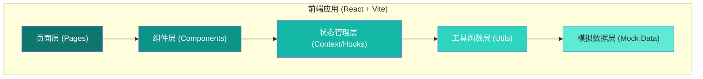
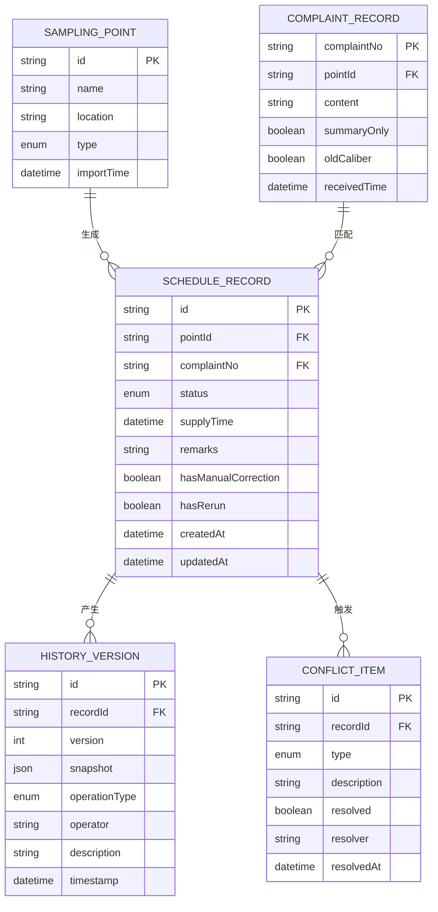

## 1. 架构设计



## 2. 技术描述

- **前端框架**: React@18 + TypeScript
- **构建工具**: Vite@5
- **样式方案**: TailwindCSS@3 + CSS Variables
- **路由管理**: React Router DOM@6
- **图标库**: Lucide React
- **数据方案**: 内置Mock数据，localStorage持久化用户操作
- **初始化方式**: Vite官方脚手架创建React+TS项目

## 3. 路由定义

| 路由 | 页面名称 | 用途说明 |
|------|----------|----------|
| / | 排程总览页 | 数据统计、记录列表、状态筛选 |
| /review | 冲突复核表 | 口径冲突列表、社区书记复核操作 |
| /history | 历史记录页 | 时间线展示、版本对比 |
| /wizard | 流程向导页 | 三步工作流引导演示 |

## 4. 核心类型定义

```typescript
// 采样点信息
interface SamplingPoint {
  id: string;
  name: string;
  location: string;
  type: 'day' | 'night';
  importTime: string;
}

// 居民投诉记录
interface ComplaintRecord {
  complaintNo: string;
  pointId: string;
  content: string;
  summaryOnly: boolean; // 是否只剩汇总无原文
  receivedTime: string;
  oldCaliber?: boolean; // 是否属于旧口径
}

// 排程记录状态
type ScheduleStatus = 'normal' | 'pending_review' | 'supplemented' | 'conflict';

// 排程记录
interface ScheduleRecord {
  id: string;
  pointId: string;
  pointName: string;
  complaintNo?: string;
  status: ScheduleStatus;
  supplyTime: string;
  remarks: string;
  hasManualCorrection: boolean;
  hasRerun: boolean;
  createdAt: string;
  updatedAt: string;
}

// 历史版本记录
interface HistoryVersion {
  id: string;
  recordId: string;
  version: number;
  snapshot: ScheduleRecord;
  operationType: 'create' | 'import' | 'update' | 'correct' | 'rerun' | 'review';
  operator: string;
  description: string;
  timestamp: string;
}

// 冲突复核项
interface ConflictItem {
  id: string;
  recordId: string;
  type: 'wrong_caliber' | 'supplement' | 'pending_review';
  description: string;
  resolved: boolean;
  resolver?: string;
  resolvedAt?: string;
}
```

## 5. 数据模型

### 5.1 ER图



### 5.2 演示数据集说明

内置6条演示数据，覆盖三种典型场景：

1. **顺利记录 (2条)**:
   - 夜间采样点导入 → 投诉编号匹配 → 口径一致 → 状态正常
   
2. **待复核记录 (2条)**:
   - 夜间采样点导入 → 匹配到投诉 → 发现意见只有汇总无原文 → 待社区书记复核
   
3. **补录旧口径记录 (2条)**:
   - 初次导入判为正常 → 后续投诉编号补录 → 发现旧口径 → 人工修正+重跑 → 标记补录

每条补录记录都包含至少1次人工修正和1次重跑的历史版本，便于培训演示。
