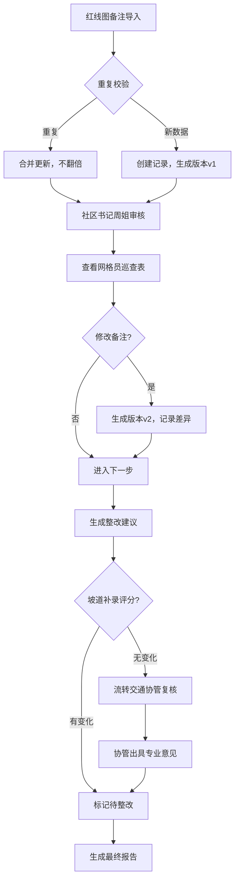

## 1. 产品概述

社区宠物活动区投诉调解管理系统，解决红线图备注与网格员巡查表数据冲突、历史追踪缺失、报告冰冷等痛点。服务于社区书记周姐、网格员、交通协管等角色，实现从数据导入、审核复核到整改报告的全流程闭环。

## 2. 核心功能

### 2.1 用户角色
| 角色 | 说明 | 核心权限 |
|------|------|----------|
| 社区书记（周姐） | 最终审核责任人 | 导入红线图备注、查看巡查表、修改备注、审批整改建议、生成报告 |
| 网格员 | 一线巡查人员 | 提交巡查表、查看整改任务 |
| 交通协管 | 专业复核人员 | 复核坡道补录评分异常、出具专业意见 |
| 系统管理员 | 系统维护 | 参数配置、模型版本管理 |

### 2.2 功能模块
1. **工作台首页**：待办任务、数据概览、快捷入口
2. **红线图备注管理**：导入、去重、版本历史、对比查看
3. **网格员巡查表**：列表展示、详情查看、与红线图关联
4. **投诉调解记录**：核心业务台账、状态流转、评分计算
5. **3D/图表可视化**：空间展示、数据图表、服务复核回退
6. **报告生成中心**：智能整改建议、材料清单、责任人追踪
7. **专业计算面板**：模型参数、版本对比、取舍理由展示

### 2.3 页面详情
| 页面名称 | 模块名称 | 功能描述 |
|----------|----------|----------|
| 工作台 | 待办卡片 | 展示待审核、待复核、待整改的任务数量和快捷入口 |
| 工作台 | 数据概览 | 投诉数量趋势、整改完成率、评分分布图表 |
| 红线图备注 | 导入面板 | 支持批量导入、自动去重、导入预览确认 |
| 红线图备注 | 版本对比 | 双栏对比展示修改前后差异，高亮变更字段 |
| 巡查表详情 | 关联视图 | 同步展示对应的红线图备注，支持互相跳转 |
| 投诉调解详情 | 评分面板 | 展示计算参数、版本号、取舍理由 |
| 3D可视化 | 场景展示 | 社区空间3D展示，点击坡道可查看详情 |
| 3D可视化 | 复核回退 | 评分无变化时一键返回红线图备注或巡查表 |
| 报告生成 | 整改建议 | 自动生成带原因分析、材料清单、责任人的整改建议 |
| 报告预览 | 历史对比 | 展示报告历次修改痕迹 |

## 3. 核心流程

### 3.1 标准三步工作流
1. **第一步：红线图备注第一次导入**
   - 系统自动去重校验，避免数量翻倍
   - 生成初始版本记录，标注导入人、时间

2. **第二步：社区书记周姐补看网格员巡查表**
   - 系统自动关联红线图备注与对应巡查表
   - 周姐可修改备注，系统自动保存历史版本
   - 支持双栏对比查看改前改后差别

3. **第三步：整改建议更新**
   - 基于备注和巡查表自动生成整改建议
   - 建议包含：保留原因、缺失材料、下一步责任人

### 3.2 特殊分支：坡道补录评分无变化
- 检测到坡道补录后评分未变化时，不直接标记为"正常"
- 自动流转至交通协管复核队列
- 交通协管出具专业复核意见后再决定状态

## 4. 用户界面设计

### 4.1 设计风格
- **主色调**：政务蓝 #1E40AF，体现专业可信
- **辅助色**：警示橙 #F59E0B（待办）、成功绿 #10B981（完成）、警示红 #EF4444（异常）
- **按钮风格**：圆角 6px，悬停微上浮阴影，点击下沉反馈
- **字体**：标题使用 Noto Serif SC（人文感），正文使用 Noto Sans SC（易读性）
- **布局风格**：左右分栏布局，左侧导航+内容区卡片式设计
- **图标风格**：线性图标，2px 描边，统一 24px 尺寸

### 4.2 页面设计概述
| 页面名称 | 模块名称 | UI 元素 |
|----------|----------|---------|
| 工作台 | 待办卡片 | 渐变背景卡片、数字动效、悬停放大 |
| 版本对比 | 双栏视图 | 左右分栏、绿色高亮新增、红色高亮删除 |
| 3D可视化 | 场景容器 | 全屏沉浸、半透明悬浮控制面板、毛玻璃效果 |
| 报告详情 | 整改建议 | 时间线布局、责任人头像气泡、材料清单复选框 |
| 计算面板 | 参数展示 | 代码块风格、版本标签、展开/收起取舍理由 |

### 4.3 响应式
- Desktop-first 设计，优先适配 1440px 及以上
- 平板端：导航折叠为图标栏
- 移动端：底部 Tab 导航，卡片单列排布

### 4.4 3D 场景指导
- **环境**：社区鸟瞰视角，柔和日光，HDRI 使用城郊日光环境
- **光照**：主光+补光+环境光，阴影柔和，突出空间关系
- **相机**：初始俯视 45 度，可自由旋转缩放，点击坡道自动聚焦
- **交互**：悬停坡道高亮，点击弹出详情面板，评分无变化时闪烁提示
- **后处理**：轻微泛光，色彩分级偏暖色调，营造社区温馨感
