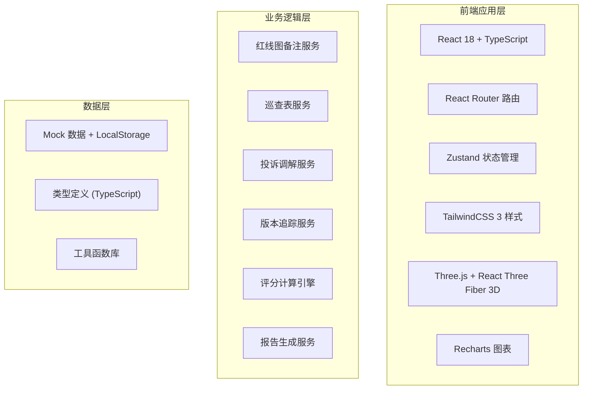
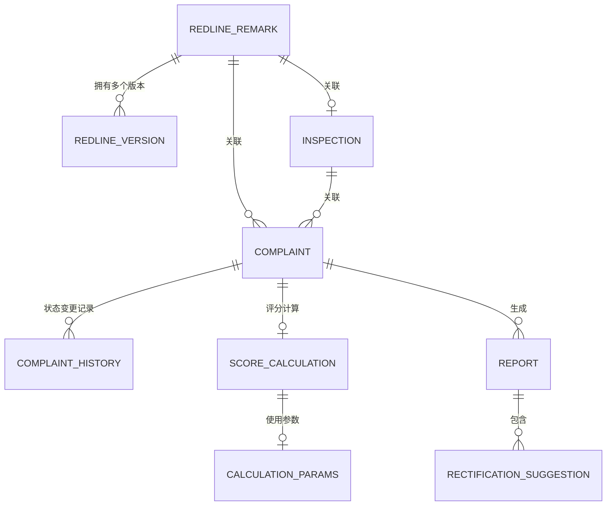

## 1. 架构设计



## 2. 技术描述
- **前端框架**: React@18 + TypeScript@5 + Vite@5
- **样式方案**: TailwindCSS@3 + PostCSS
- **状态管理**: Zustand@4（轻量、简单、支持 devtools）
- **路由**: React Router Dom@6
- **3D 引擎**: three@0.160 + @react-three/fiber@8 + @react-three/drei@9
- **图表**: recharts@2
- **图标**: lucide-react@0.294
- **数据持久化**: LocalStorage + Mock 数据（无需后端）
- **代码规范**: ESLint + Prettier

## 3. 路由定义
| 路由 | 页面 | 说明 |
|------|------|------|
| / | 工作台首页 | 待办任务、数据概览 |
| /redline | 红线图备注列表 | 备注管理、导入、版本对比 |
| /redline/:id | 红线图备注详情 | 单条备注详情、历史版本 |
| /inspection | 巡查表列表 | 网格员巡查表管理 |
| /inspection/:id | 巡查表详情 | 关联红线图查看 |
| /complaints | 投诉调解列表 | 核心业务台账 |
| /complaints/:id | 投诉调解详情 | 评分、整改建议、计算参数 |
| /visualization | 3D/图表可视化 | 空间展示、数据图表 |
| /reports | 报告中心 | 报告生成、历史报告 |
| /reports/:id | 报告详情 | 整改建议、材料清单 |
| /calculation | 计算面板 | 专业参数、版本对比、取舍理由 |

## 4. 数据模型

### 4.1 ER 图



### 4.2 核心类型定义

```typescript
// 红线图备注
interface RedlineRemark {
  id: string;
  code: string; // 唯一编码，用于去重
  areaName: string;
  location: string;
  hasPetArea: boolean;
  rampCount: number;
  remark: string;
  status: 'draft' | 'pending_review' | 'approved' | 'rejected';
  importedBy: string;
  importedAt: string;
  currentVersion: number;
  inspectionId?: string;
}

// 红线图版本历史
interface RedlineVersion {
  id: string;
  remarkId: string;
  version: number;
  data: Partial<RedlineRemark>;
  changedBy: string;
  changedAt: string;
  changeReason: string;
}

// 网格员巡查表
interface Inspection {
  id: string;
  inspector: string;
  inspectionDate: string;
  areaName: string;
  petAreaComplaints: number;
  rampIssues: string[];
  photos: string[];
  remarks: string;
  redlineRemarkId?: string;
}

// 投诉调解记录
interface Complaint {
  id: string;
  code: string;
  title: string;
  type: 'pet_area' | 'ramp' | 'other';
  redlineRemarkId: string;
  inspectionId?: string;
  status: 'pending' | 'reviewing' | 'pending_traffic_review' | rectifying' | 'completed';
  currentScore: number;
  previousScore?: number;
  assignee: 'zhoujie' | 'traffic' | 'grid';
  createdAt: string;
  updatedAt: string;
}

// 评分计算
interface ScoreCalculation {
  id: string;
  complaintId: string;
  score: number;
  modelVersion: string;
  params: CalculationParams;
  tradeOffReason: string;
  calculatedAt: string;
  calculatedBy: string;
}

// 计算参数
interface CalculationParams {
  version: string;
  rampWeight: number;
  complaintWeight: number;
  areaSizeFactor: number;
  populationDensity: number;
}

// 报告
interface Report {
  id: string;
  complaintId: string;
  generatedAt: string;
  generatedBy: string;
  suggestions: RectificationSuggestion[];
  materialList: string[];
  nextHandler: 'traffic' | 'zhoujie' | 'grid';
  notes: string;
}

// 整改建议
interface RectificationSuggestion {
  id: string;
  content: string;
  reason: string;
  priority: 'high' | 'medium' | 'low';
  requiredMaterials: string[];
  handler: string;
}
```

## 5. 核心服务设计

### 5.1 去重导入服务
- 基于 `code` 字段判断重复
- 重复数据执行更新而非创建
- 导入前展示预览：新增 X 条，更新 Y 条，忽略 Z 条

### 5.2 版本追踪服务
- 每次修改自动生成新版本
- 支持双栏 diff 对比展示
- 记录修改人、修改时间、修改原因

### 5.3 评分计算引擎
- 可配置参数版本
- 计算结果附带参数快照和取舍理由
- 评分无变化自动检测并触发交通协管复核

### 5.4 报告生成服务
- 基于模板生成有温度的整改建议
- 自动关联责任人和所需材料
- 支持导出 PDF/打印
