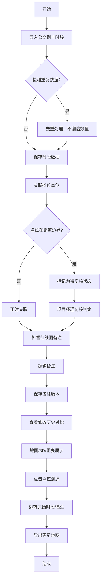

## 1. 产品概述

早市摊位轮换管理系统是为社区书记周姐等社区工作人员打造的摊位管理工具，解决公交刷卡时段、红线图备注与摊位轮换之间的协同管理难题，特别关注街道边界点位的规范化处理，实现操作可追溯、错误可回滚、流程可复核。

- 目标用户：社区工作人员（周姐）、项目经理、复核人员
- 核心价值：将口头约定固化为系统规则，实现摊位轮换全流程规范化管理

## 2. 核心功能

### 2.1 用户角色

| 角色 | 登录方式 | 核心权限 |
|------|----------|----------|
| 社区工作人员 | 账号密码登录 | 导入公交刷卡时段、编辑红线图备注、处理摊位轮换、导出地图 |
| 项目经理 | 账号密码登录 | 复核边界点位、审批异常操作、查看操作历史 |
| 系统管理员 | 账号密码登录 | 用户管理、系统配置、边界规则维护 |

### 2.2 功能模块

1. **工作台**：待办事项、统计概览、快捷操作入口
2. **公交刷卡时段管理**：时段导入、去重校验、时段列表、时段详情
3. **红线图备注管理**：备注编辑、历史对比、备注关联点位
4. **摊位轮换管理**：摊位列表、边界判定、轮换生成、回滚操作
5. **地图展示**：2D/3D切换、点位点击溯源、图表统计、地图导出
6. **操作历史**：修改记录、改前改后对比、操作回滚
7. **复核中心**：边界点位待复核、复核记录、异常处理

### 2.3 页面详情

| 页面名称 | 模块名称 | 功能描述 |
|----------|----------|----------|
| 工作台 | 待办卡片 | 展示待复核边界点、待导入时段、待处理备注 |
| 工作台 | 统计概览 | 摊位总数、边界点位数、本月轮换次数、异常处理数 |
| 公交刷卡时段 | 导入功能 | Excel/CSV导入、重复检测、导入预览、确认导入 |
| 公交刷卡时段 | 时段列表 | 分页查询、筛选、时段详情查看、删除 |
| 红线图备注 | 备注编辑 | 点位关联备注、富文本编辑、保存草稿 |
| 红线图备注 | 历史对比 | 版本列表、改前改后并排对比、版本回滚 |
| 摊位轮换 | 摊位列表 | 摊位地图视图、列表视图切换、边界标记 |
| 摊位轮换 | 边界判定 | 自动识别边界点位、归属判定规则、人工调整 |
| 摊位轮换 | 回滚操作 | 单步回滚、批量回滚、回滚预览确认 |
| 地图展示 | 3D视图 | 3D地图渲染、点位悬浮提示、点击溯源跳转 |
| 地图展示 | 图表统计 | 摊位分布柱状图、轮换趋势折线图、边界点位饼图 |
| 地图展示 | 地图导出 | PNG/PDF导出、自定义导出范围、备注水印 |
| 操作历史 | 记录列表 | 操作人、操作时间、操作类型、操作内容 |
| 操作历史 | 详情对比 | 修改字段高亮、改前改后值对比 |
| 复核中心 | 待复核列表 | 边界点位卡片、一键通过/驳回、批量操作 |
| 复核中心 | 复核记录 | 历史复核记录、复核意见、复核状态追溯 |

## 3. 核心流程

### 3.1 主流程描述
社区书记周姐按照以下三步完成工作：
1. 导入公交刷卡时段数据，系统自动去重，不翻倍摊位轮换数量
2. 补看并编辑红线图备注，系统记录每次修改的改前改后差别
3. 导出更新后的地图，中间碰到点位在两个街道边界上时，自动标记为待复核状态，不急着归正常，留给项目经理复核

### 3.2 边界点位处理流程
点位落在两个街道边界上时：
1. 系统自动识别并标记为"边界待复核"状态
2. 社区书记可查看但不能直接确认归属
3. 项目经理在复核中心进行人工判定
4. 判定后记录判定人、判定时间、判定依据
5. 支持后续修改和回滚操作

### 3.3 流程图

## 4. 用户界面设计

### 4.1 设计风格
- **主色调**：政务蓝 (#1E40AF)，体现官方、专业、可信赖
- **辅助色**：警示橙 (#F59E0B) 用于边界待复核标记，成功绿 (#10B981) 用于正常状态
- **按钮风格**：圆角6px，轻微阴影，hover时上浮2px效果
- **字体**：标题使用 Noto Serif SC（稳重官方感），正文使用 Noto Sans SC（清晰易读）
- **布局风格**：左侧导航 + 顶部面包屑 + 主内容卡片式布局
- **图标风格**：线性图标，统一2px线条粗细，配色与主题一致

### 4.2 页面设计概览

| 页面名称 | 模块名称 | UI元素 |
|----------|----------|--------|
| 工作台 | 待办卡片 | 彩色标签、数字徽章、悬浮放大动画 |
| 工作台 | 统计概览 | 渐变背景数字卡片、增长趋势小箭头 |
| 公交刷卡时段 | 导入功能 | 拖拽上传区域、进度条动画、预览表格 |
| 摊位轮换 | 边界标记 | 橙色闪烁边框、"边界待复核"角标 |
| 红线图备注 | 历史对比 | 左右分栏、差异高亮（删除红色删除线，新增绿色下划线） |
| 地图展示 | 3D视图 | 相机缓慢旋转动画、点位发光效果、点击涟漪效果 |
| 操作历史 | 详情对比 | 时间轴布局、彩色操作类型标签 |
| 复核中心 | 待复核卡片 | 悬停高亮、一键操作快捷按钮 |

### 4.3 响应式
- 桌面优先设计（1440px基准）
- 平板端（1024px）：左侧导航收起为图标栏
- 移动端（768px）：底部Tab导航，卡片垂直堆叠
- 地图组件自适应容器大小，触摸优化拖拽和缩放

### 4.4 3D场景指导
- 环境：柔和自然光HDRI，模拟白天政务大厅明亮氛围
- 光照：主光45度角，辅光补亮阴影，整体明亮通透
- 相机：默认俯视45度，支持鼠标拖拽旋转、滚轮缩放
- 构图：摊位点位用立方体标识，边界点位用橙色发光柱体突出
- 交互：hover点位上浮10%，点击触发涟漪粒子效果
- 后处理：轻微泛光，提升立体感，不过度渲染
- 性能：控制点位数量，启用实例化渲染，保持60fps

## 5. 边界规则说明（固化到代码和README）

### 5.1 边界判定规则
1. 点位坐标同时落在两个街道多边形范围内 → 边界点位
2. 点位距离街道边界线小于5米 → 疑似边界点位，需人工确认
3. 归属判定以最新复核结果为准，历史版本保留

### 5.2 修改与回滚规则
1. 任何修改都生成新版本记录，包含改前改后值
2. 单步回滚：恢复到上一个版本，同时记录回滚操作
3. 批量回滚：选择目标版本，确认后一次性回滚
4. 已复核通过的边界点位修改后，自动重回待复核状态

### 5.3 重复导入规则
1. 相同时段（起止时间+线路+日期）判定为重复
2. 重复导入时更新已有记录，不创建新记录
3. 摊位轮换数量根据有效时段计算，不因重复导入翻倍
