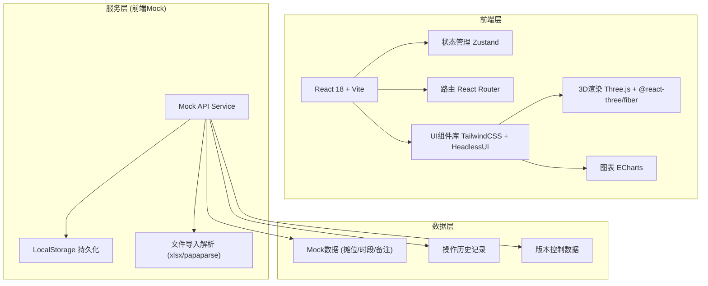
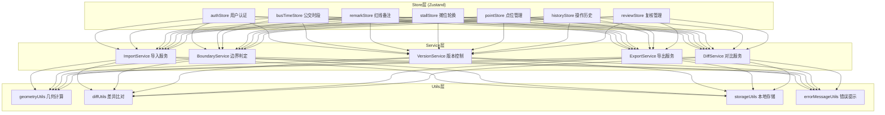

## 1. 架构设计



## 2. 技术描述

- **前端框架**: React@18.2 + TypeScript@5
- **构建工具**: Vite@5
- **状态管理**: Zustand@4（轻量级，支持中间件持久化）
- **路由**: React Router@6
- **样式方案**: TailwindCSS@3 + PostCSS
- **UI组件**: HeadlessUI（无样式组件，自定义主题）+ Lucide React 图标
- **3D地图**: Three.js@0.160 + @react-three/fiber@8 + @react-three/drei@9
- **图表**: ECharts@5 + echarts-for-react
- **文件解析**: xlsx（Excel导入）+ papaparse（CSV导入）
- **数据持久化**: LocalStorage + Zustand persist 中间件
- **导出功能**: html2canvas（PNG导出）+ jspdf（PDF导出）

## 3. 路由定义

| 路由路径 | 页面名称 | 权限要求 |
|----------|----------|----------|
| / | 工作台 | 已登录用户 |
| /bus-time | 公交刷卡时段管理 | 社区工作人员/管理员 |
| /redline-remark | 红线图备注管理 | 社区工作人员/管理员 |
| /stall-rotation | 摊位轮换管理 | 社区工作人员/管理员 |
| /map-view | 地图展示（2D/3D/图表） | 已登录用户 |
| /history | 操作历史 | 已登录用户 |
| /review | 复核中心 | 项目经理/管理员 |
| /login | 登录页 | 公开 |

## 4. 核心类型定义

```typescript
// 点位坐标
interface Point {
  id: string;
  name: string;
  lng: number;
  lat: number;
  streetIds: string[];
  isBoundary: boolean;
  boundaryStatus: 'normal' | 'pending' | 'confirmed' | 'rejected';
  reviewerId?: string;
  reviewTime?: string;
  reviewRemark?: string;
}

// 公交刷卡时段
interface BusTimeSlot {
  id: string;
  routeName: string;
  date: string;
  startTime: string;
  endTime: string;
  passengerCount: number;
  relatedPointIds: string[];
  importBatchId: string;
  createdAt: string;
  updatedAt: string;
}

// 红线图备注
interface RedlineRemark {
  id: string;
  pointId: string;
  content: string;
  version: number;
  createdBy: string;
  createdAt: string;
  previousId?: string;
  diff?: Record<string, { before: any; after: any }>;
}

// 摊位轮换记录
interface StallRotation {
  id: string;
  pointId: string;
  stallNumber: string;
  rotationDate: string;
  vendorName: string;
  status: 'active' | 'inactive';
  busTimeSlotIds: string[];
  remarkId?: string;
}

// 操作历史
interface OperationLog {
  id: string;
  operatorId: string;
  operatorName: string;
  operationType: 'import' | 'edit' | 'delete' | 'rollback' | 'review';
  targetType: 'busTimeSlot' | 'redlineRemark' | 'stallRotation' | 'point';
  targetId: string;
  beforeData?: any;
  afterData?: any;
  diff?: Record<string, { before: any; after: any }>;
  timestamp: string;
}
```

## 5. 核心模块架构



## 6. 数据模型（Mock数据结构）

### 6.1 初始化Mock数据

```typescript
// 街道数据
const streets = [
  { id: 'st1', name: '幸福街道', boundary: [[116.3, 39.9], [116.4, 39.9], [116.4, 40.0], [116.3, 40.0]] },
  { id: 'st2', name: '光明街道', boundary: [[116.4, 39.9], [116.5, 39.9], [116.5, 40.0], [116.4, 40.0]] },
];

// 点位数据（包含边界点位）
const points = [
  { id: 'p1', name: '早市入口1号点位', lng: 116.35, lat: 39.95, streetIds: ['st1'], isBoundary: false, boundaryStatus: 'normal' },
  { id: 'p2', name: '两街交界点位A', lng: 116.40, lat: 39.95, streetIds: ['st1', 'st2'], isBoundary: true, boundaryStatus: 'pending' },
  { id: 'p3', name: '两街交界点位B', lng: 116.40, lat: 39.96, streetIds: ['st1', 'st2'], isBoundary: true, boundaryStatus: 'pending' },
  { id: 'p4', name: '早市中段点位', lng: 116.45, lat: 39.95, streetIds: ['st2'], isBoundary: false, boundaryStatus: 'normal' },
];
```

### 6.2 边界规则固化代码位置

- `src/utils/geometryUtils.ts` - 点在多边形内判定、距离计算
- `src/services/BoundaryService.ts` - 边界判定业务逻辑
- `README.md` - 边界规则文档说明
