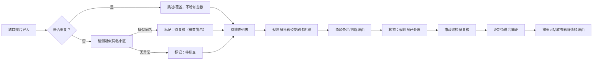

## 1. 产品概述

轨交站口雨棚排查系统，用于市政巡检和街道规划工作中的雨棚排查、数据溯源和复核流程。核心解决同一小区新旧名称混淆、数据证据链断裂、重复导入计数膨胀等问题。目标用户为街道规划员（小姜）和市政巡检员。

## 2. 核心功能

### 2.1 用户角色

| 角色 | 注册方式 | 核心权限 |
|------|----------|----------|
| 街道规划员 | 系统内置 | 导入路口照片、补看公交刷卡时段、添加备注、更新街道会摘要 |
| 市政巡检员 | 系统内置 | 复核疑似问题条目、查看数据溯源、查看历史变更记录 |

### 2.2 功能模块

1. **路口照片导入页**：批量导入路口照片、去重校验、原始行号保留
2. **排查工作区**：三步工作流主界面，待办列表、详情面板、状态流转
3. **历史溯源页**：单条记录变更历史、改前改后对比、操作人时间戳
4. **街道会摘要页**：问题汇总统计、可钻取详情、规划员保留理由展示

### 2.3 页面详情

| 页面名称 | 模块名称 | 功能描述 |
|----------|----------|----------|
| 路口照片导入页 | 上传区 | 拖拽上传 CSV/Excel，预览原始数据，显示原始行号 |
| 路口照片导入页 | 去重校验 | 检测重复导入，提示重复条目，选择跳过或覆盖 |
| 排查工作区 | 三步流程导航 | 导入→补看公交刷卡→更新摘要，每步可回退 |
| 排查工作区 | 待办列表 | 按状态分组，标注疑似同名小区条目（橙黄色警示） |
| 排查工作区 | 详情面板 | 显示原始行号、照片信息、公交刷卡时段、备注、状态 |
| 排查工作区 | 同名小区判定 | 自动检测疑似新旧名，标为"待复核"，不自动归正常 |
| 历史溯源页 | 变更记录 | 每条记录的操作历史：操作人、时间、改前值、改后值 |
| 历史溯源页 | 对比视图 | 高亮显示变更字段差异，支持回滚到指定版本 |
| 街道会摘要页 | 统计总览 | 总数、已排查、待复核、问题数，按类型分组 |
| 街道会摘要页 | 可钻取列表 | 点击条目展开详情，查看规划员保留理由和原始证据 |

## 3. 核心流程

### 3.1 三步排查工作流

街道规划员小姜的标准作业流程：

1. **第一步：导入路口照片**
   - 上传路口照片数据文件，系统保留原始行号
   - 自动去重，重复条目不增加排查数量
   - 自动检测疑似同一小区新旧名称，标记为"待复核"

2. **第二步：补看公交刷卡时段**
   - 规划员逐条查看，补充公交刷卡时段数据
   - 对疑似同名小区，规划员可添加备注说明判断理由
   - 状态流转为"规划员已处理"，等待市政巡检员复核

3. **第三步：更新街道会摘要**
   - 生成汇总数据，包含各分类统计
   - 摘要中每条问题可点击查看详情和规划员理由
   - 市政巡检员可对"待复核"条目进行最终判定

### 3.2 流程图

## 4. 用户界面设计

### 4.1 设计风格

- **主色调**：深蓝色（#1e3a5f）代表专业可信，辅助色橙色（#f59e0b）用于警示待复核条目
- **按钮风格**：圆角中等，主按钮深蓝色填充，次要按钮边框式，危险按钮红色
- **字体**：思源黑体（Source Han Sans），标题加粗，正文常规，数据用等宽字体
- **布局风格**：左右分栏，左侧列表右侧详情，顶部步骤导航条
- **视觉层次**：待复核条目用橙色背景高亮，历史变更用绿色+删除线对比显示

### 4.2 页面设计概览

| 页面名称 | 模块名称 | UI 元素 |
|----------|----------|---------|
| 排查工作区 | 步骤导航 | 顶部三步进度条，当前步骤高亮，已完成步骤打勾 |
| 排查工作区 | 列表项 | 卡片式布局，显示小区名、状态标签、原始行号、更新时间 |
| 排查工作区 | 详情面板 | 灰色分割线分区，每个字段显示标签和值，可编辑区域加边框 |
| 历史溯源页 | 时间线 | 左侧时间轴，右侧操作卡片，变更字段高亮显示 |
| 街道会摘要页 | 统计卡片 | 四个数字卡片大字号显示，下方趋势小图 |
| 街道会摘要页 | 可展开列表 | 点击行展开详情，平滑过渡动画 |

### 4.3 响应式

- 桌面端优先（1280px+），左右分栏布局
- 平板端（768-1279px）：上下布局，列表在上详情在下
- 移动端（<768px）：单列布局，Tab 切换列表和详情
- 触摸区域最小 44px，按钮和可点击元素足够大

### 4.4 边界规则可视化提示

- 待复核条目：橙色左侧边框 + 黄色背景条 + 警示图标
- 已确认正常：绿色勾选图标
- 有问题：红色叉号图标
- 历史变更：新增值绿色背景，旧值灰色删除线
