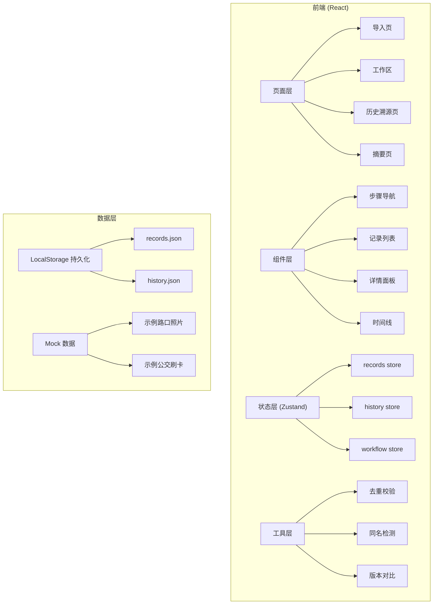
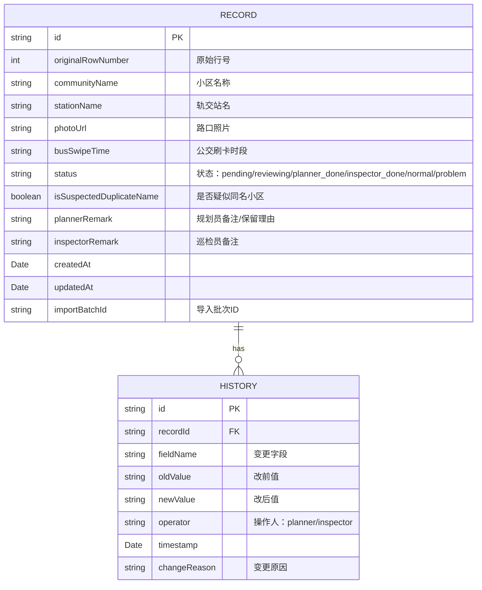

## 1. 架构设计



## 2. 技术选型

- **前端框架**：React@18 + TypeScript
- **构建工具**：Vite@5
- **样式方案**：TailwindCSS@3
- **状态管理**：Zustand（轻量级，适合本地状态持久化）
- **路由**：React Router@6
- **文件处理**：PapaParse（CSV 解析）
- **图标**：Lucide React
- **后端**：无（纯前端应用，数据存储在 LocalStorage）
- **数据库**：LocalStorage + JSON 文件导入导出

## 3. 路由定义

| 路由 | 页面 | 用途 |
|------|------|------|
| /import | 路口照片导入页 | 上传文件、预览、去重校验 |
| /workspace | 排查工作区 | 三步工作流主界面 |
| /history/:recordId | 历史溯源页 | 单条记录变更历史 |
| /summary | 街道会摘要页 | 汇总统计、可钻取详情 |

## 4. 数据模型

### 4.1 ER 图



### 4.2 状态枚举定义

```typescript
enum RecordStatus {
  PENDING = 'pending',           // 待排查
  REVIEWING = 'reviewing',       // 待复核（疑似同名小区）
  PLANNER_DONE = 'planner_done', // 规划员已处理
  INSPECTOR_DONE = 'inspector_done', // 巡检员已复核
  NORMAL = 'normal',             // 已确认正常
  PROBLEM = 'problem',           // 有问题
}

enum WorkflowStep {
  IMPORT = 'import',       // 第一步：导入
  BUS_CHECK = 'bus_check', // 第二步：补看公交刷卡
  SUMMARY = 'summary',     // 第三步：更新摘要
}
```

### 4.3 边界规则数据结构

```typescript
interface BoundaryRule {
  id: string;
  name: string;
  description: string;
  condition: (record: Record) => boolean;
  action: 'mark_review' | 'skip' | 'flag';
  rollbackable: boolean; // 是否支持回滚
}

// 同一小区新旧名字判定规则示例
const duplicateNameRules: BoundaryRule[] = [
  {
    id: 'name-suffix-village',
    name: '后缀"新村/小区/花园"差异',
    description: '如"阳光新村"与"阳光花园"判定为疑似同一小区',
    condition: (r) => removeSuffix(r.communityName) === removeSuffix(otherName),
    action: 'mark_review',
    rollbackable: true,
  },
  {
    id: 'name-prefix-number',
    name: '前缀"一期/二期/东区/西区"差异',
    description: '如"东方明珠一期"与"东方明珠二期"需人工确认',
    condition: (r) => hasDirectionalPrefix(r.communityName),
    action: 'mark_review',
    rollbackable: true,
  },
];
```

## 5. 核心算法说明

### 5.1 去重校验算法

```
输入：新导入批次 records[]
输出：去重后的有效记录数
规则：
1. 按 (communityName, stationName, originalRowNumber) 三元组匹配
2. 同一 importBatchId 的记录视为同一批次
3. 重复记录提示用户选择：跳过 / 覆盖（覆盖保留历史）
4. 统计时去重，总数 = 原有数 + 新增数（不包含重复数）
```

### 5.2 同名小区检测算法

```
输入：单条记录 record
输出：isSuspectedDuplicateName: boolean, matchedRecords: Record[]
步骤：
1. 归一化小区名称（去除空格、特殊字符、大小写）
2. 提取名称核心词（去除常见后缀：新村、小区、花园、苑、公寓等）
3. 计算核心词与现有记录的编辑距离
4. 编辑距离 <= 1 且地理坐标相近 -> 标记为疑似同名
5. 疑似同名记录自动标记 status = REVIEWING，不自动归为 NORMAL
```

### 5.3 历史版本对比算法

```
输入：recordId
输出：changeList: History[]
规则：
1. 每次字段更新前，先保存旧值到 history 表
2. 对比同 recordId 的所有 history 记录，按时间倒序排列
3. 高亮显示 oldValue 与 newValue 的差异（字符级 diff）
4. 支持 rollback：将指定版本的 newValue 还原为当前值，同时记录一次 rollback 历史
```

## 6. 持久化方案

- LocalStorage 存储 key：`canopy-inspection-records`、`canopy-inspection-history`
- 每次状态变更自动持久化
- 支持导出 JSON 备份
- 导入 JSON 恢复数据（去重校验）
