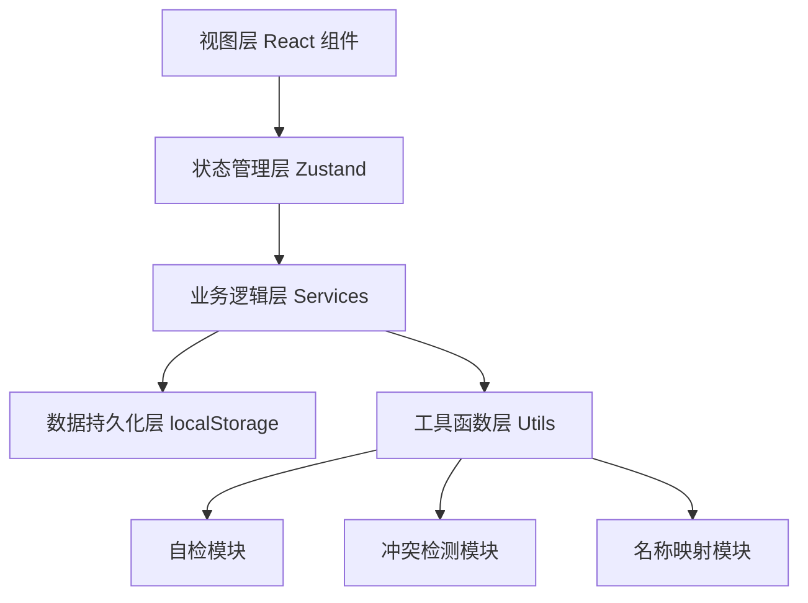

## 1. 架构设计

纯前端单页应用，数据存储使用 localStorage，支持导入导出 JSON 数据文件。采用分层架构，确保业务逻辑与视图分离。



## 2. 技术栈说明

- 前端框架：React@18 + TypeScript
- 构建工具：Vite@5
- 样式方案：TailwindCSS@3
- 状态管理：Zustand
- 路由管理：React Router@6
- 文件处理：原生 File API
- 数据导出：xlsx (Excel导出) + 原生 JSON
- 图标：Lucide React

## 3. 路由定义

| 路由 | 页面 | 说明 |
|------|------|------|
| / | 主工作台 | 三步工作流主界面 |
| /conflicts | 冲突检测 | 冲突列表与证据详情 |
| /self-check | 自检中心 | 四项自检运行与报告 |
| /history | 历史记录 | 摘要版本与操作日志 |
| /name-review | 名称复核 | 小区新旧名称复核池 |

## 4. 数据模型

### 4.1 核心类型定义

```typescript
// 路口照片
interface JunctionPhoto {
  id: string;
  fileName: string;
  uploadTime: string;
  junctionName: string;
  communityName: string;
  photoTime: string;
  hasCrosswalk: boolean;
  hasTrafficLight: boolean;
  note?: string;
  importBatch: string;
}

// 公交刷卡时段
interface BusCardRecord {
  id: string;
  communityName: string;
  timeSlot: string; // 07:00-09:00, 16:00-18:00 等
  cardCount: number;
  recordDate: string;
  importBatch: string;
  isSupplementary: boolean;
}

// 小区名称映射
interface CommunityNameMap {
  id: string;
  oldName: string;
  newName: string;
  status: 'pending' | 'confirmed' | 'rejected';
  source: 'auto-detect' | 'manual';
  reviewedBy?: string;
  reviewedAt?: string;
}

// 冲突记录
interface ConflictRecord {
  id: string;
  type: 'photo-bus-mismatch' | 'community-name-ambiguity' | 'data-inconsistency';
  severity: 'warning' | 'error';
  description: string;
  evidenceA: { source: string; data: any };
  evidenceB: { source: string; data: any };
  status: 'pending' | 'confirmed' | 'rejected';
  handledBy?: string;
  handledAt?: string;
  handlerNote?: string;
}

// 摘要版本
interface SummaryVersion {
  id: string;
  version: number;
  generatedAt: string;
  generatedBy: string;
  content: string;
  stats: {
    totalCommunities: number;
    totalPhotos: number;
    totalBusRecords: number;
    conflictsResolved: number;
    nameMapsConfirmed: number;
  };
  isExported: boolean;
}

// 操作日志
interface OperationLog {
  id: string;
  timestamp: string;
  operator: string;
  action: string;
  targetType: string;
  targetId: string;
  detail: string;
  before?: any;
  after?: any;
}

// 自检报告
interface SelfCheckReport {
  id: string;
  runTime: string;
  items: {
    duplicateImport: { passed: boolean; issues: any[] };
    communityName: { passed: boolean; issues: any[] };
    recalculate: { passed: boolean; issues: any[] };
    exportConsistency: { passed: boolean; issues: any[] };
  };
  overallPassed: boolean;
}
```

### 4.2 全局状态

```typescript
interface AppState {
  // 数据
  photos: JunctionPhoto[];
  busRecords: BusCardRecord[];
  nameMaps: CommunityNameMap[];
  conflicts: ConflictRecord[];
  summaries: SummaryVersion[];
  logs: OperationLog[];
  
  // 工作流状态
  currentStep: 1 | 2 | 3;
  currentBatch: string;
  
  // 操作方法
  addPhotos: (photos: JunctionPhoto[]) => void;
  addBusRecords: (records: BusCardRecord[]) => void;
  resolveConflict: (id: string, status: 'confirmed' | 'rejected', note?: string) => void;
  reviewNameMap: (id: string, status: 'confirmed' | 'rejected') => void;
  generateSummary: () => SummaryVersion;
  runSelfCheck: () => SelfCheckReport;
  exportData: () => string;
  importData: (json: string) => void;
}
```

## 5. 核心模块设计

### 5.1 自检模块 (selfCheck.ts)

- `checkDuplicateImport()`：通过 importBatch 和文件哈希检测重复导入
- `checkCommunityNames()`：通过字符串相似度检测疑似新旧名称
- `checkRecalculate()`：补录数据后重新计算汇总，与旧汇总对比
- `checkExportConsistency()`：导出数据再导入，对比前后数据一致性

### 5.2 冲突检测模块 (conflictDetector.ts)

- `detectPhotoBusConflicts()`：对比同小区同时段的照片证据与公交刷卡量
- `detectDataInconsistencies()`：检测数据字段异常、缺失等

### 5.3 名称映射模块 (nameMapper.ts)

- `findNameSimilarities()`：基于编辑距离的名称相似度计算
- `applyNameMapping()`：汇总时应用已确认的名称映射
