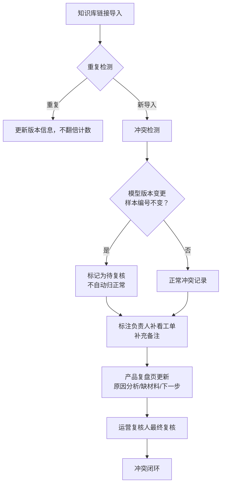

## 1. 产品概述
图片质检标签冲突管理系统，用于解决AI模型标注过程中标签不一致的问题。系统支持知识库引用链接导入、冲突检测、版本追踪、备注历史、可视化展示以及产品复盘全流程管理，帮助运营复核人和标注负责人高效协作处理标签冲突问题。

### 核心价值
- 解决模型版本更换但样本编号不变导致的标签歧义问题
- 避免重复导入导致冲突数量翻倍
- 完整记录备注修改历史，支持追溯
- 提供可解释的冲突结果，辅助运营复核决策

## 2. 核心功能

### 2.1 用户角色
| 角色 | 描述 | 核心权限 |
|------|------|----------|
| 标注负责人（周姐） | 负责标注数据管理，补充线上反馈工单，修改备注 | 导入知识库链接、修改备注、补充工单信息 |
| 运营复核人 | 负责复核冲突结果，做出最终决策 | 查看冲突详情、复核决策、查看复盘记录 |
| 产品经理 | 负责产品复盘，记录原因分析 | 编辑复盘页、分配下一步动作 |

### 2.2 功能模块
1. **冲突总览页：冲突统计、趋势图表、快速筛选
2. **知识库导入页：批量导入链接、去重检测、版本对比
3. **冲突详情页：冲突信息、历史记录、参数版本、溯源链接
4. **产品复盘页：原因分析、缺失材料、下一步动作、负责人
5. **可视化展示：3D/图表展示冲突分布，点击可追溯来源

### 2.3 页面详情
| 页面名称 | 模块名称 | 功能描述 |
|-----------|-------------|---------------------|
| 冲突总览页 | 统计卡片 | 展示待复核、已处理、模型版本冲突等关键指标 |
| 冲突总览页 | 趋势图表 | 按时间维度展示冲突数量变化 |
| 冲突总览页 | 冲突列表 | 支持筛选、排序、批量操作 |
| 知识库导入页 | 链接导入 | 批量粘贴知识库引用链接 |
| 知识库导入页 | 去重检测 | 自动检测重复导入，避免冲突数量翻倍 |
| 知识库导入页 | 版本对比 | 高亮显示模型版本更换但样本编号不变的记录 |
| 冲突详情页 | 冲突信息 | 展示冲突标签、置信度、模型参数版本 |
| 冲突详情页 | 历史记录 | 展示备注修改前后对比、操作人、时间 |
| 冲突详情页 | 溯源链接 | 一键跳转知识库引用链接或线上反馈工单 |
| 产品复盘页 | 原因分析 | 记录冲突产生原因 |
| 产品复盘页 | 材料清单 | 记录已有的材料和缺失的材料 |
| 产品复盘页 | 下一步动作 | 指定负责人（运营复核人/标注负责人）和截止时间 |
| 可视化页 | 3D/图表展示 | 按维度展示冲突分布，点击可跳转详情 |

## 3. 核心流程

### 三步工作流
1. 知识库引用链接第一次导入 → 系统自动检测冲突，标记模型版本换了但样本编号没变的记录
2. 标注负责人周姐补看线上反馈工单 → 补充备注和工单信息，不自动归为正常
3. 产品复盘页更新 → 产品经理分析原因，指定下一步负责人，交由运营复核人最终复核

## 4. 用户界面设计

### 4.1 设计风格
- **主色调**：深邃蓝 #1e3a5f 作为主色，代表专业和信任感
- **辅助色**：琥珀橙 #f59e0b 用于突出警告和待处理状态
- **成功色**：翡翠绿 #10b981 用于已处理状态
- **字体**：使用思源宋体作为标题字体，Roboto Mono作为数据展示字体
- **布局风格**：卡片式布局，左侧导航，右侧内容区
- **图标风格**：使用lucide-react线性图标，简洁专业

### 4.2 页面设计概述
| 页面名称 | 模块名称 | UI 关键元素 |
|-----------|-------------|-------------|
| 冲突总览页 | 统计卡片 | 渐变背景、悬停微动效、数字动画计数 |
| 冲突总览页 | 趋势图表 | 平滑曲线、hover显示详情、渐变色填充 |
| 冲突详情页 | 历史记录 | 时间轴样式、改前改后对比高亮 |
| 冲突详情页 | 参数展示 | 代码块样式展示模型参数和取舍理由 |
| 产品复盘页 | 动作卡片 | 待办事项样式、负责人头像、截止日期 |
| 可视化页 | 3D展示 | 可旋转的三维散点图、点击高亮对应记录 |

### 4.3 响应式
- 桌面端优先设计（1440px宽度基准）
- 平板端自适应，侧边栏可折叠
- 移动端简化导航，列表模式展示
- 支持触摸优化，大点击区域

### 4.4 可视化展示设计
- 3D散点图：X轴为样本编号，Y轴为模型版本，Z轴为冲突数量
- 支持鼠标悬停显示详情
- 点击散点直接跳转对应冲突详情页
- 支持切换2D图表模式（柱状图/热力图）
