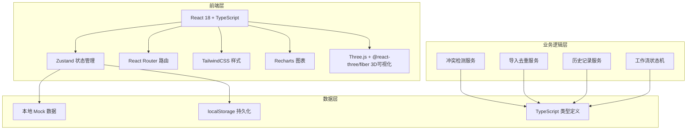
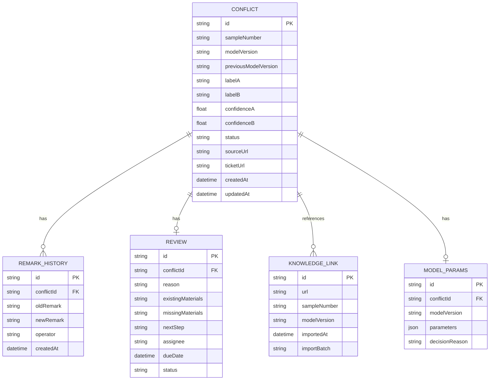

## 1. 架构设计



## 2. 技术描述

- **前端框架**: React@18 + TypeScript + Vite
- **状态管理**: Zustand（轻量级，支持持久化）
- **路由**: React Router DOM@6
- **样式**: TailwindCSS@3
- **图标**: Lucide React
- **图表**: Recharts
- **3D可视化**: Three.js + @react-three/fiber + @react-three/drei
- **数据持久化**: localStorage + Mock 数据
- **初始化工具**: vite-init

## 3. 路由定义

| 路由 | 页面 | 用途 |
|-------|---------|------|
| /dashboard | 冲突总览页 | 统计概览、冲突列表、筛选搜索 |
| /import | 知识库导入页 | 批量导入链接、去重检测 |
| /conflict/:id | 冲突详情页 | 冲突信息、历史记录、溯源链接 |
| /review/:id | 产品复盘页 | 原因分析、材料清单、下一步动作 |
| /visualization | 可视化展示页 | 3D散点图、2D图表切换 |

## 4. 数据模型

### 4.1 实体关系图



### 4.2 TypeScript 类型定义

```typescript
export type ConflictStatus = 'pending' | 'reviewing' | 'resolved' | 'dismissed';
export type AssigneeRole = 'operator' | 'annotator' | 'product';

export interface Conflict {
  id: string;
  sampleNumber: string;
  modelVersion: string;
  previousModelVersion?: string;
  labelA: string;
  labelB: string;
  confidenceA: number;
  confidenceB: number;
  status: ConflictStatus;
  sourceUrl: string;
  ticketUrl?: string;
  currentRemark?: string;
  isModelVersionChanged: boolean;
  createdAt: string;
  updatedAt: string;
}

export interface RemarkHistory {
  id: string;
  conflictId: string;
  oldRemark: string;
  newRemark: string;
  operator: string;
  operatorRole: AssigneeRole;
  createdAt: string;
}

export interface Review {
  id: string;
  conflictId: string;
  reason: string;
  existingMaterials: string[];
  missingMaterials: string[];
  nextStep: string;
  assignee: AssigneeRole;
  assigneeName: string;
  dueDate?: string;
  status: 'open' | 'in_progress' | 'completed';
}

export interface ModelParams {
  id: string;
  conflictId: string;
  modelVersion: string;
  parameters: Record<string, any>;
  decisionReason: string;
}

export interface KnowledgeLink {
  id: string;
  url: string;
  sampleNumber: string;
  modelVersion: string;
  importedAt: string;
  importBatch: string;
}
```

## 5. 项目目录结构

```
src/
├── components/          # 通用组件
│   ├── Layout/         # 布局组件
│   ├── ConflictCard/   # 冲突卡片
│   ├── Timeline/       # 时间轴组件
│   ├── StatusBadge/    # 状态标签
│   └── StatCard/       # 统计卡片
├── pages/              # 页面组件
│   ├── Dashboard/      # 总览页
│   ├── Import/         # 导入页
│   ├── ConflictDetail/ # 详情页
│   ├── Review/         # 复盘页
│   └── Visualization/  # 可视化页
├── store/              # Zustand 状态
│   ├── useConflictStore.ts
│   └── useReviewStore.ts
├── types/              # TypeScript 类型
│   └── index.ts
├── utils/              # 工具函数
│   ├── conflictDetector.ts
│   ├── deduplicator.ts
│   └── mockData.ts
├── App.tsx
├── main.tsx
└── index.css
```

## 6. 核心业务逻辑

### 6.1 去重检测算法
- 基于 `sampleNumber + modelVersion` 作为唯一键
- 同一批次导入中自动去重
- 跨批次导入时更新版本信息，不新增冲突记录

### 6.2 模型版本变更检测
- 对比同一样本编号的历史模型版本
- 检测到版本变更时标记 `isModelVersionChanged = true`
- 状态自动设为 `pending`，待运营复核人处理

### 6.3 工作流状态机
- pending → reviewing（标注负责人补充信息）
- reviewing → pending_review（产品复盘完成）
- pending_review → resolved/dismissed（运营复核人决策）
