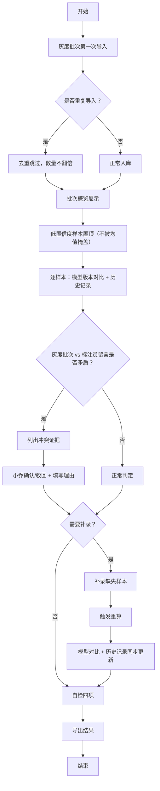

## 1. 产品概述

广告文案审核二次判定系统，面向知识库编辑（小乔）处理灰度批次的审核复核工作。重点解决低置信度样本被平均指标掩盖、重复导入去重、补录后重算、模型版本对比与历史记录一致性等核心问题。

- 目标用户：知识库编辑小乔
- 核心价值：把"低置信度样本被平均指标盖住"从边角料变成正常流程，让灰度批次审核有可追溯的复核链路

## 2. 核心功能

### 2.1 用户角色

| 角色 | 注册方式 | 核心权限 |
|------|----------|----------|
| 知识库编辑 | 系统内置账号 | 导入灰度批次、复核低置信度样本、处理冲突、补录、导出、执行自检 |

### 2.2 功能模块

1. **灰度批次导入页**：批次文件上传、重复导入去重检测、导入后样本概览
2. **审核工作区**：低置信度样本列表（不被平均掩盖）、标注员留言展示、模型版本对比、单样本判定、批量复核
3. **冲突处理面板**：灰度批次 vs 标注员留言的冲突证据罗列、确认/驳回操作、复核理由记录
4. **补录与重算**：缺失样本补录、补录后全量指标重算、重算前后对比
5. **导出与自检**：结果导出、一致性校验、自检报告（重复导入/低置信度/补录重算/导出一致）

### 2.3 页面详情

| 页面名称 | 模块名称 | 功能描述 |
|----------|----------|----------|
| 灰度批次导入页 | 上传区域 | 拖拽/点击上传批次JSON/CSV，校验批次ID，同一批次重传不翻倍 |
| 灰度批次导入页 | 去重提示 | 显示重复样本被跳过数量、新增样本数量、批次已存记录提示 |
| 灰度批次导入页 | 导入概览 | 样本总数、低置信度数量、模型版本号、导入时间戳 |
| 审核工作区 | 样本列表 | 按置信度升序排列，低置信度置顶，不展示平均值覆盖 |
| 审核工作区 | 模型对比 | 当前样本在A/B两个模型版本下的分数、标签、差异高亮 |
| 审核工作区 | 历史记录 | 同一样本历次判定、操作人、时间、备注 |
| 审核工作区 | 标注员留言 | 原文展示标注员备注，与灰度批次标签并置对比 |
| 冲突处理面板 | 冲突证据 | 逐条列举灰度批次判定 vs 标注员留言的矛盾点，附原文片段 |
| 冲突处理面板 | 操作区 | 确认（沿用灰度批次）/驳回（采纳标注员留言），必须填写理由 |
| 冲突处理面板 | 留痕 | 操作结果存入历史记录，知识库编辑不可自动替业务拍板 |
| 补录与重算 | 补录表单 | 按样本ID补录缺失的分数、标签、备注 |
| 补录与重算 | 重算触发 | 补录后自动重算批次整体指标，更新模型版本对比数据 |
| 补录与重算 | 前后对比 | 重算前后各指标变化高亮，历史记录同时更新 |
| 导出与自检 | 导出 | 导出审核结果JSON/CSV，包含所有复核痕迹 |
| 导出与自检 | 自检报告 | 四项必查：重复导入去重、低置信度置顶不掩盖、补录重算一致、导出数据与页面一致 |
| 导出与自检 | 自检解释 | 每项自检结果附处理理由，可点击查看对应样本 |

## 3. 核心流程

主流程：知识库编辑小乔登录 → 灰度批次第一次导入（检测重复，数量不翻倍）→ 低置信度样本置顶展示 → 逐样本查看模型版本对比和历史记录 → 发现灰度批次与标注员留言矛盾 → 列出冲突证据 → 小乔选择确认或驳回（填写理由）→ 补录缺失样本 → 补录后重算（模型对比和历史记录同步更新）→ 自检四项通过 → 导出结果。

## 4. 用户界面设计

### 4.1 设计风格

- 主色调：深蓝 #0F172A（知识库专业感）+ 琥珀橙 #F59E0B（低置信度警示）
- 辅助色：翠绿 #10B981（确认通过）/ 朱红 #EF4444（冲突驳回）/ 青灰 #64748B（中性信息）
- 按钮：直角微圆角（2px），实线边框，禁用态半透明
- 字体：正文用 IBM Plex Sans（等宽数字便于比对），标题用 Playfair Display 衬线体营造专业档案感
- 布局：左侧固定导航 + 主内容区卡片网格 + 右侧浮动详情抽屉
- 视觉元素：用轻微噪点纹理做背景，数据表格带斑马纹，低置信度样本左侧加琥珀色竖条标记

### 4.2 页面设计概览

| 页面名称 | 模块名称 | UI 元素 |
|----------|----------|----------|
| 灰度批次导入页 | 上传区域 | 虚线边框拖放区，批次ID预填栏，进度条，去重结果带展开详情 |
| 审核工作区 | 样本列表 | 卡片式列表，左侧置信度色条，点击展开右侧抽屉显示模型对比和历史 |
| 审核工作区 | 低置信度置顶 | 顶部固定警示条，展示"有 N 条低置信度样本需优先复核" |
| 冲突处理面板 | 证据罗列 | 左右双栏对比（灰度标签 vs 标注留言），矛盾处红色高亮 |
| 冲突处理面板 | 操作区 | 两个对立按钮（确认翠绿/驳回朱红）+ 必填理由文本框 |
| 补录与重算 | 前后对比 | 重算前数值删除线灰显，重算后数值加粗彩色，差值带箭头 |
| 导出与自检 | 自检项 | 四列并排卡片，绿色对勾/红色叉号状态图标，点击展开对应样本列表 |

### 4.3 响应性

桌面端优先（1440px 基准），次要操作在 1024px 以下堆叠展示，触控目标 ≥ 44px。

## 5. 自检逻辑说明

- **重复导入去重**：同批次ID + 同样本MD5 视为重复，重传时跳过但不报错，记录跳过数
- **低置信度被均值掩盖**：计算全量平均指标同时，单独筛出置信度 < 0.6 的样本置顶展示，均值卡片旁注明"含 N 条低置信度，请逐一复核"
- **补录后重算**：补录写入后触发异步重算，批次所有指标、模型版本对比值、历史记录时间线同步更新
- **导出一致**：导出前对页面展示数据与存储数据做一次哈希比对，不一致则阻断导出并提示自检
