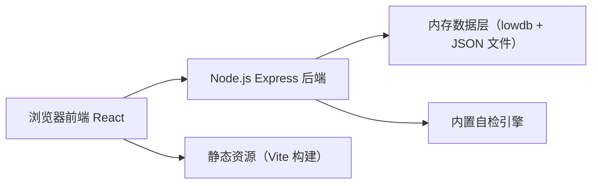
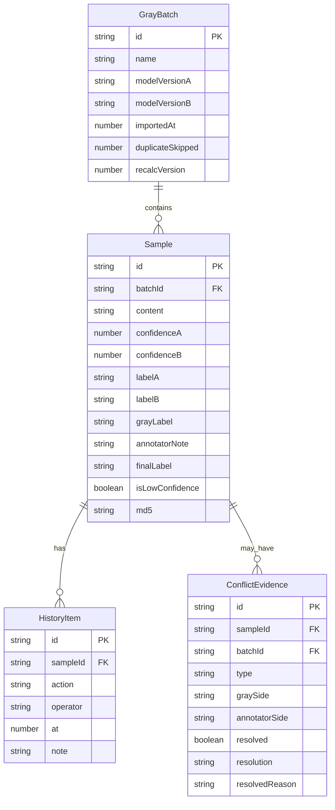
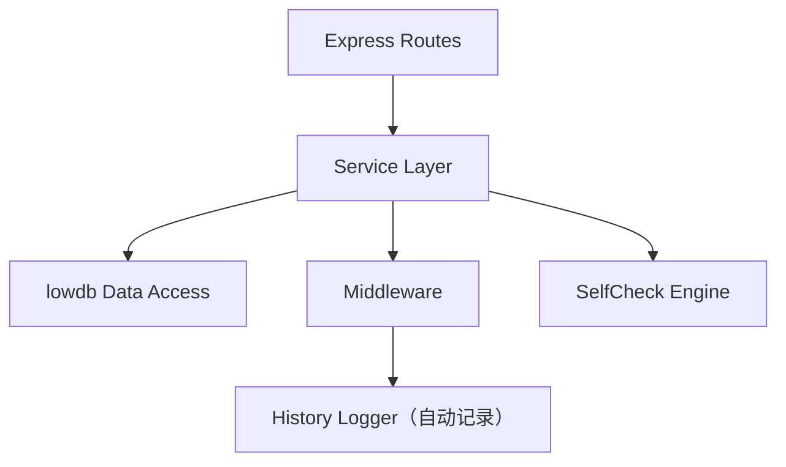

## 1. 架构设计



前后端分离，单项目内同时运行前端开发服务器和后端 API 服务；数据持久化使用本地 JSON 文件（lowdb），便于离线验证和现场复现。

## 2. 技术选型

- 前端：React@18 + React Router@6 + TypeScript + Tailwind CSS@3 + Vite@5
- 后端：Express@4 + TypeScript + lowdb@7（JSON 文件数据库）
- 状态管理：React Context + useReducer（轻量场景，避免引入 Redux）
- 导出：前端 xlsx + 后端 fs 双链路
- 自检：后端独立模块，支持 HTTP 触发与命令行触发

## 3. 目录结构

```
├── server/                后端 Express 服务
│   ├── index.ts           入口，挂载路由、启动自检
│   ├── routes/            API 路由
│   │   ├── batches.ts     灰度批次导入/去重/查询
│   │   ├── samples.ts     样本判定/补录/重算
│   │   ├── conflicts.ts   冲突证据/确认驳回
│   │   ├── history.ts     历史记录
│   │   ├── export.ts      导出
│   │   └── selfcheck.ts   自检四项
│   ├── services/          业务逻辑
│   │   ├── dedupe.ts      重复导入去重
│   │   ├── lowconf.ts     低置信度检测与置顶
│   │   ├── recalc.ts      补录后重算
│   │   ├── modelDiff.ts   模型版本对比
│   │   └── consistency.ts 导出一致性校验
│   └── db/                lowdb 数据文件
│       ├── db.json        运行时数据
│       └── seed.ts        初始种子数据（正常/错口径/补录 各一批）
├── client/                前端 React
│   ├── src/
│   │   ├── main.tsx
│   │   ├── App.tsx
│   │   ├── router.tsx
│   │   ├── pages/
│   │   │   ├── ImportPage.tsx    灰度批次导入
│   │   │   ├── ReviewPage.tsx    审核工作区
│   │   │   ├── ConflictPage.tsx  冲突处理
│   │   │   ├── SupplementPage.tsx 补录与重算
│   │   │   └── SelfCheckPage.tsx 导出与自检
│   │   ├── components/
│   │   │   ├── Sidebar.tsx
│   │   │   ├── SampleCard.tsx
│   │   │   ├── ModelCompare.tsx
│   │   │   ├── HistoryTimeline.tsx
│   │   │   ├── ConflictEvidence.tsx
│   │   │   └── SelfCheckCard.tsx
│   │   ├── api/
│   │   │   └── client.ts    fetch 封装
│   │   └── store/
│   │       └── AppContext.tsx
│   └── index.html
├── package.json
└── vite.config.ts
```

## 4. 路由定义

| 前端路由 | 页面 |
|----------|------|
| / | 跳转到 /import |
| /import | 灰度批次第一次导入 |
| /review | 审核工作区（低置信度置顶、模型对比、历史记录） |
| /conflicts | 冲突处理面板 |
| /supplement | 补录与重算 |
| /selfcheck | 导出与自检 |

| 后端 API | 方法 | 说明 |
|----------|------|------|
| /api/batches | POST | 导入灰度批次（自动去重） |
| /api/batches | GET | 列出所有批次概览 |
| /api/batches/:id | GET | 单批次详情 + 低置信度已筛出 |
| /api/samples/:id | PUT | 单样本判定（正常/低置信度复核） |
| /api/samples/supplement | POST | 补录缺失样本 |
| /api/batches/:id/recalc | POST | 触发批次全量重算 |
| /api/conflicts/:batchId | GET | 获取批次内冲突证据列表 |
| /api/conflicts/:id/resolve | POST | 确认/驳回冲突 + 必填理由 |
| /api/history/:sampleId | GET | 样本历史记录时间线 |
| /api/export/:batchId | GET | 导出 JSON/CSV |
| /api/selfcheck/:batchId | GET | 执行四项自检并返回报告 |

## 5. API 数据结构

```typescript
interface GrayBatch {
  id: string;
  name: string;
  modelVersionA: string;
  modelVersionB: string;
  importedAt: number;
  sampleIds: string[];
  duplicateSkipped: number;
  recalcVersion: number;
}

interface Sample {
  id: string;
  batchId: string;
  content: string;
  confidenceA: number;      // 模型 A 置信度
  confidenceB: number;      // 模型 B 置信度
  labelA: 'pass' | 'reject' | 'uncertain';
  labelB: 'pass' | 'reject' | 'uncertain';
  grayLabel: 'pass' | 'reject' | 'uncertain';  // 灰度批次判定
  annotatorNote?: string;   // 标注员留言
  finalLabel?: 'pass' | 'reject';
  reviewedBy?: string;
  reviewedAt?: number;
  isLowConfidence: boolean; // 后端计算：任一模型置信度 < 0.6
  history: HistoryItem[];
  md5: string;              // 用于去重
}

interface HistoryItem {
  id: string;
  sampleId: string;
  action: 'import' | 'review' | 'confirm' | 'reject' | 'supplement' | 'recalc';
  operator: string;
  at: number;
  note?: string;
  snapshot: Partial<Sample>;
}

interface ConflictEvidence {
  id: string;
  sampleId: string;
  batchId: string;
  type: 'label_mismatch' | 'note_contradicts_gray';
  graySide: string;
  annotatorSide: string;
  resolved: boolean;
  resolution?: 'confirm_gray' | 'reject_gray';
  resolvedBy?: string;
  resolvedReason?: string;
}

interface SelfCheckReport {
  batchId: string;
  items: {
    key: 'dedupe' | 'lowconf_visible' | 'recalc_consistency' | 'export_match';
    pass: boolean;
    reason: string;
    relatedSampleIds: string[];
  }[];
  overallPass: boolean;
}
```

## 6. 数据模型 ER



## 7. 后端服务分层



所有变更型接口（PUT/POST）通过 History Logger 中间件自动写入 HistoryItem，保证历史记录与模型对比数据同步更新。
