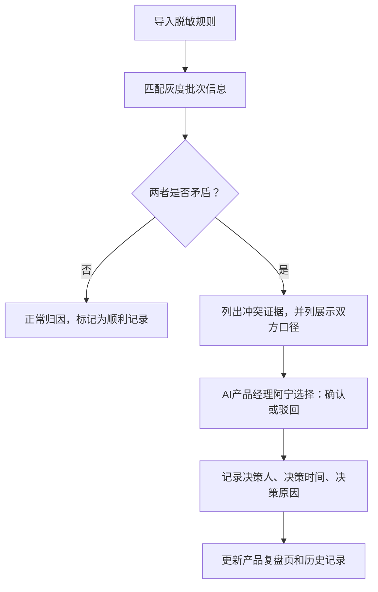
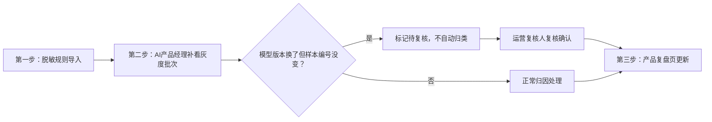

## 1. 产品概述

语音转写错词归因系统，用于解决AI产品经理在语音转写模型迭代过程中的错词归因分析问题。核心解决：模型版本更换但样本编号不变导致的口径混乱、脱敏规则备注与灰度批次可信度冲突、历史归因结果追溯等问题。

- 核心价值：为语音转写模型迭代提供可追溯、可复核的错词归因分析
- 目标用户：AI产品经理（阿宁）、运营复核人员、数据分析师

## 2. 核心功能

### 2.1 用户角色

| 角色 | 描述 | 核心权限 |
|------|------|----------|
| AI产品经理 | 阿宁，主要使用者 | 导入脱敏规则、查看灰度批次、发起归因分析、确认/驳回冲突 |
| 运营复核人 | 负责最终复核确认 | 复核模型版本冲突样本、确认最终归因结果 |
| 系统管理员 | 系统维护 | 配置数据规则、查看操作日志 |

### 2.2 功能模块

1. **归因分析主页**：样本列表、三种类型样例展示、快速筛选
2. **归因详情页**：单样本详细分析、错词对比、版本信息、冲突证据展示
3. **产品复盘页**：批量归因结果汇总、变更历史追踪、影响范围分析
4. **历史记录页**：全量操作日志、谁改了什么、为什么改、影响哪些结果
5. **冲突处理中心**：脱敏规则与灰度批次冲突列表、确认/驳回操作

### 2.3 页面详情

| 页面名称 | 模块名称 | 功能描述 |
|----------|----------|----------|
| 归因分析主页 | 样例分类展示 | 展示三类样例：顺利记录、版本冲突、灰度补录 |
| 归因分析主页 | 快速筛选 | 按类型、状态、模型版本、批次筛选 |
| 归因详情页 | 错词对比面板 | 原文、转写结果、错词标注、置信度 |
| 归因详情页 | 版本信息栏 | 模型版本、样本编号、脱敏规则版本、灰度批次 |
| 归因详情页 | 冲突证据区 | 当脱敏规则与灰度批次矛盾时，并列展示双方证据 |
| 归因详情页 | 操作按钮区 | 确认、驳回、提交复核、备注 |
| 产品复盘页 | 归因结果汇总 | 三类样例的统计数据、对比图表 |
| 产品复盘页 | 变更追踪时间线 | 展示每次修改的时间、操作人、修改内容、原因 |
| 产品复盘页 | 影响分析 | 展示本次变更影响的样本数量、归因结果变化 |
| 历史记录页 | 操作日志列表 | 全量操作记录，支持按时间、操作人、操作类型筛选 |
| 历史记录页 | 操作详情 | 展示单条操作的完整上下文：修改前、修改后、修改原因 |
| 冲突处理中心 | 冲突列表 | 所有存在冲突的样本，按紧急程度排序 |
| 冲突处理中心 | 批量操作 | 批量确认、批量驳回、批量提交复核 |

## 3. 核心流程

### 3.1 标准归因流程

1. 脱敏规则备注第一次导入系统
2. AI产品经理阿宁补看灰度批次信息
3. 系统自动进行归因分析，标记冲突
4. 运营复核人对版本冲突样本进行复核
5. 产品复盘页更新，记录完整变更历史

### 3.2 冲突处理流程

### 3.3 三步核心流程

## 4. 用户界面设计

### 4.1 设计风格

- **主色调**：深靛蓝 (#1E3A5F) - 专业、可信，适合数据分析类产品
- **辅助色**：
  - 顺利记录：翡翠绿 (#10B981)
  - 版本冲突：琥珀橙 (#F59E0B)
  - 灰度补录：紫罗兰 (#8B5CF6)
  - 冲突告警：珊瑚红 (#EF4444)
- **中性色**：深灰 (#1F2937)、中灰 (#6B7280)、浅灰 (#F3F4F6)
- **按钮风格**：直角微圆角 (4px)，2px描边，悬停时有微妙的背景色过渡
- **字体**：
  - 标题："Noto Serif SC" - 专业感的衬线字体
  - 正文："Noto Sans SC" - 清晰易读的无衬线字体
- **布局风格**：卡片式布局，清晰的视觉层级，充足的留白
- **数据可视化**：简洁的柱状图、时间线，强调数据可读性

### 4.2 页面设计概述

| 页面名称 | 模块名称 | UI元素 |
|----------|----------|--------|
| 归因分析主页 | 顶部统计卡片 | 四个统计卡片：总数、顺利、冲突、待复核 |
| 归因分析主页 | 样例列表 | 三色标签区分三种类型，每行显示核心信息 |
| 归因详情页 | 左右分栏 | 左侧：错词对比和版本信息；右侧：冲突证据和操作区 |
| 产品复盘页 | 时间线组件 | 垂直时间线，每个节点显示操作人和变更摘要 |
| 历史记录页 | 表格+详情抽屉 | 点击表格行，右侧滑出详情面板 |
| 冲突处理中心 | 冲突卡片 | 每张卡片顶部显示冲突类型，中间并列展示双方证据 |

### 4.3 响应式

- Desktop-first 设计，主内容区最小宽度 1200px
- 平板端：侧边栏可收起，列表改为单列
- 移动端：简化视图，仅展示核心数据和操作

### 4.4 动效设计

- 页面加载：卡片依次淡入，带微妙的向上位移
- 冲突检测：冲突证据区域有轻微的呼吸效果，吸引注意力
- 操作确认：按钮点击后有确认动效，状态变更有平滑过渡
- 时间线：滚动时节点逐个点亮
