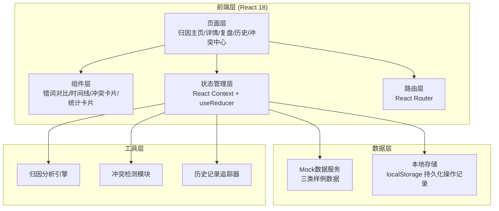

## 1. 架构设计



## 2. 技术描述

- **前端框架**: React@18 + TypeScript
- **构建工具**: Vite@5
- **样式方案**: TailwindCSS@3 + CSS变量
- **路由**: React Router@6
- **图标**: Lucide React
- **数据可视化**: Recharts
- **状态管理**: React Context + useReducer（轻量方案，无需Redux）
- **后端**: 无后端，使用Mock数据 + localStorage持久化
- **数据存储**: localStorage 存储操作历史和用户决策

## 3. 路由定义

| Route | 页面 | Purpose |
|-------|------|---------|
| `/` | 归因分析主页 | 样本列表、统计概览、快速筛选 |
| `/sample/:id` | 归因详情页 | 单样本详细分析、冲突处理 |
| `/review` | 产品复盘页 | 归因结果汇总、变更时间线、影响分析 |
| `/history` | 历史记录页 | 全量操作日志、变更详情 |
| `/conflicts` | 冲突处理中心 | 批量处理冲突样本 |

## 4. 数据模型

### 4.1 核心数据类型

```typescript
// 样本类型枚举
enum SampleType {
  NORMAL = 'normal',           // 顺利记录
  VERSION_CONFLICT = 'version_conflict',  // 模型版本换了但样本编号没变
  GRAY_BACKFILL = 'gray_backfill'  // 灰度批次补来的旧口径
}

// 归因状态枚举
enum AttributionStatus {
  PENDING = 'pending',         // 待处理
  NORMAL = 'normal',           // 正常归因
  CONFLICT = 'conflict',       // 存在冲突
  PENDING_REVIEW = 'pending_review',  // 待运营复核
  CONFIRMED = 'confirmed',     // 已确认
  REJECTED = 'rejected'        // 已驳回
}

// 错词信息
interface WrongWord {
  id: string;
  original: string;       // 原文
  transcribed: string;    // 转写结果
  errorType: string;      // 错误类型：同音字、形近字、漏字、多字
  confidence: number;     // 置信度
  position: number;       // 在文本中的位置
}

// 脱敏规则
interface DesensitizationRule {
  id: string;
  version: string;
  importTime: string;
  importedBy: string;
  remarks: string;        // 备注
  rules: Array<{
    type: string;
    pattern: string;
    replacement: string;
  }>;
}

// 灰度批次
interface GrayBatch {
  id: string;
  batchNo: string;
  modelVersion: string;
  sampleCount: number;
  startTime: string;
  endTime: string;
  remarks: string;
  dataSource: string;
}

// 归因样本
interface AttributionSample {
  id: string;
  sampleNo: string;           // 样本编号
  type: SampleType;           // 样例类型
  status: AttributionStatus;  // 状态
  modelVersion: string;       // 模型版本
  originalModelVersion?: string;  // 原始模型版本（版本冲突时）
  originalText: string;       // 原文
  transcribedText: string;    // 转写文本
  wrongWords: WrongWord[];    // 错词列表
  desensitizationRule?: DesensitizationRule;  // 脱敏规则
  grayBatch?: GrayBatch;      // 灰度批次
  hasConflict: boolean;       // 是否有冲突
  conflictEvidence?: {
    desensitizationClaim: string;
    grayBatchClaim: string;
    conflictPoints: string[];
  };
  createdAt: string;
  updatedAt: string;
  currentStep: number;        // 当前步骤：1-导入 2-补看 3-复盘更新
}

// 操作记录
interface OperationLog {
  id: string;
  sampleId?: string;
  operationType: 'import' | 'review' | 'confirm' | 'reject' | 'update' | 'comment';
  operator: string;
  operatorRole: string;
  operationTime: string;
  description: string;
  reason?: string;            // 修改原因
  beforeState?: any;          // 修改前状态
  afterState?: any;           // 修改后状态
  affectedSamples?: string[]; // 影响的样本
}
```

### 4.2 Mock数据规划

三类样例数据各至少一条：

1. **顺利记录 (NORMAL)**
   - 样本编号: S001
   - 模型版本: V2.3.1
   - 脱敏规则与灰度批次一致
   - 归因结果明确，无冲突

2. **版本冲突 (VERSION_CONFLICT)**
   - 样本编号: S002
   - 脱敏规则显示模型版本 V2.3.0
   - 灰度批次显示模型版本 V2.3.1
   - 样本编号相同，模型版本不同
   - 标记为待复核，不自动归类

3. **灰度补录 (GRAY_BACKFILL)**
   - 样本编号: S003
   - 从灰度批次补录的旧口径数据
   - 脱敏规则版本较新，灰度批次是旧数据
   - 有明确的补录来源标记

## 5. 核心模块设计

### 5.1 归因分析引擎

- 输入：原始文本、转写文本、模型版本信息
- 输出：错词列表、归因结果、置信度
- 逻辑：
  - 文本对齐比对
  - 错词类型分类
  - 置信度计算
  - 版本信息匹配

### 5.2 冲突检测模块

- 检测时机：脱敏规则导入后、灰度批次补看后
- 检测维度：
  - 模型版本一致性检测
  - 样本编号唯一性检测
  - 脱敏规则与灰度批次口径对比
- 输出：冲突证据列表、冲突严重程度

### 5.3 历史记录追踪器

- 记录所有状态变更
- 自动记录修改前后对比
- 支持按样本、操作人、时间范围查询
- 生成变更影响分析

## 6. 目录结构

```
src/
├── components/          # 通用组件
│   ├── Layout/         # 布局组件
│   ├── SampleCard/     # 样本卡片
│   ├── WrongWordDiff/  # 错词对比
│   ├── ConflictPanel/  # 冲突证据面板
│   ├── Timeline/       # 时间线
│   └── StatsCard/      # 统计卡片
├── pages/              # 页面组件
│   ├── Home/           # 归因主页
│   ├── SampleDetail/   # 样本详情
│   ├── Review/         # 产品复盘
│   ├── History/        # 历史记录
│   └── Conflicts/      # 冲突中心
├── context/            # 状态管理
│   └── AppContext.tsx
├── data/               # Mock数据
│   ├── samples.ts      # 三类样例数据
│   └── operations.ts   # 操作记录
├── hooks/              # 自定义Hooks
│   ├── useAttribution.ts
│   ├── useConflictDetection.ts
│   └── useHistory.ts
├── types/              # TypeScript类型
│   └── index.ts
├── utils/              # 工具函数
│   ├── attributionEngine.ts
│   ├── conflictDetector.ts
│   └── historyTracker.ts
├── App.tsx
├── main.tsx
└── index.css
```
