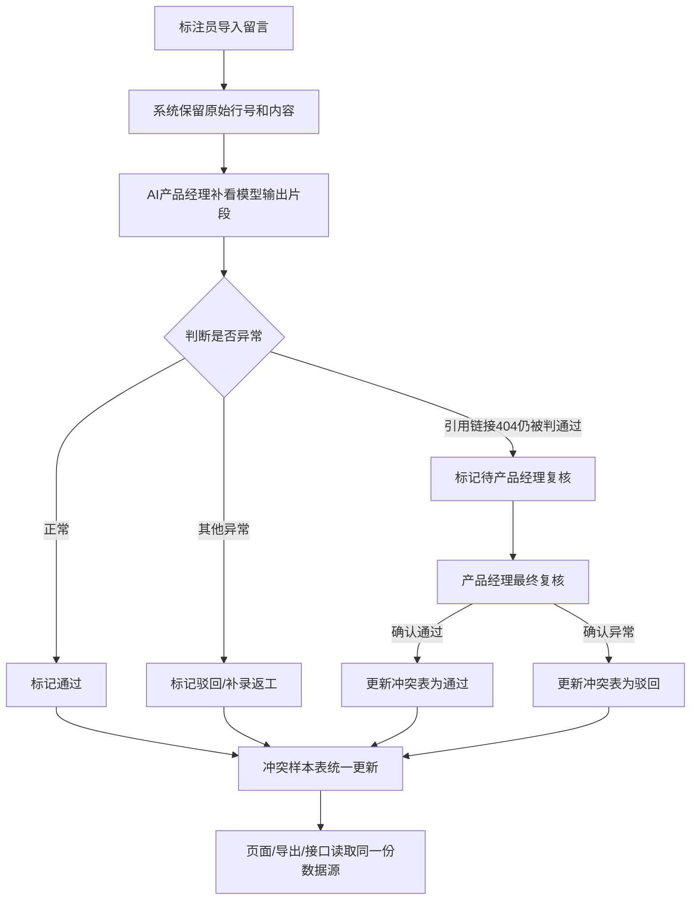

## 1. 产品概述

售后机器人转人工判断系统，用于质检和复核售后机器人的自动判断结果，特别是处理引用链接404仍被判通过等异常场景。目标用户为AI产品经理（阿宁）和标注员，核心价值是建立可追溯、可复核、一致性高的质检流程。

## 2. 核心功能

### 2.1 用户角色

| 角色 | 注册方式 | 核心权限 |
|------|---------|---------|
| 标注员 | 系统分配 | 导入标注留言、查看原始记录 |
| AI产品经理 | 系统分配 | 补看模型输出、复核异常样本、更新冲突表、导出明细 |

### 2.2 功能模块

1. **标注导入页**: 标注员留言文件导入、原始行号保留、数据预览
2. **质检工作台**: 模型输出片段查看、人工判断操作、状态流转
3. **冲突样本表**: 异常样本汇总、404链接专项标记、产品经理复核队列
4. **数据导出**: 统一数据源导出、明细完整保留、格式标准化

### 2.3 页面详情

| 页面名称 | 模块名称 | 功能描述 |
|---------|---------|---------|
| 标注导入页 | 文件上传区 | 支持CSV/Excel上传，解析并保留原始行号 |
| 标注导入页 | 数据预览表 | 展示导入数据，高亮异常字段 |
| 质检工作台 | 样本卡片流 | 逐条展示样本，包含模型输出片段 |
| 质检工作台 | 判断操作区 | 通过/驳回/转复核按钮，支持填写备注 |
| 冲突样本表 | 筛选过滤区 | 按状态、异常类型、处理人筛选 |
| 冲突样本表 | 样本列表 | 展示完整字段，支持批量操作 |
| 数据导出 | 导出配置 | 选择字段、格式，一键导出 |

## 3. 核心流程

### 三步核心流程
1. **标注员留言第一次导入**: 标注员上传留言文件，系统保留原始行号和完整内容
2. **AI产品经理阿宁补看模型输出片段**: 产品经理逐条查看模型推理片段，进行初步判断
3. **冲突样本表更新**: 异常样本（如引用链接404仍被判通过）进入复核队列，由产品经理最终裁定

### 特殊处理规则
- 引用链接404仍被判通过：不自动归为正常，标记为"待产品经理复核"
- 错口径和补录返工：作为优先处理的常见问题分类
- 所有操作保留痕迹：原始行号、人工改动、处理状态、操作人、时间戳

## 4. 用户界面设计

### 4.1 设计风格
- 主色调：深海军蓝 (#1e3a5f) 作为主色，传达专业可靠
- 辅助色：琥珀橙 (#f59e0b) 用于异常标记，薄荷绿 (#10b981) 用于正常状态
- 按钮风格：圆角8px，轻微阴影，hover时有颜色加深过渡
- 字体：标题使用 Noto Serif SC 彰显专业感，正文使用 Noto Sans SC 保证可读性
- 布局风格：卡片式布局，信息分区清晰，数据表格支持固定表头
- 图标风格：使用 lucide-react 线性图标，保持简洁一致

### 4.2 页面设计概述

| 页面名称 | 模块名称 | UI元素 |
|---------|---------|-------|
| 标注导入页 | 文件上传区 | 拖拽区域、文件选择按钮、上传进度条 |
| 标注导入页 | 数据预览表 | 固定列表格、行号列、异常高亮行 |
| 质检工作台 | 样本卡片流 | 竖向滚动卡片、模型输出代码块、状态标签 |
| 质检工作台 | 判断操作区 | 底部固定操作栏、三个主操作按钮、备注输入框 |
| 冲突样本表 | 筛选过滤区 | 标签式筛选、搜索框、日期范围选择 |
| 冲突样本表 | 样本列表 | 可排序列表、行内操作按钮、批量选择框 |
| 数据导出 | 导出配置 | 字段多选组、格式单选、导出预览按钮 |

### 4.3 响应式
- Desktop-first设计，最小支持宽度1280px
- 表格区域支持横向滚动，操作栏在小屏下折叠
- 移动端优化触摸区域，按钮最小44px高度

### 4.4 动效设计
- 页面加载：内容区域渐入，导航栏下滑
- 状态变更：标签颜色过渡动画，0.3s ease
- 表格行hover：背景色轻微变化，左侧边框高亮
- 模态框弹出：缩放+淡入，0.2s ease-out
