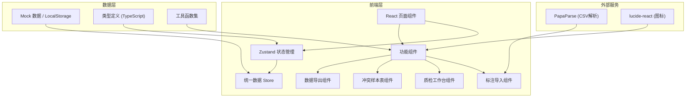
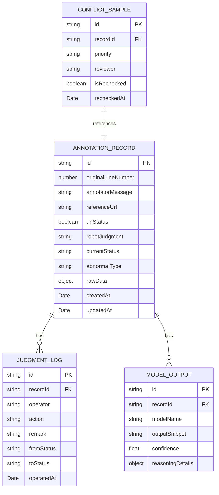

## 1. 架构设计



## 2. 技术描述

- **前端**: React@18 + TypeScript + Vite
- **样式**: TailwindCSS@3
- **状态管理**: Zustand
- **路由**: React Router DOM
- **图标**: lucide-react
- **CSV解析**: papaparse
- **后端**: 无（纯前端应用，使用Mock数据 + LocalStorage持久化）

## 3. 路由定义

| Route | 页面 | 用途 |
|-------|------|------|
| / | 首页 / 导航 | 功能入口跳转 |
| /import | 标注导入页 | 标注员上传留言文件 |
| /workbench | 质检工作台 | AI产品经理补看模型输出、判断 |
| /conflicts | 冲突样本表 | 异常样本汇总、复核队列 |
| /export | 数据导出 | 统一数据源导出 |
| /rules | 边界规则 | 查看判断规则文档 |

## 4. 数据模型

### 4.1 核心类型定义



### 4.2 状态枚举

```typescript
enum RecordStatus {
  PENDING = 'pending',           // 待处理
  PASSED = 'passed',             // 通过
  REJECTED = 'rejected',         // 驳回
  REWORK = 'rework',             // 补录返工
  WRONG_CRITERIA = 'wrong_criteria', // 错口径
  PM_REVIEW = 'pm_review',       // 待产品经理复核（404专用）
  REVIEW_PASSED = 'review_passed',   // 复核通过
  REVIEW_REJECTED = 'review_rejected' // 复核驳回
}

enum AbnormalType {
  NONE = 'none',
  URL_404_PASSED = 'url_404_passed',  // 引用链接404仍被判通过
  WRONG_CRITERIA = 'wrong_criteria',  // 错口径
  REWORK_NEEDED = 'rework_needed',    // 补录返工
  OTHER = 'other'
}
```

## 5. 核心模块说明

### 5.1 统一数据源 (Single Source of Truth)
- 所有页面展示、导出功能、接口返回均读取同一份 Zustand Store 数据
- Store 中数据变更后自动同步到 LocalStorage 持久化
- 禁止组件内部维护独立的数据副本

### 5.2 边界规则引擎
- 在 `src/utils/boundaryRules.ts` 中集中定义所有判断规则
- 引用链接404仍被判通过的检测逻辑固化为代码
- 支持规则版本管理，便于追溯

### 5.3 操作日志
- 每次状态变更都生成 JUDGMENT_LOG 记录
- 保留操作前后状态、操作人、时间戳、备注
- 支持完整的审计回溯

## 6. 项目结构

```
src/
├── components/
│   ├── layout/           # 布局组件
│   ├── import/           # 标注导入相关组件
│   ├── workbench/        # 质检工作台组件
│   ├── conflicts/        # 冲突样本表组件
│   ├── export/           # 数据导出组件
│   └── common/           # 通用组件（表格、按钮、标签等）
├── pages/
│   ├── Home.tsx
│   ├── Import.tsx
│   ├── Workbench.tsx
│   ├── Conflicts.tsx
│   ├── Export.tsx
│   └── Rules.tsx
├── store/
│   └── useRecordStore.ts # 统一状态管理
├── types/
│   └── index.ts          # 类型定义
├── utils/
│   ├── boundaryRules.ts  # 边界判断规则
│   ├── csvParser.ts      # CSV解析工具
│   ├── exportUtil.ts     # 导出工具
│   └── mockData.ts       # Mock数据生成
├── hooks/
│   └── useRecordFlow.ts  # 流程控制Hook
├── App.tsx
├── main.tsx
└── index.css
```
