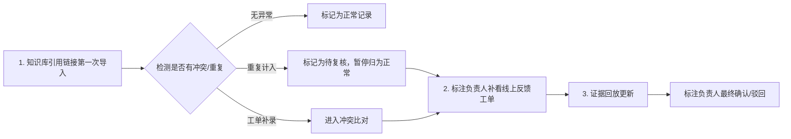

## 1. 产品概述

模型 A/B 灰度回看系统是面向标注负责人的专业复核工具，解决同一用户反馈重复计入、知识库引用与线上工单口径冲突等问题，提供可解释的灰度测试结果回溯能力。

- 核心用户：标注负责人（如周姐）
- 核心价值：减少口头兜底，提供结构化证据链，支持三步复核流程
- 目标：让灰度回看结果可追溯、可解释、可复核

## 2. 核心功能

### 2.1 用户角色

| 角色 | 说明 | 核心权限 |
|------|------|----------|
| 标注负责人 | 周姐等标注团队管理者 | 查看所有回看记录、复核冲突证据、确认/驳回处理结果、补看线上工单 |

### 2.2 功能模块

1. **回看列表页**：三类记录分类展示（正常记录、重复计入、补录旧口径）、筛选搜索、状态概览
2. **回看详情页**：证据回放时间线、历史操作记录、冲突证据对比、参数版本说明
3. **三步复核流程**：知识库导入 → 补看线上工单 → 证据回放更新
4. **冲突处理中心**：知识库引用与线上工单矛盾时的证据列示、确认/驳回操作

### 2.3 页面详情

| 页面名称 | 模块名称 | 功能描述 |
|----------|----------|----------|
| 回看列表页 | 分类标签栏 | 按"全部/正常/重复计入/补录"四类切换，显示每类数量 |
| 回看列表页 | 记录卡片列表 | 每条记录展示ID、类型标签、用户反馈摘要、处理状态、时间 |
| 回看列表页 | 筛选搜索栏 | 支持按记录ID、用户ID、时间范围、处理状态筛选 |
| 回看详情页 | 基本信息区 | 记录ID、模型版本、灰度批次、创建时间、当前状态 |
| 回看详情页 | 三步流程进度条 | 可视化展示"知识库导入→补看工单→证据更新"进度 |
| 回看详情页 | 证据回放时间线 | 按时间顺序展示所有证据节点，可点击展开详情 |
| 回看详情页 | 历史操作记录 | 展示所有操作人、操作时间、操作内容的审计日志 |
| 回看详情页 | 冲突证据区 | 并列展示知识库引用与线上工单内容，高亮矛盾点 |
| 回看详情页 | 操作按钮区 | 确认/驳回按钮，提交复核意见输入框 |
| 回看详情页 | 参数说明区 | 展示模型参数版本、计算逻辑、取舍理由 |

## 3. 核心流程

### 3.1 正常记录处理流程
系统导入知识库引用链接 → 识别为顺利记录 → 自动标记为正常 → 标注负责人可查看证据回放

### 3.2 重复计入处理流程
系统导入知识库引用链接 → 检测到同一用户反馈多次出现 → 标记为"待复核" → 标注负责人查看重复证据 → 确认或调整归属

### 3.3 补录旧口径处理流程
从线上反馈工单补录旧口径数据 → 与原知识库记录对比 → 如有冲突列出证据 → 标注负责人选择确认或驳回 → 更新证据回放

### 3.4 三步复核主流程

## 4. 用户界面设计

### 4.1 设计风格
- **主色调**：深蓝（#1e3a5f）代表专业可信，搭配琥珀金（#d4a574）作为强调色
- **辅助色**：绿色（#10b981）表示正常，橙色（#f59e0b）表示待复核，红色（#ef4444）表示冲突
- **按钮风格**：微立体圆角按钮，hover时有微妙阴影变化
- **字体**：标题用"Noto Serif SC"体现正式感，正文用"Noto Sans SC"保证可读性
- **布局风格**：卡片式布局，清晰的信息层级，左侧时间线+右侧详情的双栏结构
- **视觉元素**：细线分隔、微磨砂玻璃效果、时间线连接节点

### 4.2 页面设计概述

| 页面名称 | 模块名称 | UI 元素 |
|----------|----------|---------|
| 回看列表页 | 分类标签栏 | 圆角标签，选中态有底部琥珀金色指示条，带数字角标 |
| 回看列表页 | 记录卡片 | 白色卡片带轻微阴影，左上角类型色标，hover时卡片上浮 |
| 回看详情页 | 三步流程进度条 | 横向步骤条，已完成步骤打钩，当前步骤发光，未完成置灰 |
| 回看详情页 | 证据回放时间线 | 左侧垂直时间线，节点用不同颜色图标区分证据类型 |
| 回看详情页 | 冲突证据区 | 左右双栏对比布局，矛盾处用红色高亮框标注 |
| 回看详情页 | 参数说明区 | 浅灰色背景卡片，代码风格展示参数键值对 |

### 4.3 响应式
- Desktop-first 设计，主内容区最小宽度 1200px
- 详情页在中等屏幕下转为上下布局，时间线上移到顶部横向展示
- 触摸设备优化按钮点击区域（最小 44px）

### 4.4 动效设计
- 页面加载：内容区渐入 + 轻微上移动画
- 时间线节点：滚动触发依次显现动画
- 冲突展开：平滑展开/收起，高度过渡
- 按钮点击：微妙的 scale(0.98) 反馈
