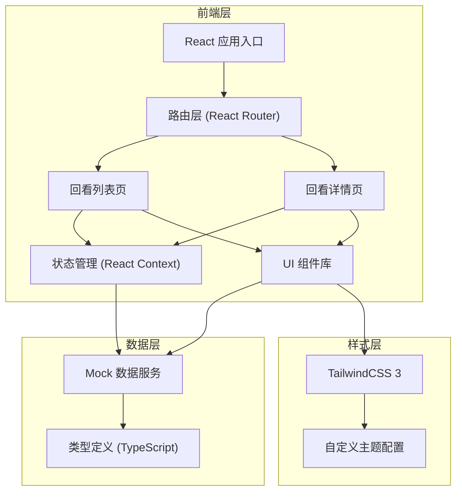
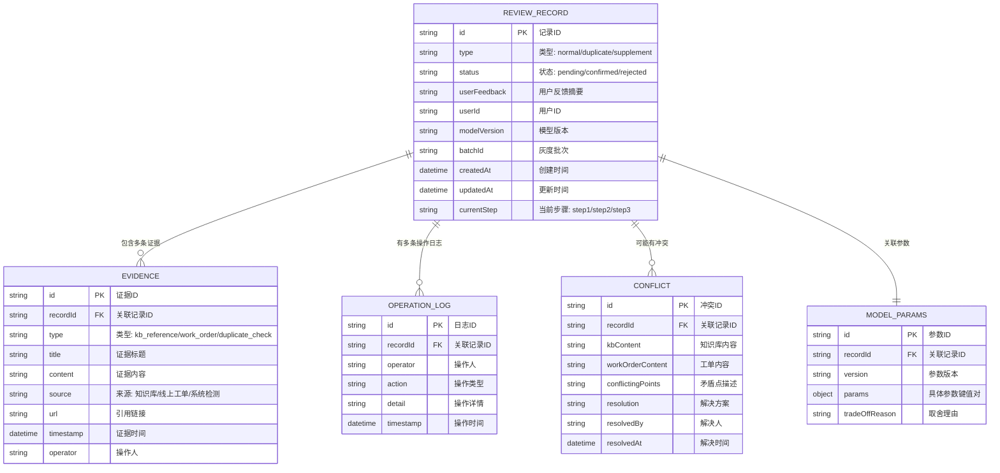

## 1. 架构设计



## 2. 技术说明

- **前端框架**：React@18 + TypeScript@5
- **构建工具**：Vite@5
- **样式方案**：TailwindCSS@3 + 自定义主题变量
- **路由管理**：React Router DOM@6
- **状态管理**：React Context + useReducer（轻量级，满足单页应用需求）
- **图标库**：Lucide React（轻量、现代化图标）
- **后端**：无后端，使用本地 Mock 数据模拟
- **数据持久化**：LocalStorage（保存用户复核操作结果）

## 3. 路由定义

| 路由 | 页面 | 说明 |
|------|------|------|
| `/` | 回看列表页 | 首页，展示所有回看记录，支持分类筛选 |
| `/review/:id` | 回看详情页 | 展示单条记录的完整证据链、冲突处理、复核操作 |

## 4. 数据模型

### 4.1 核心数据模型



### 4.2 TypeScript 类型定义

```typescript
// 记录类型
type RecordType = 'normal' | 'duplicate' | 'supplement';
type RecordStatus = 'pending' | 'confirmed' | 'rejected';
type ReviewStep = 'step1' | 'step2' | 'step3';
type EvidenceType = 'kb_reference' | 'work_order' | 'duplicate_check' | 'system';

interface ReviewRecord {
  id: string;
  type: RecordType;
  status: RecordStatus;
  userFeedback: string;
  userId: string;
  modelVersion: string;
  batchId: string;
  createdAt: string;
  updatedAt: string;
  currentStep: ReviewStep;
  evidences: Evidence[];
  conflicts?: Conflict[];
  operationLogs: OperationLog[];
  modelParams: ModelParams;
}

interface Evidence {
  id: string;
  type: EvidenceType;
  title: string;
  content: string;
  source: string;
  url?: string;
  timestamp: string;
  operator?: string;
}

interface Conflict {
  id: string;
  kbContent: string;
  workOrderContent: string;
  conflictingPoints: string[];
  resolution?: 'confirm_kb' | 'confirm_work_order' | 'reject_both';
  resolvedBy?: string;
  resolvedAt?: string;
}

interface OperationLog {
  id: string;
  operator: string;
  action: string;
  detail: string;
  timestamp: string;
}

interface ModelParams {
  version: string;
  params: Record<string, string | number | boolean>;
  tradeOffReason: string;
}
```

## 5. 项目目录结构

```
src/
├── types/               # TypeScript 类型定义
│   └── index.ts
├── data/                # Mock 数据
│   └── mockRecords.ts   # 三条样例数据（正常/重复/补录）
├── context/             # React Context
│   └── ReviewContext.tsx
├── components/          # 可复用组件
│   ├── layout/          # 布局组件
│   │   ├── Header.tsx
│   │   └── Layout.tsx
│   ├── list/            # 列表页组件
│   │   ├── FilterBar.tsx
│   │   ├── CategoryTabs.tsx
│   │   ├── RecordCard.tsx
│   │   └── RecordList.tsx
│   └── detail/          # 详情页组件
│       ├── BasicInfo.tsx
│       ├── StepProgress.tsx
│       ├── EvidenceTimeline.tsx
│       ├── HistoryLogs.tsx
│       ├── ConflictSection.tsx
│       ├── ParamsSection.tsx
│       └── ActionButtons.tsx
├── pages/               # 页面组件
│   ├── ListPage.tsx
│   └── DetailPage.tsx
├── hooks/               # 自定义 Hooks
│   └── useReviewData.ts
├── utils/               # 工具函数
│   └── format.ts
├── App.tsx
├── main.tsx
└── index.css
```

## 6. 三种样例数据设计

### 样例一：顺利记录（normal）
- 用户反馈正常，知识库引用清晰
- 无重复计入，无线上工单冲突
- 三步流程自动走完，状态为 confirmed

### 样例二：同一用户反馈被重复计入（duplicate）
- 同一用户ID在知识库中出现两次相同反馈
- 系统检测到重复，标记为待复核
- 停在 step2，等待标注负责人确认

### 样例三：后来从线上反馈工单补来的旧口径（supplement）
- 先有知识库引用，后补录线上工单
- 两者口径存在冲突
- 需要标注负责人选择确认哪一方
