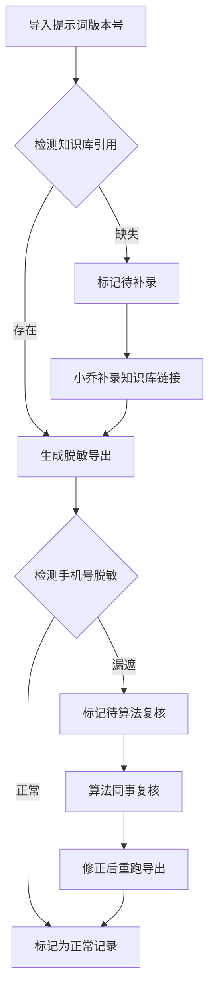

## 1. 产品概述
AI 绘画素材版权提醒系统，用于管理AI绘画素材的版权审核流程，支持提示词版本管理、知识库引用追溯、脱敏导出和人工复核机制。
- 目标用户：知识库编辑（小乔）、算法同事、新人培训
- 核心价值：快速定位手机号漏遮等脱敏问题，保留完整审核链路，便于培训和复盘

## 2. 核心功能

### 2.1 用户角色
| 角色 | 核心权限 |
|------|----------|
| 知识库编辑 | 查看记录、补录知识库链接、发起重跑、导出脱敏数据 |
| 算法同事 | 复核手机号漏遮问题、确认修正结果 |

### 2.2 功能模块
1. **记录列表页**：版权审核记录列表，支持状态筛选和快速查看
2. **详情与操作页**：单条记录的完整信息展示、流程操作、历史追踪
3. **脱敏导出面板**：预览导出内容、检查脱敏状态、执行导出

### 2.3 页面详情
| 页面名称 | 模块名称 | 功能描述 |
|-----------|-------------|---------------------|
| 记录列表 | 状态筛选 | 按"正常/待复核/已补录"筛选记录 |
| 记录列表 | 记录卡片 | 展示素材名称、提示词版本、状态标签、操作时间 |
| 详情页面 | 基本信息 | 素材名称、提示词版本号、创建时间、当前状态 |
| 详情页面 | 知识库引用 | 展示/编辑知识库引用链接，支持补录 |
| 详情页面 | 脱敏导出 | 预览导出内容，高亮手机号漏遮等问题 |
| 详情页面 | 操作面板 | 补录链接、发起重跑、提交复核、确认修正 |
| 详情页面 | 历史记录 | 完整操作时间线，展示人工修正和重跑记录 |

## 3. 核心流程

### 3.1 正常处理流程
导入提示词版本号 → 自动关联知识库引用 → 生成脱敏导出 → 标记为正常

### 3.2 手机号漏遮处理流程
导入提示词版本号 → 生成脱敏导出 → 检测到手机号漏遮 → 标记为"待算法复核" → 算法同事复核确认 → 修正后重新生成导出 → 标记为正常

### 3.3 知识库补录流程
导入提示词版本号 → 知识库引用缺失 → 知识库编辑补录链接 → 更新口径信息 → 重新生成脱敏导出 → 标记为"已补录"

## 4. 用户界面设计

### 4.1 设计风格
- **主色调**：深蓝(#1e3a5f)作为主色，搭配琥珀色(#d97706)作为警告色，绿色(#059669)作为正常状态
- **按钮风格**：圆角8px，悬停有微妙的阴影变化，禁用状态灰度显示
- **字体**：标题使用思源黑体加粗，正文使用系统无衬线字体
- **布局风格**：卡片式布局，左侧列表+右侧详情的两栏结构
- **状态标签**：使用不同背景色的胶囊标签，直观展示当前状态

### 4.2 页面设计概述
| 页面名称 | 模块名称 | UI元素 |
|-----------|-------------|-------------|
| 记录列表 | 顶部导航 | 系统标题、筛选下拉、演示数据说明 |
| 记录列表 | 记录卡片 | 素材名称标题、版本号标签、状态胶囊、时间戳 |
| 详情页面 | 信息区块 | 分组展示基本信息、知识库、导出内容 |
| 详情页面 | 错误提示 | 红色边框+图标+人话描述，不显示内部字段名 |
| 详情页面 | 历史时间线 | 左侧垂直线+圆点，右侧操作记录和时间 |
| 详情页面 | 操作按钮区 | 主要操作按钮突出显示，次要操作弱化 |

### 4.3 响应性
- 桌面端：左右分栏布局，左侧30%宽度列表，右侧70%详情
- 平板端：列表可折叠，详情占满宽度
- 移动端：列表全屏展示，点击进入详情页
